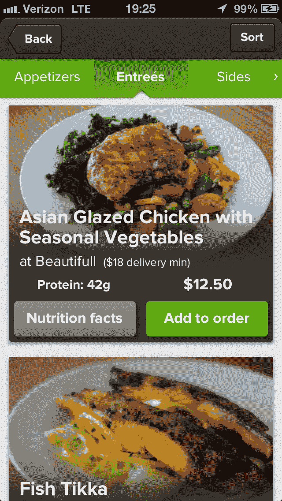

# 仓促计划在 SF TechCrunch 中推出超级健康的外卖和交付应用程序，以应对 GrubHub

> 原文：<https://web.archive.org/web/https://techcrunch.com/2013/06/27/hasty-app-plans-to-take-on-grubhub-with-super-healthy-fast-food-ordering-app-in-sf/>

# 仓促计划在旧金山推出超级健康的外卖和交付应用程序来应对 GrubHub

GrubHub 或 Seamless——如果你在欧洲，Just Eat，DeliveryHero，HungryHouse 和许多其他公司——众所周知，是一个罪恶的秘密。近年来，按需订购的食品数量激增。但是，试图选择健康的选择很少那么容易。这是一家新的自举创业公司，首先在旧金山成立，但希望在美国和国际上扩张。要加入“外卖和递送”iPhone 应用的私人测试名单，[请访问网站](https://web.archive.org/web/20221206050305/http://hastyapp.com/)。Instagram 的首席设计师蒂姆·范达姆(Tim Van Damme)恰好是该公司的顾问。通过这个链接，有 200 个针对 [TechCrunch 读者的私人测试邀请。](https://web.archive.org/web/20221206050305/http://hastyapp.com/?invitecode=tc1)

很简单。你使用该应用程序从一系列当地餐厅订购健康食品，按照自己的方式准备，并通过餐厅自己的外卖服务交付。Hasty 从交易中提成，餐厅可以利用对(可能)高价菜肴感兴趣的非常有眼光的顾客。

这家初创公司直接与旧金山的餐馆合作，确保不使用味精或额外的糖，同时尽量减少盐和油。他们在任何菜单上寻找最健康、最美味的菜肴，计算每一道菜的营养成分，并拍摄每道菜的高质量照片，然后将其放入一个好看的应用程序。

你可以根据饮食偏好(例如，旧物、低碳水化合物、无麸质)从特定城市最好、最健康的餐厅点餐。这家初创公司声称，早期测试已经看到用户从其他食品订购应用程序迁移，每周订购 2-3 次。

他们正在开发美国 2500 亿美元外卖和送货市场的一部分，这个市场还没有被大量的健康快餐唤醒，并受到健康活动家的攻击——这是很合理的。

Hasty 是由牛津大学毕业生大卫·兰格和克里斯·霍林代尔创建的。此前，兰格创建了总部位于英国的会员制软件公司 GroupSpaces，该公司得到了 Index Ventures 的支持，如今拥有约 500 万会员。Hasty 的顾问是 Van Damme 和 Heyzap 的联合创始人 Jude Gomila。

