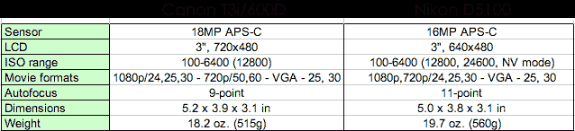
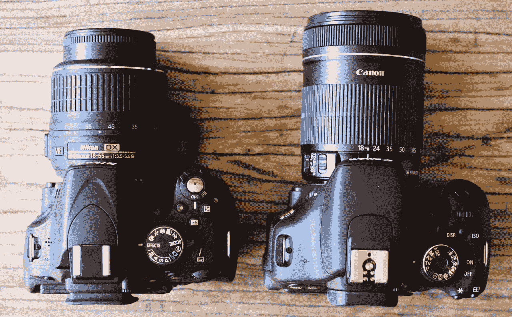
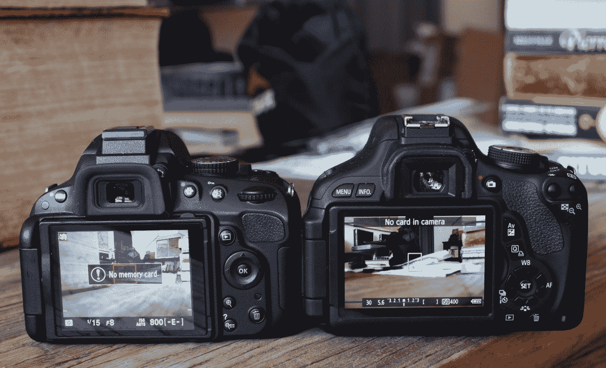
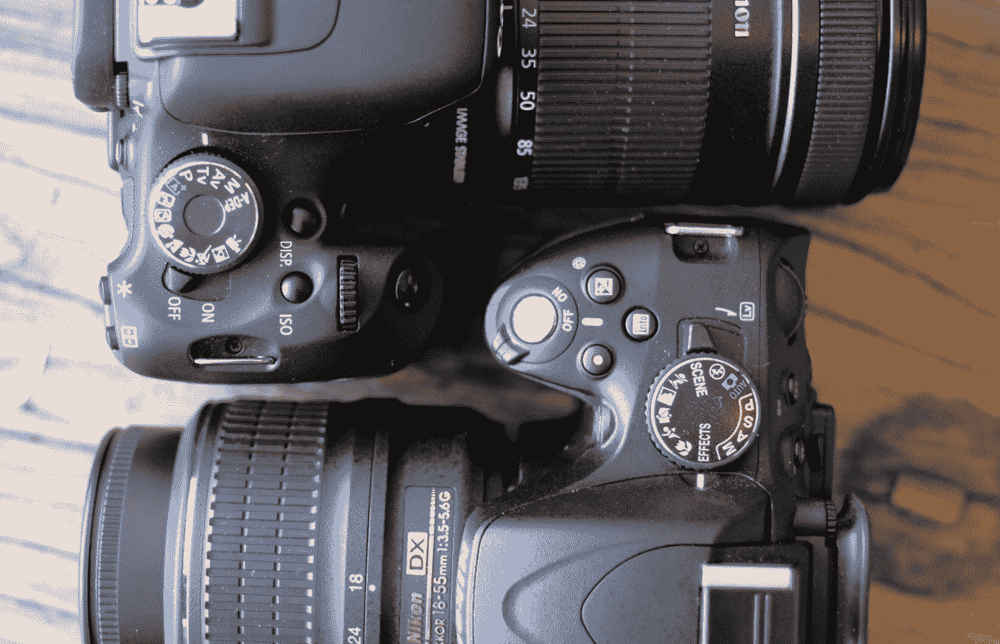
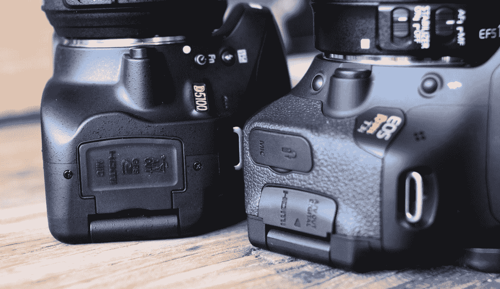
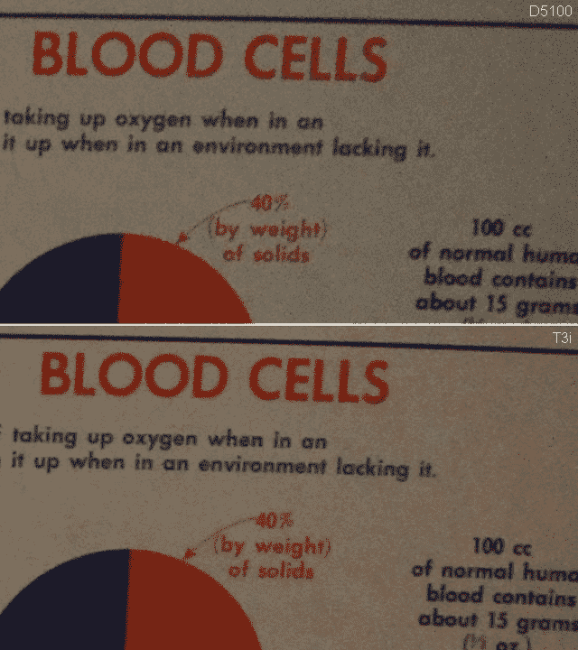

# 面对面评论:佳能 T3i 与尼康 d 5100 

> 原文：<https://web.archive.org/web/http://techcrunch.com/2011/07/29/head-to-head-review-canon-t3i-vs-nikon-d5100/>

凭借高清视频录制、出色的图像质量和丰富的镜头选择，[尼康 D5100](https://web.archive.org/web/20230205030223/https://techcrunch.com/2011/04/04/nikons-d5100-dslr-swivel-lcd-in-camera-hd-movie-filters-800/) 和[佳能 T3i](https://web.archive.org/web/20230205030223/https://techcrunch.com/2011/02/07/canon-increments-rebel-line-with-new-t3i-and-t3/) 是许多人的首选。对于已经在佳能或尼康阵营的人(完全披露:我是一个佳能人)，如果升级是他们的未来，选择是显而易见的，但对于 DSLR 人群中不那么教条的新人来说，这远不是那么明确的。不管怎样，800 美元可以买很多相机。

Pixel peepers 会希望在 DP Review ( [这里](https://web.archive.org/web/20230205030223/http://www.dpreview.com/reviews/canoneos600d/)和[这里](https://web.archive.org/web/20230205030223/http://www.dpreview.com/reviews/nikond5100/))和其他以摄影为中心的网站上查看可靠和详尽的评论，这些网站对图像质量进行了系统的检查，但我想只是将这两款有价值的设备放在一起，看看它们不仅在技术上，而且在日常使用中如何进行比较。

在我开始我的轶事回顾之前，让我们先回顾一下这两款相机的主要规格。

所以，没什么决定性的。尼康在自动对焦系统和(表面上)ISO 功能方面有优势，佳能有几百万像素和略好的 LCD。但它们离得很近，所以无法确定该拿哪一个。

然而，其中一个必须是更好的相机，或者至少某些类型的射手可能会合理地喜欢这个或那个。我将介绍几个主要的与众不同之处，除非你手里拿着相机，否则你不会真正想到这些。注意，这些点不一定是这些相机的新内容！这两种型号的主要变化是增加了一个铰接式 LCD。除此之外，它们与它们的前辈非常相似。但是由于这些都是最新款，很可能会让潜在的 DSLR 买家失眠(因为它们都很超值)，直接比较似乎是合适的。这是一个*实用*比较，聚焦于消费者普遍关心的事情。

两款相机都使用其配套镜头进行了测试，并在 Adobe Lightroom 中进行了处理。镜片是一个很好的起点，因为大量首次购买 DSLR 的人至少在开始阶段会坚持使用套装镜片。

**更新**:我的错误。我的印象是佳能已经将其配套镜头提升到 18-135，但事实上，配套镜头实际上仍然是 EF-S 18-55mm f/3.5-5.6 IS。我已经使用过镜头，我会修改下面的评论，大意是尼康实际上配备了更好的镜头(尼康套件镜头，虽然不是很好，但更好的构造，可能在光学上更好)——所以无论我在哪里提到镜头的优势，请忽略这一点。我也更新了结论。也就是说，我对未来 DSLR 车主的建议是*只买一辆车，把你省下来的钱花在一辆便宜的 prime 上*。实验起来更有趣，如果你想要的话，便宜的变焦镜头很容易买到。

**套件镜头**

T3i 配有 18-135 F/3.5-5.6。D5100 的 F/3.5-5.6 为 18-55。两者都有光学图像稳定功能，这有助于保持更长时间的曝光清晰(我不相信它低于 1/20 秒)，但在非常糟糕的光线下真的没有帮助。

佳能镜头是这里更实用的选择。虽然两者都不是很好的光学抖动，当放大时你会很快失去光线，但佳能比尼康有两个优势:首先，如果你只有一个镜头，那么长端的额外部分真的很方便。这是一个相当不错的长焦长度，适合在中距拍摄野生动物、鸟类等。在大多数情况下，尼康焦距末端的同一物体会不太清晰。第二，佳能镜头虽然稍大一些，但所有内部元件都有——这意味着除了开关和环之外，外部没有任何东西会移动。另一方面，尼康有一个可伸缩的前部元件，可以随着对焦和变焦移动，手动对焦可以旋转整个镜头。感觉有点廉价，就像它不能处理门框上的丁字，它整天都从前面伸出来。

不管怎样，我的简短测试显示尼康镜头的光学性能更好。在 100%时，佳能拍摄的照片在明亮的光线下显示出明显更多的边缘。如果你把图片缩小一点，你不会注意到这一点，但肯定值得一提。

如果两个镜头上都有最大光圈指示器就好了，但这并不常见，取景器中的信息就足够了。

**取景器**

两个取景器都是普通的五面镜，所以两者都没有明显的优势。但它们并不相同。橡胶眼罩略有不同，但都很舒适。两者都不会突出很远，所以无论如何你都会在屏幕上蹭鼻子。

尼康的取景器比佳能显示更多的图像——也就是说，在镜头焦距相同的情况下，尼康显示的图像更多。据我估计，大概只多了 3%，但如果你在寻找的话，这是显而易见的。

也就是说，我更喜欢佳能取景器中的读数；在我看来，它更明亮，可读性更强。自动对焦点在佳能取景器上更明显，这真的是一个品味问题。佳能有一个圆圈显示中心加权曝光将限制在哪里，这很方便。

**液晶**

佳能的 LCD 尺寸相同，但分辨率略高(720×480 而不是 640×480)，并且具有原生 3:2 的优势。我发现这让图像看起来更好一些，但两个屏幕都比我们几年前的 480×320 屏幕好得多。佳能的在我看来似乎也变得更加锐利；在佳能相机上，我只能勉强看清离我 18 毫米、10 英尺远的一本书的书名，但在尼康相机上，我看不清。

两个屏幕都向左铰接，然后垂直旋转 270 度。两者的动作都很流畅，展台看起来就像内置的液晶显示器一样坚固。液晶屏或塑料背板朝外时，两者均可安全锁定。然而，佳能的右边有一个剪切的“手柄”，尼康的顶部和底部有两个小把手。佳能的最适合用拇指抓取，我发现它比尼康的双指捏抓更方便。这是另一个味道的问题，但我肯定更喜欢拇指握。

**控件**

除了佳能/尼康布局的正常差异外，最新的佳能还有一个雕刻的形状，几乎与机身齐平。D5100 的按钮都是圆形的，尽管有不同的“深度”两者都有点击和非点击按钮的混合，一般规则似乎是任何直接影响照片的按钮都不会点击。

佳能的按钮在感觉上更一致，但它们太接近齐平了，以至于有些按钮在黑暗中或不从取景器上移开眼睛时很难识别。不过，它的方向按钮当然更好:尼康的圆形 D-pad 手感柔软。不过，我更喜欢尼康的镀银、更垂直的快门按钮，这肯定是你会用得最多的按钮。

作为一名佳能用户，我已经习惯了将微动拨盘放在我的食指下，但你是否更喜欢它放在那里而不是拇指下，这是你自己想出来的事情。佳能的模式转盘要大得多，我觉得这很有帮助，虽然它停在 A-Dep(为什么不是手动？)和 mode，尼康的就是不停的转。知道拨号盘相对于两端的位置可以节省时间。

T3i 有一点是 D5100 没有的，那就是专用的 ISO 控制按钮。在 D5100 上，你必须一步进入菜单选择不同的 ISO，而在 T3i 上，只需按一个按钮。这对我来说很奇怪，因为尼康对 ISO 有更好的控制，你会认为他们会希望有这样的东西。我会立刻把“信息”按钮换成 ISO。

至于屏幕上的界面:尼康的图形表示和 primary-stats-central 外观对不习惯单反控制的人来说很有吸引力，但它似乎有点华而不实，次要信息也不是一眼就能清楚确定的。

**实时取景**

D5100 有一个很棒的小拉杆，可以让你进出 LV。佳能有一个专用的(圆形)按钮。D5100 进入 LV 的速度也快得多——我认为是四分之一秒，而佳能需要半秒。这听起来没什么，但确实很明显，可能会影响你对这种模式的使用。

一旦进入 LV，两个相机的自动对焦都很慢。然而，尼康似乎更快地做出了决定，而佳能采取了几个额外的步骤，发出吃力的咔哒声。手动对焦可能仍然是你最好的选择，但它们正在变得越来越好，尼康肯定是这里的赢家。

【T2

**正文**

T3i 比尼康轻一盎司，但它也更大，右侧的雕刻更具侵略性(尽管从图片上很难看出)。那些手比较大的人会喜欢这一点，因为它提供了更多的空间，但是这两个相机都不够大，不适合大手。我有一双很好的手，而且我多年来一直在拍摄一个反叛者，但这并不适合所有人。尼康有一个更大的嘴唇在快门下突出来，但总的来说佳能有更多的进展。

佳能也把更多的雕刻放在右后方和左前方。T3i 在两个地方都有一种纹理，抓地力材料和一种山谷，当你正常握着相机时，你的拇指可以进入其中。

覆盖端口的挡板和门等在质量上并不完全相同，但尼康的 SD 门弹出来了，所有的端口都在一个挡板下，我认为这两个都给了它一个优势。

**电影模式**

佳能在模式盘上有一个专用的电影模式，而尼康让你在实时取景时使用一个单独的按钮进行录制。这两者都有优点(特别是考虑到尼康进入 LV 的速度)，但如果你主要是在做视频内容，能够直接进入视频拍摄模式是很方便的。

至于格式，这是一个掷硬币。在 1080p 相机有相同的帧率，但尼康有两个质量设置的优势。两者都会产生相当大的文件。在 720p，尼康使用更常见的 24 或 30 帧作为选项，而佳能有 50 和 60fps。一方面，尼康格式更容易用于正常拍摄，而另一方面，60fps 就像一种穷人的慢动作，根据你的显示方式，将速度减慢一半或更多。但是尼康却把事情搞砸了，让低质量的选项变成 640×424，而不是标准的(和 4:3) 640×480。这或多或少是 3:2，但 16:9 和 4:3 更常用于视频。

尼康有一些相机内的效果，如“微缩”和“夜视”，但完全诚实地说，我认为如果你用 DSLR 拍摄视频，你就不太可能想要相机内的效果。至少，一个新的业余视频编辑会把东西放到 iMovie 或类似的设备中，那里的效果更好，更可调，而且不会让相机陷入困境(就像他们中的一些人做的那样)。也就是说，能够看到黑白场景可能会很方便。

**图像质量**

虽然 DP Review 的图表会告诉你比我在这里浅尝辄止多得多的东西，但如果你愿意，你可以仔细研究一些真实世界的对比照片。相机被设置为完全相同的曝光设置，并直接设置为大 JPEG(没有原始性能数据给你)。不过，我确实想提一下，在“手动”模式下，尼康一直在改变我设定的曝光。我真的不知道为什么在手动模式下它会改变什么。

这里你有理想的照明情况:没有移动，漂亮的快速快门和中等光圈。我将两台相机都设置为 1/500 的 f/9 和 200 ISO。如果你下载 100%的，你真的可以看到 CA 的不同。

**T3i(左)–d 5100(右)**
 

接下来，在同样明亮的环境下，使用最自动模式拍摄。我再次认为胜利属于尼康，由于佳能的一些过度处理。

**T3i**T2

**d 5100**T6

这是一个光线不足的情况，在 ISO 3200。佳能温暖了不少，但最终细节保留得更好。

看看这个 Flickr 集里的全尺寸照片。

# 结论

我不能告诉你这些相机中哪一个拍摄起来感觉更好。但是让我们很快地了解一下摄像机的优势。很明显，其中一些只是我的观点，但是我认为当一些事情对我来说确实更好的时候说出来是合理的。

**佳能 T3i**

*   更清晰、更方便的 LCD
*   侵略性的形状更适合较大的手
*   控制更符合人体工程学
*   更多通用套件镜头
*   60fps 视频录制和 4:3 VGA 模式
*   作为主要视频设备更方便
*   支持更多生产中的镜头

**尼康 D5100**

*   更紧凑，绝对感觉更小
*   更好的取景器覆盖范围
*   实时视图中更快的输入和更好的性能
*   I/O 端口的单个挡板
*   视频中的场景模式和质量控制
*   更高的 ISOs 可用(尽管不一定实用)
*   快速设置单个自动对焦点

看看这些清单，看看是否有什么吸引你的。因为这两款相机都非常出色，无论哪种方式，你都将物有所值。如果我必须选择，我会说佳能是一个更好的选择:套件镜头，更多功能的视频，和更严肃的机身。也就是说，尼康肯定更紧凑，对一些人来说，它的视频选项可能更好。

**更新**:针对我在套件镜头上的失误进行调整让这个选择变得更加困难。就我个人而言，我仍然会选择 T3i，因为我从来不使用相机内场景模式，我主要在低 ISO 下拍摄，很少使用实时取景或 LV 内对焦(我只是更像一个老式的摄影师)。对于初学者来说，D5100 可能更加用户友好，而知道自己想要什么的人(比如我)可能很容易选择 T3i 而不是它。和往常一样，最好的选择可能是去你当地的相机商店，让他们都看看。

**注意**:如果你决定用 T3i，考虑一下你是否可以用 T2i。铰接屏幕确实是唯一缺少的主要功能(D5100 比它的小弟弟更上一层楼)，所以你可以在购买 T2i 机身上节省一大笔钱，并用它来选择更好的镜头。只是一个想法。

[商品页:佳能 T3i](https://web.archive.org/web/20230205030223/http://usa.canon.com/cusa/consumer/products/cameras/slr_cameras/eos_rebel_t3i_18_55mm_is_ii_kit#BoxContent)
[商品页:尼康 D5100](https://web.archive.org/web/20230205030223/http://www.nikonusa.com/Nikon-Products/Product/Digital-SLR-Cameras/25478/D5100.html#tab-ProductDetail.ProductTabs.Overview)