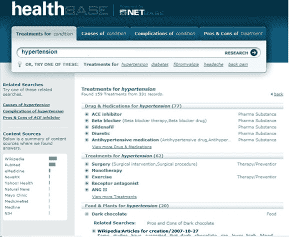

# HealthBase 是终极医疗内容搜索引擎 TechCrunch

> 原文：<https://web.archive.org/web/https://techcrunch.com/2009/09/02/healthbase-is-the-ultimate-medical-content-search-engine/>

# HealthBase 是终极医疗内容搜索引擎

网络上有如此多的健康信息门户，很难判断哪一个是回答医学问题的最佳资源。 [NetBase Solutions](https://web.archive.org/web/20221209140036/http://netbase.com/index.php) 推出了 [healthBase](https://web.archive.org/web/20221209140036/http://healthbase.netbase.com/) ，这是一个强大的语义搜索引擎，它聚合了数百万权威健康网站的医疗内容，包括 [WebMD、](https://web.archive.org/web/20221209140036/http://www.webmd.com/)维基百科、 [PubMed、](https://web.archive.org/web/20221209140036/http://www.ncbi.nlm.nih.gov/pubmed/)和[梅奥诊所的健康网站。](https://web.archive.org/web/20221209140036/http://www.mayoclinic.com/)

HealthBase 使用 NetBase 的[专有搜索智能技术](https://web.archive.org/web/20221209140036/http://www.beta.techcrunch.com/2009/04/22/netbase-offers-powerful-semantic-indexing-platform-that-reads-the-web/)来读取文档中的句子，并从语言上理解内容的含义。因此，healthBase 的搜索引擎可以自动找到任何健康状况或疾病的治疗方法；任何治疗、药物和食物的利弊，等等。

搜索引擎的结果令人印象深刻。当您键入对糖尿病可用治疗方法的搜索时，您会得到按 63 种用于治疗该疾病的药物、70 种常见的糖尿病治疗方法以及 20 种用于治疗糖尿病的合适食物和植物细分的结果。你也可以看到某些治疗方法的利弊。搜索结果出现的速度非常快，会把你带到存放内容和信息的适当网站。

毫无疑问，这是一个有用的网站，可以挖掘网上各种各样的健康信息，但我觉得这个网站有点缺乏人情味。医学信息可能令人望而生畏，而且枯燥无味，但有时最好在网上提供人性化的服务，尤其是在涉及消费者知识的时候。 [Medpedia](https://web.archive.org/web/20221209140036/http://www.medpedia.com/) 是一个很好的例子一个包含大量内容的网站，同时也有社交元素。

但是 healthBase 作为一个医疗内容的聚合器提供了一个有效的目的，并且肯定会帮助那些寻找综合研究工具的人。母公司 NetBase 不会在网站上提供广告服务，但会通过为拥有大型内容数据库的公司提供内部搜索引擎来实现技术盈利。Healthbase 是其技术的公开展示。