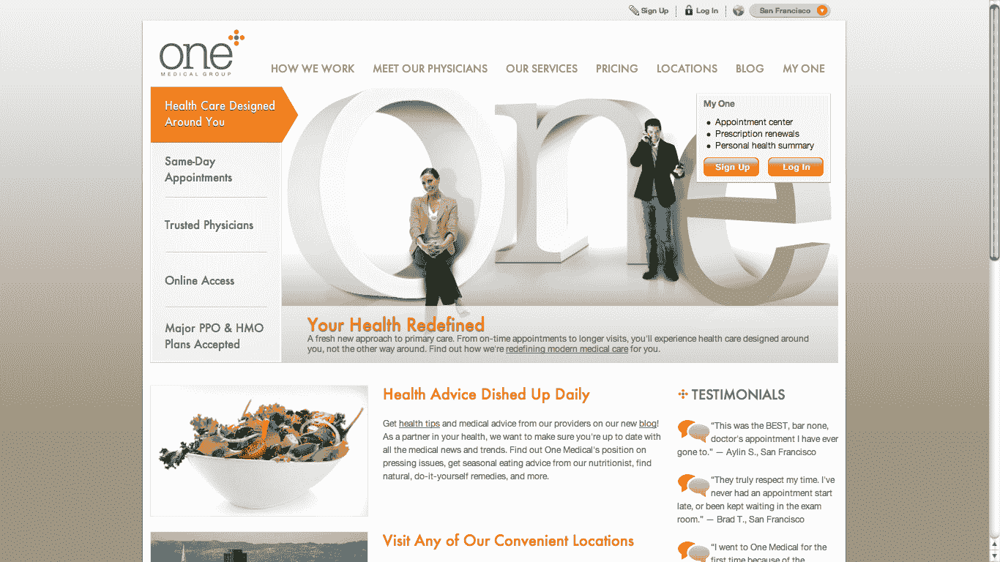

# 医疗保健中断:提供商将利用医疗保健技术实现差异化并产生更好的结果(第二部分)

> 原文：<https://web.archive.org/web/http://techcrunch.com/2011/07/25/healthcare-disruption-providers-will-use-healthtech-to-differentiate-and-produce-better-outcomes-part-ii/>

**编者按** : *这篇客座博文是由曾是 [TechCrunch Disrupt 决赛入围者](https://web.archive.org/web/20230203111123/https://techcrunch.com/2011/05/24/avado-is-the-mint-for-your-personal-health-records/)的健康科技公司[Avado.com](https://web.archive.org/web/20230203111123/https://avado.com/)的首席执行官戴夫·蔡斯撰写的。此前，他是埃森哲医疗保健业务的管理顾问，也是微软健康业务的创始人。你可以在推特上关注他。*

从历史上看，在美国医疗保健系统中，作为医疗保健提供商，使自己与众不同的主要方式是拥有令人印象深刻的有形资产，如新建的诊所/医院/侧楼和医疗设备。当遗留报销模式具有激励性活动(程序、测试、处方)而不是积极的健康结果时，这是合乎逻辑的。任何可以创造更多活动的事情都会创造更多的计费机会。

然而， [DIY 医疗改革运动](https://web.archive.org/web/20230203111123/https://techcrunch.com/2011/04/30/diy-health-reform/)已经认识到有缺陷的付费服务补偿模式是医疗保健恶性通货膨胀的原因。一些最有趣的医疗保健提供商初创公司，如 [MedLion](https://web.archive.org/web/20230203111123/https://techcrunch.com/2011/06/19/the-most-important-organization-in-silicon-valley-that-no-one-has-heard-about/) 、 [National Surgery Network](https://web.archive.org/web/20230203111123/https://techcrunch.com/2011/07/10/hotwire-for-surgery/) 和 [One Medical Group](https://web.archive.org/web/20230203111123/http://www.crunchbase.com/company/one-medical-group-2) 正在使用 IT 而不是昂贵的设备/设施来区分自己，并以可承受的价格提供卓越的健康结果。

在第一部分[医疗保健颠覆:制药 3.0 将推动从生命科学到医疗技术投资的转变](https://web.archive.org/web/20230203111123/https://techcrunch.com/2011/07/23/healthcare-disruption-pharma-3-0-will-drive-shift-from-life-science-to-healthtech-investing-part-i-of-iii/)，我讨论了医疗 IT 如何主要应用于管理功能，如索赔处理，而不是核心临床功能，如决策支持。相比之下，今天的创新医疗保健提供商认识到，医疗保健的不断变化需要从根本上重新思考客户体验，就像许多其他行业一样。

由于三分之一的劳动力是长期自由职业者、承包商、顾问和企业家，个人被迫直接购买医疗保健，而不是像过去那样依赖雇主。随着越来越多的雇主因价格过高而选择不提供医疗福利，直接购买自己医疗保健的人的比例将接近 50%(大多数雇主已经降低了他们覆盖的医疗保险费的比例)。因此，消费主义正以前所未有的方式开始渗透到医疗保健领域。作为回应，提供商网站的审美更为重要。例如，Benchmark Capital-backed[One Medical Group](https://web.archive.org/web/20230203111123/http://www.onemedical.com/sf/doctors)的网站会让[飞利浦·斯塔克](https://web.archive.org/web/20230203111123/http://en.wikipedia.org/wiki/Philippe_Starck)感到骄傲(见下面的截图)。

当然，它需要超越美观的网站。虽然技术在历史上为医疗保健行业带来了不断增长的管理效率，但 Qliance 和 OneMedical 等组织已经利用技术进行了彻底的变革。亚马逊、aQuantive、戴尔、Expedia 和 Benchmark 等风险公司的创始人支持他们并非巧合，这些公司都曾利用技术颠覆整个行业。Qliance 评估了 240 个不同的美国电子医疗系统，然后拒绝了它们，因为它们过于以账单为中心，而不是以患者和健康结果为中心。取而代之的是，Qliance 通过使用现成的和定制的软件定制开发他们的软件系统来创造竞争优势。

前面提到的组织都是颠覆性的创业公司，带来了显著更低的成本和更好的结果。在包括遗留流程和系统在内的更复杂的大型卫生系统层面上发生了什么？让我们看一个来自硅谷中心的例子——[斯坦福医院&诊所](https://web.archive.org/web/20230203111123/http://www.gsb.stanford.edu/phi/events/speakers/tabb.html)。

在某种程度上，对于像斯坦福这样的大型医疗中心来说，采用全面的电子病历系统不再是可选的。然而，Tabb 是第一个同意该组织必须做更多的事情，而不仅仅是吸收这笔巨大的费用作为业务成本。虽然斯坦福大学传统上在医疗界保持着“产品领先”的地位(即提供领先的高质量护理)，但 Kaiser Permanente 等竞争对手正试图通过提供有趣的新护理范式来打破现状，这些范式利用 EMR 作为其基础。

斯坦福医院和诊所正在实施一个传统的医疗 IT 系统，该系统来自领先的医疗 IT 供应商之一——Epic Systems。Epic 的名字恰如其分，因为从各方面来看，它的实现和成本也是 epic。我听说的所有史诗级项目的软件和实现成本都是八九位数。项目的规模听起来类似于早期的 CRM，只有非常大的组织才能实施。CRM 的市场领导者是 Siebel，这些项目经常达到 7 到 9 位数(据报道，Epic 的 Kaiser 实施达到了 10 位数)，这显然是中小型组织无法企及的。

颠覆性的定价并不是来自 Oracle 或其他大型客户端-服务器供应商，以将这一重要类别扩展到较小的组织。相反，它来自基于云的 Salesforce.com，大大降低了成本。也许更有趣的是，Salesforce 创建了一个开放的生态系统，邀请第三方开发人员来解决特定工作职能和行业的广泛客户需求。医疗保健有类似的条件和社区多样性，需要第三方生态系统。我预测，由于传统客户端-服务器 CRM 系统的封闭性为 Salesforce 创造了机会，传统客户端-服务器健康 IT 供应商系统也同样封闭，并将为新一代科技创业公司的现代开放式架构创造机会。

根据定义，遗留系统已经围绕着当今医疗保健普遍存在的有缺陷的收费服务模式进行了优化。相比之下，正在全国各地爆发的颠覆性新医疗和支付模式需要一个新的技术平台生态系统。出于需要，新的医疗保健交付模式需要定制的软件，但随着这些模式达到临界质量，这种情况应该会改变。下一代医疗技术的现成软件市场将会发展起来。

一位制药公司高管向我解释了更加关注医疗技术的必要性。“基于医疗保健领域的‘专利悬崖’和对持续 R&D 的需求，促销预算越来越紧张；技术提供了一种与客户互动的更廉价的方式。与此同时，虽然许多医生办公室一直不愿采用技术，但摆在他们面前的激励措施正在改变他们对技术的看法。制药公司有机会利用这一点。”她继续解释了“不看医生”(即医生通常禁止医药代表与他们会面)如何对通过代表提供的新技术更加开放，从而帮助实现更好的结果。

大型制药公司、健康产品/设备和健康计划组织的新商业模式计划的规模将使这些以前互补的组织日益相互竞争。也许更有趣的是，他们将开始与他们提供产品/服务的医疗保健提供商竞争。科技领域的人对合作竞争的概念很熟悉，但在医疗保健领域，这个词可能不再陌生。正如我们已经看到[媒体变得更像商人](https://web.archive.org/web/20230203111123/https://techcrunch.com/2010/05/08/media-merchants/)一样，我希望我们将看到医疗保健供应商表现得更像供应商。我们已经看到医疗保健提供者成为健康计划。

报纸为医疗保健提供者提供了一个警示。是那些不明显的竞争对手让报业陷入困境。在这个医疗保健中断系列的第三部分中，我将把我今天观察到的卫生系统的行为与 90 年代后半期报纸公司的行为进行比较。考虑到丹麦在过去几十年中转向关注结果的副产品已经导致他们一半的医院关闭，因为根本不再需要它们了。

医疗服务提供者必须彻底改造自己，否则他们将会遭遇与现在已经关闭的丹麦医院相似的命运。他们改造的一个关键部分将由新一代技术解决方案来实现。