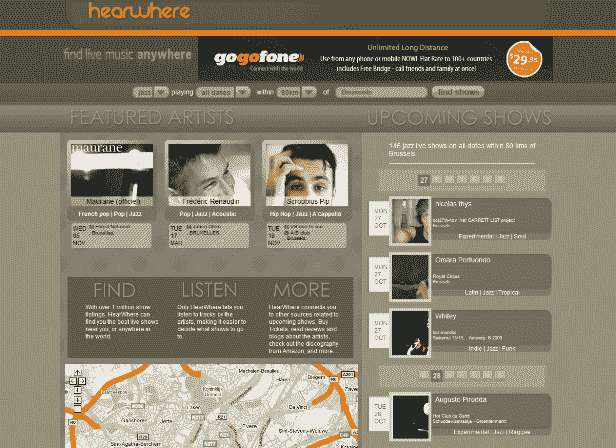

# HearWhere 让您发现附近的现场音乐 TechCrunch

> 原文：<https://web.archive.org/web/https://techcrunch.com/2008/10/27/hearwhere-lets-you-discover-live-music-in-your-neighborhood/>

# HearWhere 可让您发现附近的现场音乐

由皮特·菲尔德创立，总部设在加拿大不列颠哥伦比亚省惠斯勒的 [HearWhere](https://web.archive.org/web/20230204172047/http://www.hearwhere.com/) 是一个现场音乐搜索引擎，于 2008 年 5 月推出，但一直设法保持低调。

现场表演搜索引擎声称列出了超过一百万场音乐表演。这项服务会告诉你谁在附近演奏，还会播放相关的音乐，并随后链接到艺术家的 MySpace 页面。由于与 [Clearspring](https://web.archive.org/web/20230204172047/http://www.clearspring.com/) 的巧妙集成，你可以从艺术家页面添加小部件，并将其重新分发到你在脸书、MySpace、Blogger、Netvibes 和其他地方的账户。目前还不清楚菲尔德计划如何从这项服务中赚钱，但他可能会尝试将广告和 mp3 及门票销售收入相结合。

顶部的搜索栏可以让你根据流派(如果你使用 Safari 或 Chrome，这将不起作用)、日期和地点过滤现场音乐。该网站自动检测您的地理位置，并在您访问时定制列表。这种类型的服务显然也属于移动设备，但不管出于什么原因，Field 已经将与 iPhone 兼容的版本下线。

如果你喜欢现场音乐，你可能想去看看这个网站。类似的服务包括 [Gig Junkie](https://web.archive.org/web/20230204172047/http://www.gigjunkie.net/) 、 [JamBase](https://web.archive.org/web/20230204172047/http://www.jambase.com/) 、 [Madtown Lounge](https://web.archive.org/web/20230204172047/http://www.madtownlounge.com/) 和[bands town](https://web.archive.org/web/20230204172047/http://www.bandsintown.com/)。

