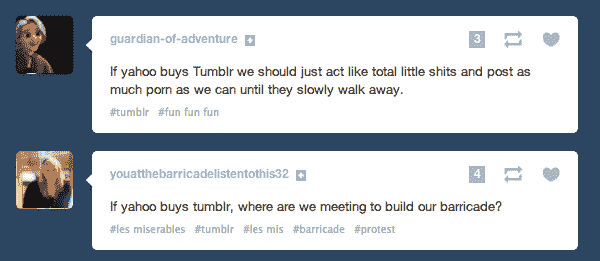
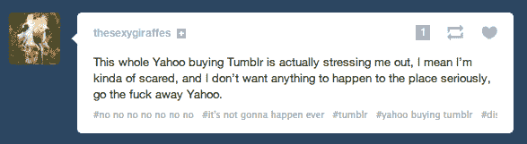
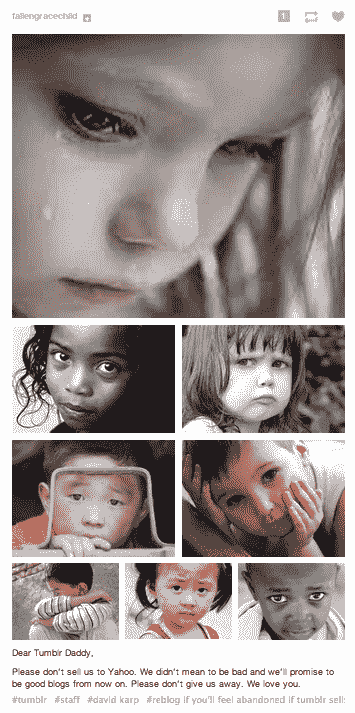
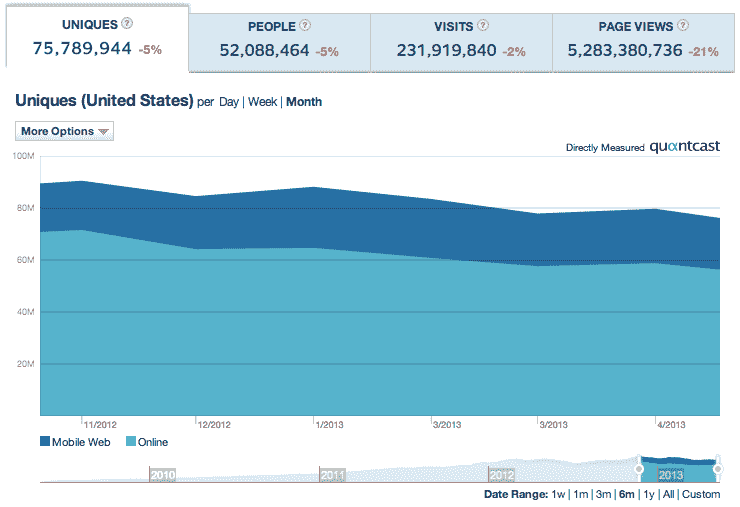

# 当然不会，Tumblr 用户不会去雅虎！TechCrunch

> 原文：<https://web.archive.org/web/https://techcrunch.com/2013/05/18/hell-no-tumblr-users-wont-go-to-yahoo/>

到目前为止，我们都已经听说了雅虎如何试图通过以 10 亿美元收购时尚博客平台 [Tumblr](https://web.archive.org/web/20230326022740/http://www.tumblr.com/) 来获得一些[酷](https://web.archive.org/web/20230326022740/http://allthingsd.com/20130516/will-yahoo-try-to-get-its-cool-again-by-doing-a-deal-for-tumblr/)，但是如果 Tumblr 的用户在售后服务中没有留下来，这可能是一个有争议的问题。

[微软](https://web.archive.org/web/20230326022740/http://www.forbes.com/sites/jeffbercovici/2013/05/17/tumblr-in-talks-with-yahoo-facebook-and-microsoft-also-said-to-be-circling/)和[脸书](https://web.archive.org/web/20230326022740/http://gigaom.com/2013/05/16/yahoo-wants-to-buy-tumblr-will-facebook-swoop-in-at-the-last-minute/)可能试图在雅虎之前采取行动，Tumblr 可能[逐渐接近现金耗尽](https://web.archive.org/web/20230326022740/https://techcrunch.com/2013/05/17/tumblr-is-not-impressed/)，并且(尽管如此)可能不害怕玩一点[强硬手段](https://web.archive.org/web/20230326022740/https://techcrunch.com/2013/05/17/tumblr-is-not-impressed/)。但有一件事你没怎么听说过:Tumblr 的用户几乎普遍对该网站可能被雅虎收购的消息感到不满。他们可能会让他们的手指说话，走路。

在 Tumblr 上搜索“雅虎”，你会得到一连串的痛苦，偶尔夹杂着一点无奈的辞职，以及一些呼吁行动主义的声音。不情愿接受的声音(通常是因为前面提到的现金状况)或任何类似积极的声音很少。没有十足的热情。

(爸爸！)[自己看](https://web.archive.org/web/20230326022740/http://www.tumblr.com/tagged/yahoo)。

这是一个延伸到 Tumblr 的一些老用户的问题。

“如果 Tumblr 去了雅虎，我会认真考虑把我的个人博客转移到 Medium，如果可能的话，”TC 的联合编辑 Alexia 告诉我。自 2009 年 6 月起，她就在 Tumblr 上开了一个博客，虽然她不属于令人垂涎的 18-24 岁年龄段，但却是另一批重要用户的重要代表:数字影响者。“我不知道具体为什么，但我的 Tumblr 是我身份的一部分。不管出于什么原因，我都不想认同雅虎。”

一些人试图发起请愿活动，目标是 500 万个签名，尽管其他人对这是否真的会有任何效果持怀疑态度。

用户流失是不容忽视的，尤其是当它被网站上更广泛的使用趋势所支撑的时候。

当我在 1 月写了一篇关于 Tumblr 作为一个企业的下一步可能是什么的帖子时(它关注的是如何赚钱；我注意到，在 2012 年 12 月的前一个月，它在全球有 1.67 亿的访客和近 180 亿的浏览量(Quantcast 数据)。然而，过去六个月的趋势是下降的:在美国，页面浏览量下降了 21%，至 53 亿，uniques 下降了 5%，至 7600 万。[全球](https://web.archive.org/web/20230326022740/http://www.quantcast.com/p-19UtqE8ngoZbM?country=GLOBAL)情况有所好转，但仍未增长:浏览量下降了 4%；独一无二的下降了 3%。

不是一艘沉船，也不是一艘轻快的小快艇。[雅虎的 MySpace](https://web.archive.org/web/20230326022740/http://news.cnet.com/8301-1023_3-57585157-93/could-tumblr-turn-into-yahoos-myspace/) ，的确。

图片来自 [Tumblr](https://web.archive.org/web/20230326022740/http://abnormal-angel.tumblr.com/post/50755906424/tumblr-is-looking-to-be-bought)