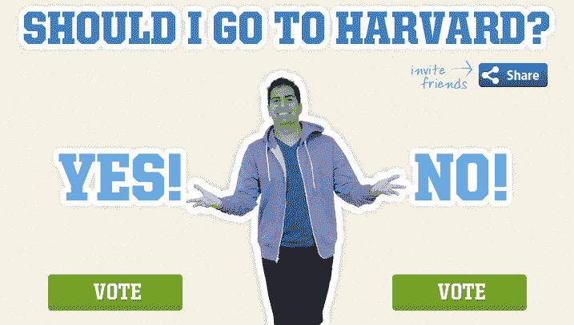

# 帮助这位企业家在哈佛和他的创业公司之间做出选择(在此投票)

> 原文：<https://web.archive.org/web/http://techcrunch.com/2011/08/08/help-this-entrepreneur-decide-between-harvard-and-his-startups-vote-here/>

有时候，当面临一个重要的决定时，抛硬币让机会决定结果是不行的。相反，当生活把我们带到一个十字路口，两条路分叉，似乎都可以走，我们通常会求助于家人、朋友和信任的顾问来帮助我们面对事实，做出最佳选择。或者我们中的一些骑士可能会选择[“神奇 8 球”](https://web.archive.org/web/20230209035835/http://en.wikipedia.org/wiki/Magic_8-Ball)方法。当然，在我们拥有脸书墙、Twitter 流和投票网站的数字时代，重要的生活决策现在可以考虑我们的社交图——或者通过一些快速的在线众包方式做出，这是非常合适的。

后一种方法是[迈克·莫拉迪安](https://web.archive.org/web/20230209035835/http://www.crunchbase.com/person/mike-moradian)考虑到他目前面临的一个非常棘手的决定而采取的方法。去年 12 月，莫拉迪安被哈佛商学院(Harvard Business School)录取，这让他成为许多有抱负的研究生企业家和商人羡慕的对象。哈佛商学院在几乎所有追踪排名的出版物中都一直排在前五名，拥有一批著名的校友，是任何简历中的骄傲。

另一方面，[莫拉迪安](https://web.archive.org/web/20230209035835/http://twitter.com/#!/mikemoradian)是 [CampusBuddy](https://web.archive.org/web/20230209035835/http://www.crunchbase.com/company/campusbuddy) 和 [CollegeBudget](https://web.archive.org/web/20230209035835/http://www.crunchbase.com/company/collegebudget) 的创始人，这两个[我们已经在](https://web.archive.org/web/20230209035835/https://techcrunch.com/2008/10/17/campusbuddy-hands-over-campus-grading-records-to-students/)[多次报道过](https://web.archive.org/web/20230209035835/https://techcrunch.com/2009/09/03/campusbuddy-gets-a-facelift-and-more-social-skills-in-time-for-the-new-school-year/)，包括最近推出的后者[。](https://web.archive.org/web/20230209035835/https://techcrunch.com/2011/08/01/collegebudget-brings-daily-deals-and-group-buying-to-campuses/)

CampusBuddy 为大学生提供了一个社交平台，他们可以在这里访问官方成绩记录，查看关于教授、班级、院系和校园的综合评论，目前声称每月活跃用户超过 20 万，总数超过 150 万，这家初创公司的收入在去年翻了两番。随着团购和每日交易的巨大流行，上周推出的将这两种东西带到全国大学校园的 [CollegeBudget](https://web.archive.org/web/20230209035835/https://collegebudget.com/national/users/subscription) ，可能会有很长的寿命和几美元的潜在收入。

尤其是 CollegeBudget，是 Moradian 最感兴趣的；他说，这真的是他考虑不去哈佛的主要原因，因为这是一个需要大量跑腿工作才能建立合法业务的想法，而 CampusBuddy 更稳定。

因此，人们可以开始看到，莫拉迪安面前确实有一个艰难的选择:他是离开自己的创业公司，进入哈佛的 MBA 课程，还是遗憾地拒绝哈佛的邀请，帮助他的企业发展成为价值数百万美元的企业？

被彭博商业周刊评为 2010 年[美国最佳年轻企业家的莫拉迪安告诉我，他知道他不能两者兼得；如果他试图分割他的时间，他将对他的创业公司和哈佛造成伤害。所以，他决定通过众包将决定权交给大众。无论观众做出什么决定，他都会坚持他们的选择。他对此很认真，因为他知道自己很幸运首先有这个选择。](https://web.archive.org/web/20230209035835/http://www.businessweek.com/smallbiz/content/oct2010/sb20101027_160093.htm)

他在这个登陆页面上开放了投票，所以用户可以在这里投票[。Moradian 上周向 CollegeBudget 用户开放了投票，超过 2 万人投了票。到目前为止，53%对 47%的人支持哈佛。](https://web.archive.org/web/20230209035835/http://collegebudget.com/national/pages/shouldigotoharvard)

鉴于美国最近关于高等教育功效的辩论，Moradian 众包这一选择的决定尤其有趣。早在 4 月，TC 的 Sarah Lacy 写了一篇文章，详细介绍了彼得·泰尔关于高等教育如何成为当前下一个泡沫的[想法，以及他创立的“Thiel Fellowship ”,该基金在财务和概念上鼓励年轻人“停止”学业，追求他们的创业和创新梦想。项目本身以及泰尔基金会固有的想法激起了一些激烈的争论，包括来自维韦克·瓦德瓦](https://web.archive.org/web/20230209035835/https://techcrunch.com/2011/04/10/peter-thiel-were-in-a-bubble-and-its-not-the-internet-its-higher-education/)的[和](https://web.archive.org/web/20230209035835/https://techcrunch.com/2011/04/12/friends-don%E2%80%99t-let-friends-take-education-advice-from-peter-thiel/)[泰尔奖学金获得者戴尔·斯蒂芬斯](https://web.archive.org/web/20230209035835/https://techcrunch.com/2011/04/13/living-the-knowledge-life-a-thiel-fellowship-finalists-response/)的回应。

至于莫拉迪安，他明白不断上涨的教育成本和难以获得教育是美国年轻人面临的最大问题之一，留在他的创业公司将有助于他做到这一点。然而，当哈佛给你发来一封录取通知书，随之而来的是一种内在的承诺，即以正确的方式接受更好的教育，以解决这些大问题，很难说“不”。

那么，你会怎么做？你认为摩拉迪安应该怎么做？在这里投票[，并在下面的评论中告诉我们。](https://web.archive.org/web/20230209035835/http://collegebudget.com/national/pages/shouldigotoharvard)

