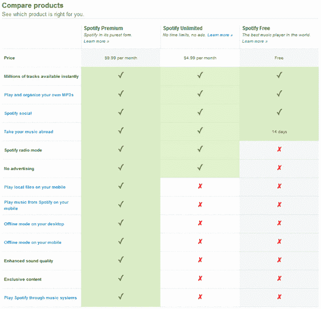

# Spotify 来了！音乐流媒体服务正式登陆美国 

> 原文：<https://web.archive.org/web/http://techcrunch.com/2011/07/14/heres-spotify-the-music-streaming-service-officially-lands-in-the-us/>

# Spotify 来了！音乐流媒体服务正式登陆美国

等待终于结束了！Spotify 是欧洲最受欢迎的音乐服务，刚刚在美国推出。这不应该太令人惊讶，因为该公司昨天已经发来了预告。但现在，它已经完成了离线模式、移动收听、独家内容，是的，甚至还有一个有限但仍然免费的用户模式。

正如所料，有三个服务级别，包括免费服务计划，显然是为了吊你的胃口而设计的。每月 5 美元可以让用户在电脑上无限制、无广告的收听时间，10 美元的计划增加了移动服务、独家内容和离线模式。但是不要觉得自己需要马上交出信用卡。有一个广告支持但免费的服务让你开始。

【T2

Spotify 此前表示，如果没有这项免费服务，他们不会在美国推出；这很重要。免费账户每月只限于 10 个小时，并有广告。另外，免费帐号现在只能被邀请，这似乎很难获得。稍后会详细介绍。

但是剩下的服务已经准备好了！[只需选择](https://web.archive.org/web/20230203033815/http://www.spotify.com/us/get-spotify/overview/)5 美元或 10 美元计划，填写付款信息，您就可以立即开始播放音乐了。

【YouTube = http://www . YouTube . com/watch？v=CvYX_P_c__8&w=640&h=390]