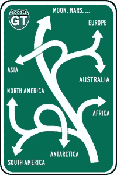
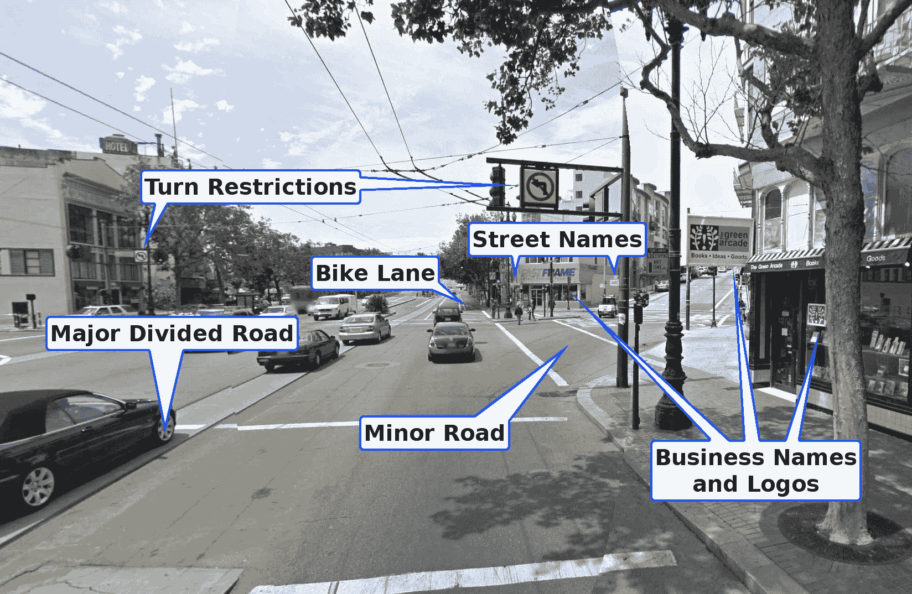
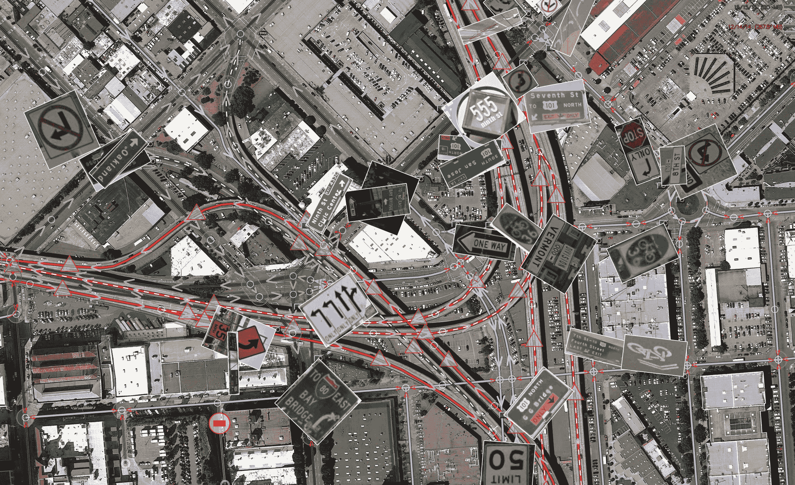

# 以下是制作谷歌地图的过程，苹果能重新计算吗？

> 原文：<https://web.archive.org/web/https://techcrunch.com/2012/09/23/heres-what-goes-into-making-google-maps-will-apple-be-able-to-recalculate/>

上周，无论你走到哪里，都有另一个关于 iOS 6 地图的故事。有些人觉得这是苹果的一个伟大的新方向，但像我这样的人觉得我们留下了一个丑陋的经历，在目前的状态下，本不应该向公众介绍。

是的，谷歌地图在 iOS 6 中被移除了，但我们知道这一点已经有一段时间了。我们不知道的是，从第二批开发人员开始修补操作系统到发布那天，苹果不会对自己的产品做出任何实质性的改进。

当我第一次尝试在第一个开发者版本中使用苹果地图时，感觉非常粗糙，没有经过深思熟虑。这对苹果来说很罕见，所以我认为情况会好转。可悲的是，他们没有。

自近八年前推出以来，谷歌地图一直是地图领域的主要参与者。我不知道是什么制造了这个产品，或者更重要的是，让产品保持最新。幸运的是，这个团队允许我像最近其他一些[出版物](https://web.archive.org/web/20230306165911/http://www.bbc.com/news/technology-19536269)一样看一眼它的流程，但是更多一点。

当你听该公司发言时，它重申其“组织世界信息”的使命，但它很少谈论该组织实际上是如何发生的。我看了一眼，印象非常深刻。苹果能很快赶上吗？让我们看看，好吗？

### 融合虚拟世界和现实世界

在我[与谷歌搜索团队](https://web.archive.org/web/20230306165911/https://techcrunch.com/2012/09/09/google-search-a-discussion-about-the-past-present-and-future-with-jack-menzel/)的杰克·门泽耳坐下来之后，他向我介绍了产品是如何发展的，以及对未来的计划和想法。周五，我和地图团队做了同样的事情。这两款产品都在改变我们与周围物理世界的互动方式。

 这一切都始于一个名为“地面真相”的项目，这是谷歌地图的团队将所有 1300 个地图数据来源合并成一个我们今天在网络和手机上看到的可消费产品。这不是一个简单的过程，但这是一个非常棘手、复杂而又充满常识的过程。

想象一下，从世界上每一个地形信息来源获取垃圾文件，然后必须为服务于数百万用户的世界级系统进行标准化。它是复杂的，多层次的，令人印象深刻。

我与谷歌地图产品的工程负责人迈克尔·韦斯-马利克进行了交谈，他向我展示了谷歌内部用来整合所有信息的系统。它叫 Atlas，让我想起了 Photoshop。

该公司获得的每条信息都变成了各种各样的“层”，可以放在将成为完整地图的顶部。看一个人使用系统和看一个设计师使用 Photoshop 是一样的。有时会有按键、快捷键和系统问题。还有许多算法支持所有这些活动。

维斯-马利克是这样总结谷歌地图的:

> 如果你想制作一张地图，现在你要做的就是从供应商那里收集尽可能多的数据源:地理编码、水体、公园。你没想过的事情。甚至邮政编码。真的有无穷无尽的事情。所有的数据都有点不完美，所以我们用东西来纠正这一点，以吐出一个更高质量的产品。

听起来很简单，对吧？一些其他出版物可能会让你相信这一点，但在幕后有无数的过程在进行，包括在全球看到之前对每一个变化进行双重和三重检查。

作为一家正在改变道路的公司，在*犯一个错误*，就可能给某人带来严重的问题或危险。

如果有人正在探索美国的一条新的主要城市道路，他们必须使用谷歌的所有工具，包括街景，以准确记录每一个细节。我说的是正确的标志和所有东西的链接。想想看，这些数据是向你，也许是你的车显示要去哪里的，所以它的正确和彻底是非常重要的。

让我们来看看 Atlas 让运营商做了什么，以确保谷歌拥有的所有地图数据都是更新和正确的:

这是他们在这个过程后得到的结果:

维斯-马利克认为，像这样的交叉路口是一件非常棘手的事情:

> 这就是街景非常关键的地方。这是一个简单的十字路口。我们检查所有的十字路口，决定哪里可以转弯，哪里不可以转弯。我们的操作跳转到 3D 模式，所以你可以看到你在编辑什么。抓住一个“不要回头”的标志作为“观察”，当你在系统中移动时给自己留下痕迹。

如果有什么地方操作员不太明白，而这条路是加州某处的一条主干道，他们可以申请一张罚单，再次派出一辆街景车去勘察该地区。它是如此的高效，而且经过加工处理。

### 将这些点连接起来

“绘制整个世界的地图”，正如团队中的每个人告诉我的那样，包括筛选疯狂的数据，浏览数 Pb 的照片和卫星图像，然后当然提供稳定的服务，尽可能扩展。哦，让我们不要忘记谷歌通过公共 API 提供所有这些。

就目前情况而言，该团队每两周推出一次新的图像，很多图像。由于该公司现在更少依赖第三方信息和图像，它不必等待很长时间来验证和推送新信息。在美国，有时需要长达 18 个月的时间来完善一个城市，但现在几个小时就可以完成。

对谷歌来说，把这些点连接起来是一件大事，是对室内地图的新关注。比方说，当你在旧金山国际机场时，告诉你去哪里是谷歌工程师的一个困扰。根据该团队的说法，你永远不应该想知道你在哪里。

维斯-马利克股份公司:

> 我们从商业中心、购物中心等获取平面图。我们把它们放进地图里。这里有步行道，就像普通地图一样，我们也标出了浴室和自动扶梯。这些是让你到达机场登机口的“内部驾驶指南”。这种体验现在在移动设备上也有了。

### 谷歌地图的未来

我还和谷歌地图和地球副总裁 Brian McClendon 聊了聊，他告诉了我自从把 Keyhole 卖给谷歌后他在谷歌的经历。Keyhole 当然变成了我们现在所知道的 Google Earth。

我问麦克伦登谷歌是如何进行收购的:

> 谷歌的创始人在 2004 年兴奋不已。他们来见了我们，并提出购买。他们上市前的估值非常疯狂，我们对此非常紧张。我们这么做的原因是谷歌有两样东西我们没有，规模和数据。拉里(佩奇)愿意当场给我们写一张购买卫星图像的支票。

在此期间，一个小团队正在开发谷歌地图。这个团队包括前谷歌和脸书员工布雷特·泰勒。地球和地图团队共同努力使谷歌的数据正常化，这样两个产品都可以使用它。该流程现在允许整个公司即时扩展需要位置信息的一切。

未来呢？麦克伦登对我相当坦诚:

> 地图数据从来都不是完美的；我们要努力接近“完美”如果你离得不够近，人们会感到沮丧。如果你真的很亲密，人们会更依赖它。
> 
> 对谷歌来说，下一个层次是偶然发现。我们应该根据位置、搜索、朋友、喜欢和一天中的时间，为您提供您关心的最佳体验。这是近期必须具备的，它依赖于数据、覆盖面和质量。

### 苹果:他们能打赢位置战吗？

显然，苹果决定将谷歌地图从其手机操作系统中撤出是有原因的。这可能是一个真正合理的商业理由，由于两家公司之间糟糕的业务往来，它的推进速度略快于预期。

这真的很不幸，因为受害的是像你我这样的消费者。我有一部 iPhone 5 正在路上。我现在已经使用苹果的地图应用几个月了，我对它的未来并不感到兴奋。尽管该公司表示，随着越来越多的人使用它，它会变得更好，但感觉还不到半生。

谷歌对自己的原生 iOS 6 地图应用的进展只字不提。一个字也没有。有些人说它会在 12 月前[上市，但是当我和我的更多消息来源谈过之后，我觉得公司并不是为了“发布一些东西”而绊倒自己的](https://web.archive.org/web/20230306165911/https://techcrunch.com/2012/09/20/crap-maps/)

毫无疑问，iOS 6 将会有一个原生的谷歌地图应用，但在它准备好击败苹果之前不会推出，因为这是谷歌给人们一个真正的可口可乐与百事可乐测试的唯一机会，看看他们想用什么来导航全球。

这是件大事。

你永远也不想说永远，尽管苹果公司在仓促决定将谷歌地图从其产品中撤出后，似乎还有很长的路要走。谷歌显然已经很好地掌握了地图，但就连谷歌也承认，它还不够“完美”。为了实现这一目标，苹果似乎要做一些它过去做过的事情:[通过雇佣别人来抄袭别人的东西](https://web.archive.org/web/20230306165911/https://techcrunch.com/2012/09/23/source-apple-aggressively-recruiting-ex-google-maps-staff-to-build-out-ios-maps/)。

正如史蒂夫·乔布斯曾经说过的:

> 毕加索有一句话——“好的艺术家临摹，伟大的艺术家偷窃”——我们总是无耻地偷窃伟大的想法。

这一次，看起来苹果不仅仅是在试图窃取创意，它可能是在试图窃取背后的流程和技术工人。不过，谷歌在这些过程中表现得很透明，这有点可笑，是吧？这是他们说“来抓我们”的方式至于我在访问期间的其他所见所闻，敬请关注。

现在，我只想问你这个问题:

苹果能比谷歌更快“完美”吗？

[图片来源: [Flickr](https://web.archive.org/web/20230306165911/http://www.flickr.com/photos/timsnell/1598770905/sizes/z/)