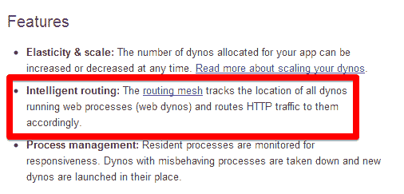

# 在受到说唱天才的批评后，Heroku 承认在过去的三年里，他的表现一直在下降

> 原文：<https://web.archive.org/web/https://techcrunch.com/2013/02/14/heroku-admits-to-performance-degradation-over-the-past-3-years-after-criticism-from-rap-genius/>

# 在受到说唱天才的批评后，Heroku 承认在过去的 3 年里他的表现下降了

流行的云应用平台 Heroku 可能没有三年前那么快了。昨天，[说唱天才](https://web.archive.org/web/20230328231607/http://rapgenius.com/)詹姆斯·萨默斯(James Somers)在[发表了一篇被广泛阅读的博文](https://web.archive.org/web/20230328231607/http://rapgenius.com/James-somers-herokus-ugly-secret-lyrics)，称 Heroku 在过去几年的某个时候悄悄改变了将 Ruby on Rails 应用程序的任务分配到亚马逊 EC2 机器上的方式，而没有提醒开发者这一变化。Somers 认为，Heroku 没有像早期那样智能地将请求路由到下一个可用的服务器，而是随机分发请求，导致排队时间增加。今天，Heroku 的总经理柳文欢·泰奇[承认确实如此。](https://web.archive.org/web/20230328231607/https://blog.heroku.com/archives/2013/2/15/bamboo_routing_performance/)

“我们没能解释我们的产品是如何工作的，”泰奇今晚写道。“我们未能帮助我们的客户进行扩展。我们辜负了整个社区。我想亲自道歉，并承诺解决这个问题。”根据他的说法，Heroku 的用户确实“在过去的 3 年里，随着我们规模的扩大，经历了性能的下降。”他写道，Heroku 的目标是成为所有开发者的最佳平台。“在这种情况下，我们没有成功。但我们会让它恢复正常。”

Teich 承诺，明天，该公司将发布一份深入的技术评论，并且该公司也将很快向开发者提供一张更清晰的图片，展示他们的应用程序的 web 请求队列的真实情况。他还承诺，Heroku 将更新其文档，并为开发人员提供工具，以了解如何提高其应用程序的性能。

对于 Rap Genius 这样的网站，性能下降尤其明显，这些网站使用了大量所谓的 Heroku“dyno”，这些 dyno 本质上是按需定制的 Amazon EC2 实例(有 web 和 worker dynos，但这里的问题似乎只影响 web dynos)。在其当前的[文档](https://web.archive.org/web/20230328231607/http://www.heroku.com/how/scale)中，Heroku 暗示它使用[智能伸缩](https://web.archive.org/web/20230328231607/https://devcenter.heroku.com/articles/http-routing)将 web 请求路由到下一台可用的机器。然而，正如 Somers 发现的那样，这种分布实际上是随机的，这意味着即使有当前空闲的 dynos 可用，许多请求也可能在队列中结束。

Heroku 每月向[收取 35 美元](https://web.archive.org/web/20230328231607/http://www.heroku.com/pricing#2-1)的费用，这位快速成长的说唱天才目前每月支付约 2 万美元，在该平台上运行其大部分关键的 it 基础设施。要深入了解 Rap Genius 如何使用 Heroku，以及 Somers 是如何发现 Heroku 的，请从繁忙的日程中抽出一些时间，在这里阅读他的帖子。