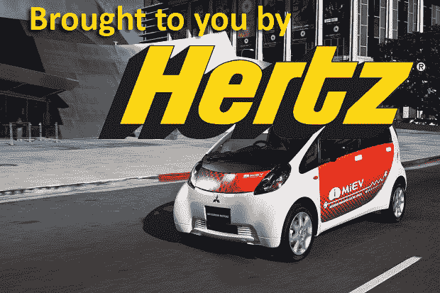

# 赫兹宣布投资租赁汽车设施的太阳能系统 

> 原文：<https://web.archive.org/web/https://techcrunch.com/2011/02/10/hertz-announces-investment-in-solar-systems-at-rental-car-facilities/>

# 赫兹宣布投资租赁汽车设施的太阳能系统

赫兹最近通过出租[电动汽车做出了一些绿色举动。](https://web.archive.org/web/20221209013551/http://www.crunchgear.com/2010/09/22/hertz-will-offer-electric-vehicles-most-likely-at-a-premium/)现在，他们通过在特定地点安装太阳能电池板，将绿色运营提升到一个新的水平。第一阶段包括用 2.3 兆瓦以上的太阳能系统改造 16 个现有设施，并在 2011 年第三季度投入运行。去年 12 月，赫兹在丹佛国际机场开展了试点项目。他们安装了一个 1018 面板、235 千瓦的太阳能电力系统，预计每年可产生 342，766 千瓦时的交流输出，抵消约 650，000 磅的二氧化碳。

另外，别忘了报名参加我们的赠品活动。你可以赢得赫兹的[电动汽车爱情约会。](https://web.archive.org/web/20221209013551/http://www.crunchgear.com/2011/02/01/valentines-giveaway-new-york-readers-win-an-electric-car-love-date-from-hertz/)

**新闻稿**

赫兹启动太阳能计划
赫兹引领太阳能行业——2011 年进一步扩张

新泽西州帕克里奇——2011 年 2 月 10 日——赫兹公司(纽约证券交易所代码:HTZ)宣布，在该公司太阳能计划的第一阶段，将在美国 16 个地方安装超过 2.3 兆瓦的太阳能光伏系统。

“赫兹致力于降低成本和可持续的商业实践。董事长兼首席执行官 Mark Frissora 表示:“为这些设施投资太阳能具有良好的商业意义。“我们现在将在美国和国际上寻找更多的设施来推进这一重要项目。赫兹在创新承诺方面再一次引领了行业潮流。”

赫兹已经完成了位于丹佛国际机场的 235 千瓦太阳能电力系统的建设。该系统预计将产生 342，766 千瓦时的交流电输出，并将每年抵消约 650，000 磅的二氧化碳。

到 2011 年第三季度，赫兹将在美国完成 15 个额外设施的建设，以进一步降低能源成本，抵消赫兹的碳足迹。赫兹正在亚利桑那州、加利福尼亚州、科罗拉多州、乔治亚州、马里兰州、马萨诸塞州、新泽西州、纽约州和宾夕法尼亚州安装太阳能系统。

赫兹的高级副总裁理查德·布鲁姆说:“赫兹在可持续实践方面处于行业领先地位。“从我们对电动汽车和其他低排放汽车的承诺，到我们对减少用水量的实施，以及现在我们的太阳能计划，我们都站在将良好的环境实践与亲消费者服务、效率和增长战略相结合的最前沿。”

关于赫兹
赫兹是全球最大的机场通用汽车租赁品牌，在全球 146 个国家的 8，500 多个地点运营。赫兹是美国和欧洲 81 个主要机场的头号机场租车品牌，在北美、欧洲、拉丁美洲、亚洲、澳大利亚和新西兰的城市和机场经营公司和特许经营场所。该公司还在美国的 26 个机场运营 Advantage 汽车租赁品牌，并在纽约市、柏林、伦敦、马德里、墨尔本和巴黎运营全球汽车共享俱乐部 Connect by Hertz。此外，Hertz 经营着世界上最大的设备租赁公司之一 Hertz Equipment Rental Corporation，该公司在美国、加拿大、中国、法国、西班牙和意大利的大约 325 个分支机构提供各种租赁设备，包括工具和耗材以及新旧设备。