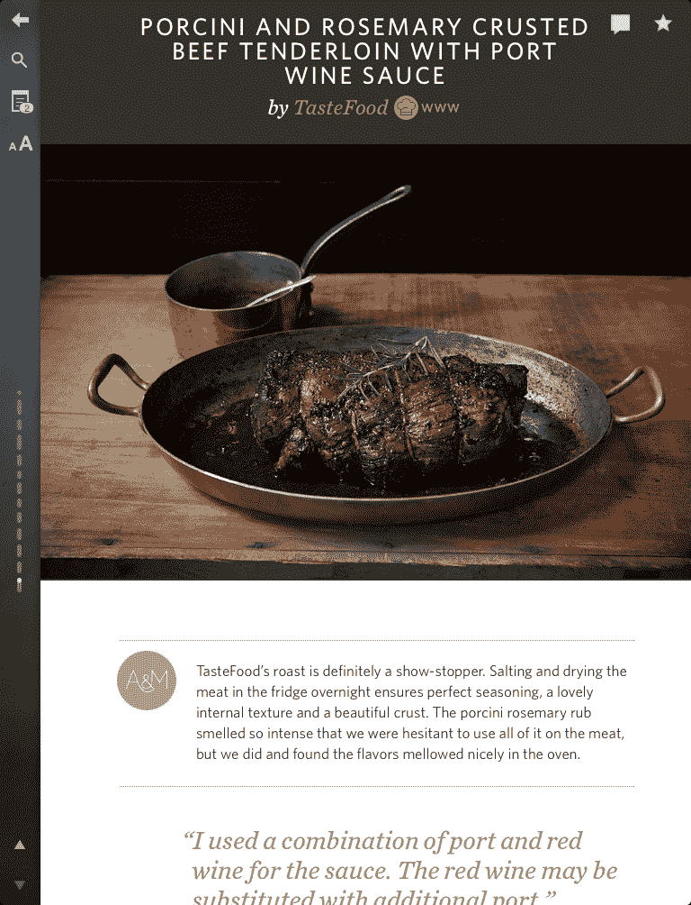

# Amanda Hesser 的 Food52 在 iPad 上发布了一本假日食谱 

> 原文：<https://web.archive.org/web/https://techcrunch.com/2011/11/17/hesser-food52-cookbook-ipad/>

# 阿曼达·海瑟的《美食 52》在 iPad 上发布了一本假日食谱

两年前,《纽约时报》( New York Times )( New York Times )( New York Times )( New York Times )( New York Times )( New York Times )( New York Times )( New York Times )( New York Times )( New York Times )( New York Times )( New York Times )( New York Times )( New York Times )( New York Times )( New York Times )( New York Times)的)美食评论家阿曼达·黑瑟(Amanda Hesser)和她的联合创始人梅里尔·斯塔布斯(Merrill Stubbs)发起研究和撰写这本食谱花了 52 周，但在出版前又花了整整一年。当他们完成第二本烹饪书(尚未出版)时，他们确信一定有更好的方法。这就是:iPad。

两人在几个月的时间里编写了一本名为*food 52 Holiday Recipe&Survival Guide*的数字食谱，现在在 iTunes 上售价 9.99 美元。我最近在曼哈顿的一家三明治店遇到了 Hesser，她带我看了一段 iPad 应用程序的演示，你可以在上面的视频中看到。

这本食谱建立在红杉支持的数字教科书平台之上。它包含 75 种假日食谱，有令人垂涎的图片和说明，从如何腌制火鸡到如何制作姜饼屋。

如果你对某事有疑问，你可以点击热线按钮，它将被转到 Food52 网站的问答部分，其他读者可以回答他们。该公司还为 iPhone 发布了一款 [Food52 热线应用](https://web.archive.org/web/20230203222823/http://itunes.apple.com/us/app/food52-hotline/id479689597?mt=8)，该应用仅包含 Q & A 功能。

