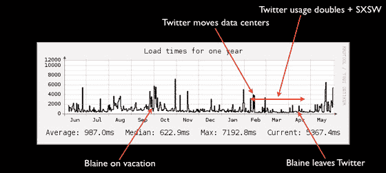

# 嘿 Twitter 我也有几个问题 

> 原文：<https://web.archive.org/web/https://techcrunch.com/2008/05/31/hey-twitter-i-have-a-few-questions-too/>

# 嘿，推特，我也有几个问题

最近，Twitter 一直在清理门户，筹集资金，做[采访](https://web.archive.org/web/20230213174030/https://techcrunch.com/2008/05/30/scoble-interviews-twitter-founders-evan-willams-and-biz-stone/)，并实际上与用户交谈。在上周的一篇博文中，他们做了一个问答环节，直接回答了关于 Twitter 的架构(T4)的问题。

所以我也有几个问题，是基于我和一些说见过 Twitter 架构的人的讨论。

*   你只有一个主 MySQL 服务器运行复制到两个从服务器，当主服务器关闭时，架构不会自动切换到热备份，这是真的吗？
*   您真的有三台物理数据库机器来驱动所有的 TWITTER 吗？
*   让 Twitter 保持活力的唯一方法是让某人坐在那里不断地观看它，然后在其中一个从属服务器出现故障时手动切换数据库并重建，这是真的吗？
*   这就是为什么你的大部分重大停机都可以追溯到前首席架构师/服务器观察者布雷恩·库克不在的时候吗？
*   鉴于库克被解雇后 Twitter 在 5 月份出现了创纪录的宕机，有人有能力让 Twitter 继续运营吗？
*   要多久你才能[消除库克对 Twitter 和社区造成的损害？](https://web.archive.org/web/20230213174030/http://dev.twitter.com/2008/05/twittering-about-architecture.html)

**更新:** Twitter 继续对批评做出恼人而有建设性的回应。他们[在这里](https://web.archive.org/web/20230213174030/http://blog.twitter.com/2008/05/its-not-rocket-science-but-its-our-work.html)回复这个帖子，说“我们正在开发一个更好的架构。”当你不能激怒他们的时候，就像是把气球里的空气抽走了。