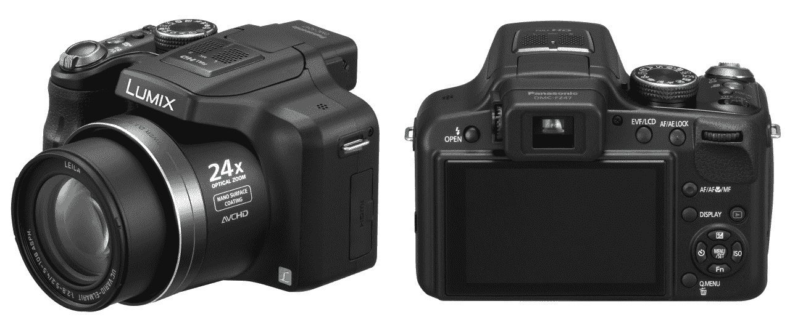
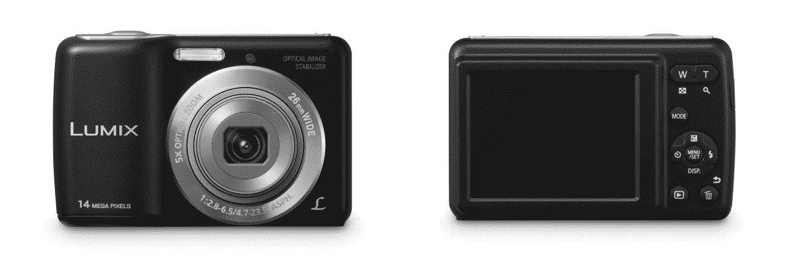

# 嘿，两台来自松下的新相机 TechCrunch

> 原文：<https://web.archive.org/web/http://techcrunch.com/2011/07/21/hey-two-new-cameras-from-panasonic/>

# 嘿，两台来自松下的新相机

相机制造商喜欢随机宣布事情——完全没有方法。我们可能一晚上得到 10 个，或者连续 10 周每周得到 1 个。有时它们成双成对出现，就像松下的这些:一个新的超级变焦和一个傻瓜相机，两者都没有太大的区别，但也许其中一个会有适合你的功能组合。

* * *

【T2

FZ47 是他们的新超级变焦镜头，具有 24 倍变焦和 1210 万像素的传感器。它专注于动作摄影，所以快速启动和一次拍摄大量照片是它的优先事项。在全分辨率下，它每秒可以拍摄 3.7 帧，但不幸的是，高帧率(10 fps)拍摄会将图片大小降至 300 万像素。有趣的是，在录制视频时，你可以手动设置曝光和快门——甚至更复杂的相机偶尔也不会提供这种功能。售价 400 美元，但由于这款设备只能拍摄 1080i 的视频，我无论如何都不会推荐它。原则上我不推荐任何记录交错视频的东西。继续前进，然后…

LS5 更实用一点。它有一个相当不错的 26 毫米 F/2.8 镜头，在 1410 万像素的传感器上有 5 倍变焦。它具有光学防抖功能，可拍摄 720p 视频。它使用 AA 电池——你知道，有些人喜欢这样。这实际上是所有值得一提的功能。还没有价格信息，但如果我是你，我不会为它支付超过 150 美元。

FZ47 将于下月上市，但 LS5 要到 11 月才会上市。我想我等不了那么久！甜蜜的 LS5，现在来找我吧！毫无疑问，一旦准备好，它们就会出现在松下的 Lumix 网站上。