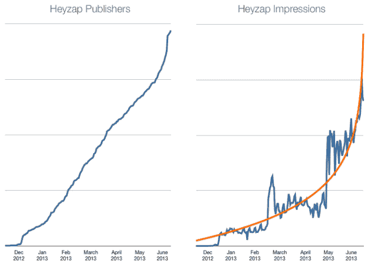

# Heyzap 表示，其移动广告网络已经增长到 800 款游戏(占其收入的大部分)

> 原文：<https://web.archive.org/web/https://techcrunch.com/2013/06/14/heyzap-ad-growth/>

# Heyzap 表示，其移动广告网络已经增长到 800 款游戏(并占其收入的大部分)

早在三月份，我就写过 Heyzap 如何将广告引入其手机游戏平台。现在，联合创始人 Jude Gomila 表示，该公司已经成为移动广告领域的重要参与者。

具体来说，Gomila 发送了一张图表，显示了 Heyzap 广告出版商的增长以及过去六个月广告印象的相应增长。你不能确切地说出现在的情况，因为图表上没有 Y 轴。然而，Gomila 确实注意到 Heyzap 广告现在在 800 个游戏中运行(3 月份是 350 个)，这个数字也在快速增长。他还说，与 Heyzap 一起做广告的出版商包括 Zynga 和 DeNA 这样的大公司。

在该项目启动后的六个月里，广告收入已经增长到了占其收入大部分的程度。因此，Heyzap 希望扩大其团队，使之超过目前的 25 人。

“这确实改变了我们的优先事项，”Gomila 说。“我们希望为游戏开发者提供完整的盈利工具。还有机会实现更多自动化。”

【T2

Gomila 将 Heyzap 的广告计划称为其“游戏发现网络”——基本上，当出版商付费推广他们的游戏时，Heyzap 将开始通过游戏中弹出的间隙单元推荐该游戏。这些推荐也是基于用户在 Heyzap 社交平台上分享的游戏数据，所以 Gomila 说探索网络和社交工具“携手并进”

他认为，对于移动游戏生态系统来说，这是一个更好的方法，因为 Heyzap 可以推荐用户实际上可能喜欢的游戏。

“我们认为大多数手机广告都很烂，”他说。