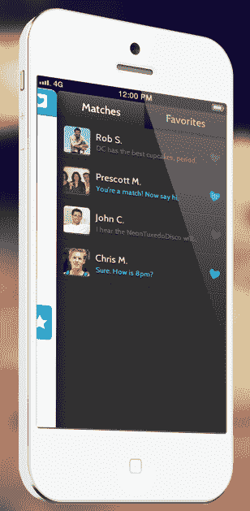

# DC 约会应用 Hinge 将其浪漫图表带到更多城市

> 原文：<https://web.archive.org/web/https://techcrunch.com/2013/08/07/hinge-romance-graph/>

Tinder 的问题在于女性不信任陌生人，所以火柴不会变成偶遇。铰链使用同样的热或不热的风格，但只根据它的“浪漫图表”向你显示朋友的可信任的朋友。这导致了在华盛顿特区疯狂的保留，即将到来的资金，现在扩展到纽约市，计划在波士顿和费城。Hinge 想成为移动时代的年轻 Match.com。

创始人贾斯汀·麦克劳德在哈佛商学院毕业时有了这个想法。有一个“最后机会舞会”,组织者认为让学生提交他们喜欢的人的名字并给彼此喜欢的人配对会很有趣。这是太多的工作和失败，但麦克劳德认为“我可以建立”，并在夏季他做到了。Hinge 于 2 月份推出，并在华盛顿特区由福特与来自投资者的[62.5 万美元](https://web.archive.org/web/20230314105206/http://www.crunchbase.com/company/hinge)[孵化，投资者包括 500 家初创公司和皮德蒙特资本。](https://web.archive.org/web/20230314105206/https://techcrunch.com/2012/03/07/d-c-s-newest-tech-accelerator-the-fort-debuts-inaugural-batch/)

Hinge 的免费 [iOS](https://web.archive.org/web/20230314105206/https://itunes.apple.com/app/id595287172) 和 [Android](https://web.archive.org/web/20230314105206/https://play.google.com/store/apps/details?id=co.hinge.mobile.android) 应用在华盛顿有多受欢迎？麦克劳德告诉我，这个城市有 11 万名单身大学毕业生，其中超过 2 万人活跃在 Hinge 上。这款应用专注于年轻专业人士和研究生的密集网络，他们开始考虑安顿下来。它拥有 30，000 名用户，平均年龄为 27 岁，已经匹配了 200，000 对。85%下载的人一周后依然活跃，75%一个月后依然活跃。怎么会？因为不是勾搭 app。

### **感情联系**

可能不会像 Tinder、Grindr/Blendr 和许多其他“约会”应用程序说的那样让你马上上床。它并不是为了让你和任何一个超级亲近的人同时使用这个应用程序而设计的。

铰链看起来更深。不完全进入你的灵魂，但至少进入你的脸书档案。其结果是大量的透明度和量身定制的匹配，让人们有信心从网上调情发展到面对面的接触。

*   只有在你的应用程序上已经有朋友的情况下，你才能加入，并且它只在华盛顿和纽约有效，而在波士顿和费城才刚刚起步。
*   它显示你的姓。表现得下流一点，人们就会找到你。
*   你不仅仅是你的照片。Hinge 可以让你的年龄、共同的朋友、学校和工作地点立即可见。
*   它利用所有这些信息每天给你发送一组符合你风格的潜在匹配。
*   如果你和潜在的约会对象互相认可，Hinge 会给你们发一个可爱的半真半假的破冰语，比如“辛迪也在乔治敦大学上学，她在树屋里长大”，然后让你们开始聊天。

Hinge 成功的秘诀是我所说的“浪漫图表”。Hinge 一直在观察什么样的人被撮合在一起，最终会互相发信息。麦克劳德解释说:“这是关于社会接近。他们去的是同一类学校吗？有同类工作吗？”

例如，他告诉我“假设你在谷歌工作。我们可能会帮你联系在脸书工作的人，因为你会有话题可聊。”这不仅仅是显而易见的匹配，而是将同一行业的人，或者来自名牌大学和附近州立学校的人配对，他们似乎很喜欢。

最终，麦克劳德告诉我，Hinge 将寻求通过高级订阅来赚钱，让你更深入地了解谁在看你，或者让你面对更多潜在的约会。

最终，Hinge 将笨重但准确的老式约会应用带入了现代。不需要问你一百个问题就能知道你喜欢谁。它只需要知道一些传记特征和你的社交图谱。麦克劳德总结道，“OKCupid、Match、eHarmony——它们都是在脸书、移动设备和大数据出现之前发明的。我们想成为颠覆者。”

*为 [iOS](https://web.archive.org/web/20230314105206/https://itunes.apple.com/app/id595287172) 和[Android](https://web.archive.org/web/20230314105206/https://play.google.com/store/apps/details?id=co.hinge.mobile.android)下载铰链*