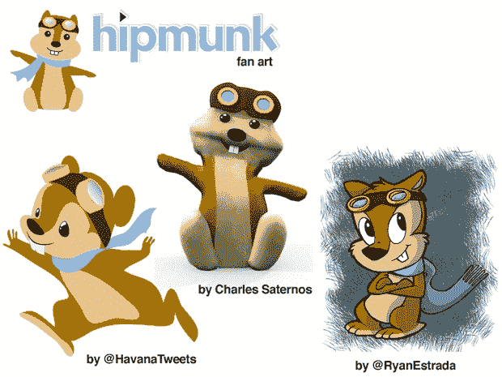

# Hipmunk 的官方融资:420 万美元，由 Ignition 和一群在线旅游专家 TechCrunch 牵头

> 原文：<https://web.archive.org/web/http://techcrunch.com/2011/02/03/hipmunk-funding-2/>

# Hipmunk 的官方融资:420 万美元，由 Ignition 和一群在线旅游专家牵头

大约一周前，我们听说旅游初创公司 [Hipmunk](https://web.archive.org/web/20230203001546/http://hipmunk.com/) 正在筹集新一轮资金。果然，一份 SEC 文件[出现了，确认了](https://web.archive.org/web/20230203001546/https://techcrunch.com/2011/01/25/hipmunk-funding/)的融资，并指出他们目前已经获得了 600 万美元融资中的 460 万美元。当我们联系 Hipmunk 时，他们证实了这一轮，但拒绝透露更多细节。现在我们有了这些细节。

Hipmunk 实际上已经筹集了 420 万美元，由 [Ignition Partners](https://web.archive.org/web/20230203001546/http://www.crunchbase.com/financial-organization/ignition-partners) 牵头。参与的还有里奇·巴顿(Expedia 前 CEO)、埃里克·布拉克福德(Expedia 另一位前 CEO)、吉姆·霍恩塔尔(Preview Travel 负责人)、西蒙·布雷克韦尔(TravelPost 联合创始人)、罗布·格拉泽(Real Networks 创始人)。如你所见，这个团队有很多在线旅游经验。

Hipmunk 的 Alexis Ohanian 说:“我们很兴奋，因为这意味着我们有资本雇佣更多的编程人才，继续消除旅游搜索的痛苦。“*我们很幸运在短短六个月内增长了这么多，这要感谢我们出色的粉丝们的口碑——他们让我作为 hipmunk 营销人员看起来真的很棒*，”他继续说道。确实如此。

联合创始人[亚当·高德斯坦](https://web.archive.org/web/20230203001546/http://www.crunchbase.com/person/adam-goldstein)重申:“*我们正在用这笔钱雇佣我们需要的人才，以保持 hipmunk 在旅游搜索创新方面的领先地位。他继续说道:“我们还有很多方法可以让这个过程变得更加简单。*

Hipmunk 的新融资是在他们去年 10 月的超级竞争天使轮之后几个月。但是在线旅游市场在经历了几年的停滞后又开始升温了。[处理像 ITA](https://web.archive.org/web/20230203001546/https://techcrunch.com/2010/11/16/hipmunk-ita/) (正在被谷歌收购)和美国航空公司(正在退出大多数旅游聚合网站)这样的服务让 Hipmunk 现在处于有利地位。

这家初创公司似乎也有一些忠实的粉丝。奥哈尼安把上面的扇面艺术发了过来。“*过了几个月才有人画出 Reddit 外星人粉丝艺术*，”他说(Ohanian 是 Reddit 的联合创始人，其他几个嬉皮士也在那里工作过)。