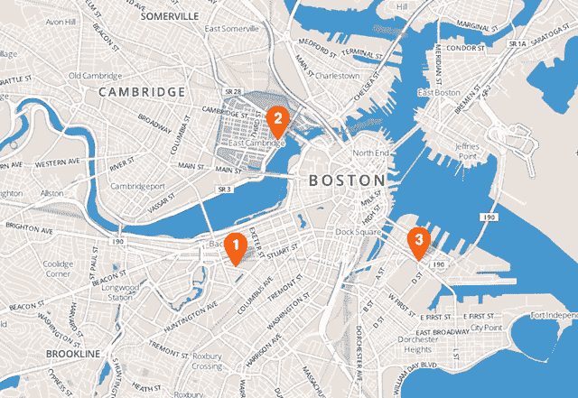

# Hipmunk 推出改进的酒店搜索，并配有当地人撰写的社区指南 

> 原文：<https://web.archive.org/web/https://techcrunch.com/2012/11/13/hipmunk-hotel-search-neighbor-hood-guides/>

旅游初创公司 Hipmunk 今天对其酒店搜索功能进行了重大的重新设计，这应该有助于旅行者在附近找到最符合他们正在寻找的旅行类型的地方。

该公司于 2011 年初首次在 T2 推出酒店搜索服务，但联合创始人 Steve Huffman 告诉记者，起初，Hipmunk 采用了错误的方法来解决这个问题。该公司的航班搜索，以日历为基础的结果布局和“痛苦”为基础的排名，是对其联合创始人面临的实际问题的回应。另一方面，Hipmunk“很快认识到，如果我们想作为一家公司生存下去，我们需要一种酒店产品”，因为在酒店搜索中可以赚更多的钱。

霍夫曼认为，Hipmunk 现有的酒店搜索已经是一个很好的产品，但由于它不是真正为解决特定问题而构建的，他发现自己对它感到“沮丧”，就像他对其他酒店搜索产品感到沮丧一样。例如，他回忆起去圣地亚哥的一次旅行，当时他希望避开旅游陷阱，住在更接近圣地亚哥当地体验的地方。他最终来到了煤气灯区，这与他想要的正好相反。同样，霍夫曼说，他给旧金山游客的主要建议是“避开渔人码头和田德隆区”，但该市的大多数酒店都在这两个街区，所以这可能是一个随机旅行者的最终目的地。

Hipmunk 的解决方案？由当地旅游作家撰写的邻里指南。新的酒店搜索功能保留了旧版本基于地图的视图，但现在地图被分解为社区，您可以点击它了解更多信息。一旦你在寻找一个似乎符合你需求的社区，Hipmunk 将根据价格、便利设施和评论的综合情况推荐最好的酒店。谈到价格和便利设施，霍夫曼说 Hipmunk 一直在给酒店打电话，询问他们是否对 WiFi、停车等收费，这样网站就可以让用户更好地了解住宿的实际成本。在 Hipmunk 的搜索结果中显示的 30 万家酒店(来自各个网站)中，霍夫曼说，该公司已经收集了用户实际入住的所有“主要”酒店的数据，现在正在努力填写“长尾”

当然，如果你真的有兴趣为你的旅行寻找合适的社区，你已经可以自己做网上调查了。然而，试图将这种研究整合到您的酒店预订体验中可能是一件痛苦的事情，让您在浏览器的多个选项卡之间来回切换。Hipmunk 将这些信息直接引入搜索结果，让搜索变得更加容易。Huffman 说，这些变化也应该使 Hipmunk 成为一个用户可能想浏览的网站，即使他们不需要预订航班或酒店。另外，如果有人第一次听说 Hipmunk，他们可以立即查看该网站并找到有趣的内容，而不是等到他们真正计划旅行时(然后可能会忘记)。

同样，Hipmunk 允许旅行者根据他们关心的因素(无论是痛苦、旅行时间、最少的中途停留时间还是其他因素)对航班结果进行优先排序，现在它允许您确定您是哪种类型的旅行者，以及您正在寻找的酒店体验，无论是商务、浪漫(异性恋或同性恋)、探险还是家庭。Hipmunk 然后会过滤结果，为你指出附近符合你兴趣的酒店。该公司仍在努力充实其社区指南，因此并非每个地区都有书面描述(尤其是如果你不是去美国主要城市旅行)。但霍夫曼说，该公司仍然可以使用当地数据来提出基于社区的建议，例如，通过注意到有许多律师事务所和银行的社区可能是该市的金融区。

当你准备好预订酒店时，你甚至可以不用离开 Hipmunk 网站。如果列表来自 Orbitz，您可以直接从 Hipmunk 进行预订，而 Orbitz 在后端处理预订(多亏了 Orbitz API)。这是人们第一次能够在 Hipmunk 上直接预订，当我问及我们是否会在航班搜索中看到类似的情况时，霍夫曼说，“理论上我们可以在航班上这样做，但我们现在不会这样做，”因为在航班搜索中，“这更像是一个政治问题。”在网站上加入更多的预订功能也不是一个优先考虑的事情。

“作为一家公司，如果我们要在更倾向于成为一家旅行社或更倾向于成为一家内容公司之间做出选择，这对我们来说是显而易见的，”霍夫曼说——提供更好的内容并以更好的方式展示是 Hipmunk“注定要做的事情”

Hipmunk 的一位发言人告诉我，允许用户直接从网站预订的功能存在问题，所以现在还没有上线。这个帖子修好了我会更新的。

**更新 2:** 这是 Orbtiz 关于预订功能及其与 Orbitz API 集成的声明:

> 该功能不可用的原因是因为 Orbitz 和 Hipmunk 之间没有提供这项服务的协议，所以我们对 Hipmunk 向您显示的内容感到困惑。此外，虽然我们正在讨论各种可能性，但任何潜在的协议都不会包括直接从他们的网站进行 Orbitz 预订的能力。Orbitz 预订体验仅面向到访 Orbitz.com 的消费者。