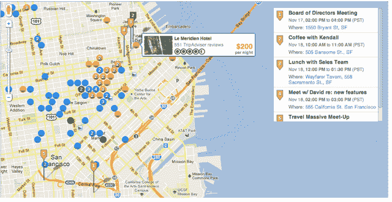
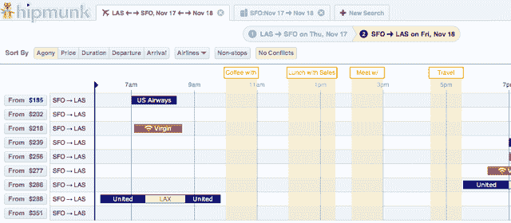

# Hipmunk 整合谷歌日历，实现无冲突飞行 

> 原文：<https://web.archive.org/web/http://techcrunch.com/2011/10/25/hipmunk-integrates-google-calendar-for-conflict-free-flying/>

# Hipmunk 整合谷歌日历，实现无冲突飞行

这有点老生常谈，但仍然是真的:最好的特性往往是那些让你拍自己脑门问自己为什么没想到它们(或者为什么没人想到它们)的特性。

当我听说航班和酒店旅游搜索引擎 [Hipmunk](https://web.archive.org/web/20230203161908/http://www.hipmunk.com/) 今天早上推出的新功能时，我立刻有了这种反应。今天，该服务增加了对谷歌日历集成的支持，这意味着它可以根据您的时间表检查航班列表，以确定哪些最适合您。

现在，日历同步对于旅游网站来说已经不是什么新概念了——很多网站会让你自动将你预订的航班和预订*同步到你的*日历中。但 Hipmunk 表示，这是第一个深入研究你的时间表并发现潜在冲突的旅游网站，以帮助你在第一时间预订这些航班。

你可以在下面的截图中看到这个界面，它非常简单:一旦你输入了你的谷歌日历凭证，你就会看到黄色的垂直条悬停在 Hipmunk 的航班搜索网格上。很明显，并不是所有你预定的事件都会保证改变你的飞行计划，所以如果你愿意，你可以忽略它们。或者你可以点击“按冲突排序”按钮，这实际上会隐藏任何与你的承诺重叠的航班。

同样，Hipmunk 会查看您的日历，找出您的会议和活动在哪里举行，并据此推荐方便的酒店。

 
