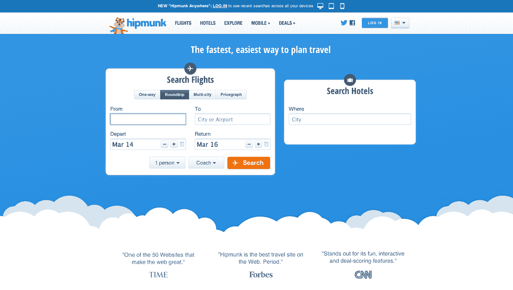

# Hipmunk 让跨平台旅游搜索变得更容易 

> 原文：<https://web.archive.org/web/https://techcrunch.com/2014/03/13/hipmunk-makes-cross-platform-travel-search-easier/>

旅游元搜索引擎 [Hipmunk](https://web.archive.org/web/20221205135831/http://hipmunk.com/) 今天发布了“Hipmunk Anywhere ”,这是一个跨平台的搜索功能，对于我们这些经常使用多种设备的人来说，这使得旅游搜索变得更加容易。

如果你和我一样，有可能你经常在手机上寻找航班，但之后会转到桌面上继续搜索或实际订票。根据 [comScore](/web/20221205135831/http://techcrunch.com/Users/Frederic/Downloads/The_Multi_Screen_Path_to_Purchasing.pdf) 的数据，大约 60%的消费者现在开始在一个设备上搜索他们想要购买的东西，然后在其他地方完成搜索。这个数字对于旅游搜索来说可能也非常相似。

[https://web.archive.org/web/20221205135831if_/https://www.youtube.com/embed/UxOdW-At3Zo?feature=oembed](https://web.archive.org/web/20221205135831if_/https://www.youtube.com/embed/UxOdW-At3Zo?feature=oembed)

视频

通常，这意味着你必须在每个平台上重复搜索。然而，使用 Hipmunk Anywhere，您只需在开始搜索时登录该服务，无论您是在手机、平板电脑还是台式机上，该服务都会保存您的搜索，并使它们可以在其他平台上轻松使用。例如，在网络上，这些搜索会出现在 Hipmunk 主页的标签页上。

这是一个简单的功能，但它符合 Hipmunk 的使命，即让旅游搜索变得更容易。

Hipmunk 的联合创始人亚当·高德斯坦昨天在一封电子邮件中告诉我:“我们想让它简单得可笑，以至于用户会奇怪为什么以前没有人这么做过。”。

当然，Hipmunk 这项新功能的一个额外好处是，它激励用户注册这项服务。

除了跨平台搜索，该公司还将通过 Hipmunk 直接预订酒店的功能(而不是通过第三方预订网站)引入其移动网站。直到现在，这只能在桌面上使用。正如 Goldstein 告诉我的，这项功能推出不到一年，但它已经占据了 Hipmunk 每月酒店预订量的一半以上。

移动端的另一个新功能是多城市航班搜索，现在 Hipmunk 的所有移动应用都可以使用。

