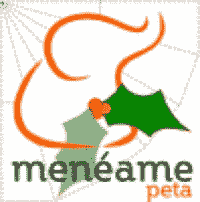

# HoHoHo: Digg 可能会收购 Menéame 和 CoRank 

> 原文：<https://web.archive.org/web/https://techcrunch.com/2007/12/25/hohoho-digg-might-be-acquiring-meneame-and-co-rank/>

# HoHoHo: Digg 可能会收购 Menéame 和 CoRank

 西班牙科技网站 Techtear [报道【Digg 可能已经收购了西班牙社交投票网站](https://web.archive.org/web/20230215214024/http://www.techtear.com/2007/12/25/digg-adquiriria-meneame/) [Menéame](https://web.archive.org/web/20230215214024/http://meneame.net/) 以及可能的 coRank。

Techtear 所说的一种翻译

> …然后我们发现人们 Digg 接触了私人投资公司 Allen & Company。当时人们认为 Digg 正在组织一次可能的出售，但是凯文·罗斯回答说“我们从不评论收购”没人明白它指的是收购 Menéame，而不是出售 Digg 本身。

收购 coRank 的传言最早出现在 11 月，当时 Co-rank 否认了收购谈判。我们了解到，在这些传言(以及随后的否认)之后，有两个可能的买家接触了 coRank，其中一个可能是 Digg。

在 Menéame 方面，除了 Techtear 的报告和 Enrique Dans 的一篇文章[之外，我们没有太多的信息](https://web.archive.org/web/20230215214024/http://www.enriquedans.com/2007/12/movimientos-navidenos-en-el-subsector-de-los-filtros-sociales.html)讨论出售事宜，并指向 menéame 博客，其中谈到了[年底前的一项重大宣布](https://web.archive.org/web/20230215214024/http://www.google.com/translate?u=http%3A%2F%2Fblog.meneame.net%2F2007%2F12%2F24%2Ffelicidades%2F&langpair=es%7Cen&hl=en&ie=UTF8)。更难的是:Google Translate 将 Menéame 翻译成 Reddit(这里的[和这里的](https://web.archive.org/web/20230215214024/http://www.google.com/translate?u=http%3A%2F%2Fwww.enriquedans.com%2F2007%2F12%2Fmovimientos-navidenos-en-el-subsector-de-los-filtros-sociales.html&langpair=es%7Cen&hl=en&ie=UTF8)和)。如果我们得到的话会更多。
 **更新:** coRank 的首席执行官联系了我们，并表示“虽然可能会有一些交易在进行中……但 Digg 不参与其中。”