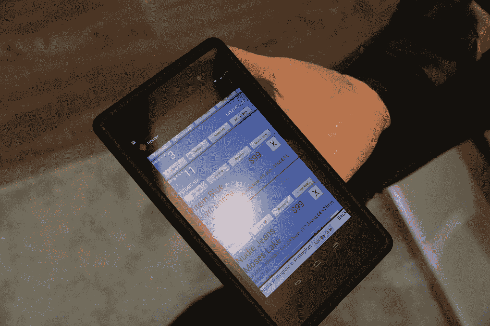

# 霍因特对零售业未来的愿景是利用机器人将重点放在购物体验上 TechCrunch

> 原文：<https://web.archive.org/web/https://techcrunch.com/2014/03/06/hointers-vision-of-the-future-of-retail-uses-robots-to-put-the-focus-on-shopping-experience/>

在今年多伦多的 Dx3 数字商务博览会上，一个亮点是一家总部位于西雅图的公司，名为 [Hointer](https://web.archive.org/web/20221208175541/http://hointer.com/) ，该公司的目标是彻底改变我们在商店购买服装的方式——它使用机器人来实现这一目标。

如果你问普通人购物经历中他们最不喜欢的部分，他们中的大部分人可能会提到不得不与过于热情的销售人员打交道。客户服务是一回事，但感觉被那些热衷于强行推销的人喋喋不休是另一回事，有时很难区分这两者。

还有一个问题是，零售并不一定是人们所说的方便或放松:与人群斗争，在混乱的库存中搜寻，排队等待结账。亚马逊正在成功地从实体零售商手中抢走业务，它这么做的主要原因是提供了一种不需要任何人离开自己舒适的家的体验。

零售商在霍尔因特的后台

Hointer 创始人 Nadia Shouraboura 对亚马逊及其零售战略略知一二:她是这家总部位于西雅图的科技公司的第十名员工。她的新公司也非常注重技术，因为它使用移动软件、机器人后端和快速软件原型开发战略，将一切整合在一起，带来一种全新的店内体验。

“成千上万的人来到我们在西雅图的店面，他们告诉我们他们喜欢什么，不喜欢什么，他们大喊大叫，”她在采访中解释道，描述了 Hointer 自己的商店是如何工作的，开发人员坐在展厅里编写代码，取代了传统的客户服务代表。“有时如果一个功能请求非常简单，第二天就会出现在商店里，客户会回来，看到这个想法已经实现了。我们每天会尝试 10 个想法，其中 10 个通常是愚蠢的，但我们会尝试，然后再放弃。”

快速原型法已经产生了一个成熟的销售平台，它通过移动应用程序整合了条形码扫描，提供产品信息和直接从移动设备订购的能力，并在更衣室里为您准备好库存。你可以订购新的尺寸并立即拒绝物品，在某些版本中还可以直接从你的设备上支付。这可以通过机器人商店后端来处理，或者使用人工支持人员来完成，这是劳动力更便宜的新兴市场中更受欢迎的选择。霍因特告诉我，即使是用于客户互动和零售运营管理的机器人系统和 SaaS 解决方案，安装、启动和运行每年也只需要 4 万至 5 万美元。

消费者对店内购物的期望是一头不断变化的野兽，在货架上堆满商品已经不再管用了。人们想要一些不容易通过在线工具复制的现代购物体验，Hointer 的系统旨在处理基本问题，并腾出地面空间和零售商时间，以便他们可以专注于更好地解决他们可以为客户提供的在线购物车无法提供的东西。