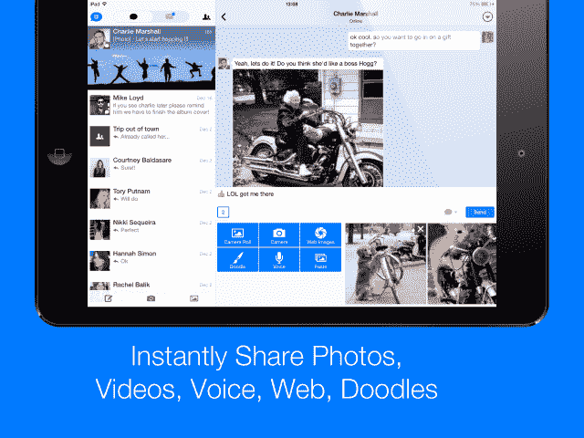

# Hop 将其类似即时通讯的电子邮件客户端引入 iPad 

> 原文：<https://web.archive.org/web/https://techcrunch.com/2014/02/20/hop-brings-its-instant-messaging-like-email-client-to-the-ipad/>

# Hop 将其类似即时通讯的电子邮件客户端带到了 iPad 上

该公司今天宣布，Hop (以前的 [Ping](https://web.archive.org/web/20221007183130/https://beta.techcrunch.com/2013/09/05/meet-ping-an-app-that-turns-your-emails-into-real-time-conversations/) )是一款移动应用程序，[让回复电子邮件感觉更像即时通讯](https://web.archive.org/web/20221007183130/https://beta.techcrunch.com/2013/10/17/ping-now-called-hop-launches-an-app-that-makes-email-feel-more-like-real-time-mobile-messaging/)，现在可以在 [iPad](https://web.archive.org/web/20221007183130/https://itunes.apple.com/us/app/hop-your-email.-reimagined./id707452888?ls=1&mt=8) 上使用。此外，hop 现在还支持多个电子邮件帐户——这是用户自 2013 年秋季应用首次亮相以来一直要求的。

对于那些不熟悉 hop 的人来说，这个想法很有趣。该应用程序基本上通过提供一个界面将电子邮件线程转化为实时对话，该界面不仅感觉更像移动信息，而且像 iMessage 或 chat 一样工作，你甚至可以看到另一个人何时打字。

该应用融合了电子邮件客户端的许多功能，如主题行或 cc:/bcc:字段及其类似消息的界面，同时还支持消费者通信应用中更常见的功能，如照片共享、语音或视频通话。

Hop 目前允许你从 Gmail、Yahoo、iCloud 或 Aol 等顶级服务添加现有的电子邮件帐户(或现在的帐户 *s* ),然后在新邮件到达时得到提醒。

实际上，hop 对年轻的消费者更有意义，他们可能只是偶尔使用电子邮件，或者在绝对必要时使用，而不是每天收件箱被数十或数百封新邮件淹没，其中许多邮件需要更专业的回复，而不是快速的“聊天式”回复。

话虽如此，但很难否认这家总部位于特拉维夫的公司在试图为移动时代重新思考电子邮件方面的独创性。但大多数电子邮件用户是否真的希望他们的电子邮件更像短信一样工作仍有待观察——hop today 没有透露确切的用户数量，只是说它有“数千名”hop 客户。

更新后的应用程序，现在是 iPad 友好的，在 iTunes 上[。](https://web.archive.org/web/20221007183130/https://itunes.apple.com/us/app/hop-your-email.-reimagined./id707452888?ls=1&mt=8)