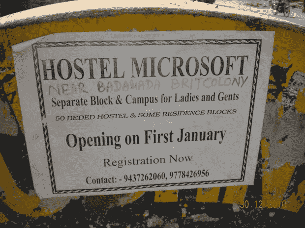

# 欢迎来到微软旅舍。如此可爱的地方。

> 原文：<https://web.archive.org/web/https://techcrunch.com/2010/12/29/hostel-microsoft/>

# 欢迎来到微软旅舍。如此可爱的地方。

差不多就在一年前，我们写了一篇关于谷歌软件研究学院(T2)的文章，这是一所位于印度的名字很巧妙的在线大学。在我们发布了向学生提供“GCPA”——谷歌高级计算认证专家——等学位的机构的帖子后，该学校的网站没过多久就被关闭了。但是，最初向我们透露这些恶作剧的人现在带着另一个有趣的东西回来了。很明显，它的总部在印度的同一个城市。

向“微软招待所”问好。

在一个被称为“巴达勒英国殖民地”的地方附近，微软宿舍显然为女士和男士提供了单独的街区和校园。这显然是一个有大约 50 个床位的招待所。它也有一些住宅区，不管那是什么意思。它将在一月初开放。

虽然从迹象来看，他们并没有像谷歌研究所那样提供任何类型的假学位，但他们更直接地剽窃了一家全球科技公司的名字。(当然，我们假设微软实际上并没有在印度开设招待所。)

那个标志在 5，4，3，…

*【感谢[Deb](https://web.archive.org/web/20230202225121/http://developerpanda.com/)*