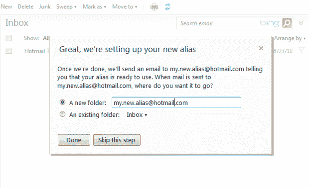
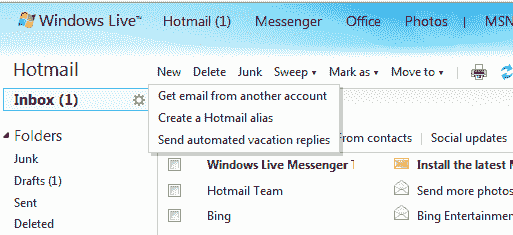

# Hotmail 的新别名功能让您可以从同一个收件箱处理多个地址 TechCrunch

> 原文：<https://web.archive.org/web/https://techcrunch.com/2011/02/03/hotmails-new-alias-feature-lets-you-handle-multiple-addresses-from-the-same-inbox/>

# Hotmail 的新别名功能允许您处理同一个收件箱中的多个地址

你是否曾希望有多个电子邮件地址可以发送到同一个收件箱，而不必设置一堆不同的账户和转发选项？hotmail——是的，你可能已经很多年没看过的电子邮件服务——刚刚增加了一个非常方便的新别名功能，让你可以做到这一点。换句话说，我现在可以设置一个 Hotmail 收件箱，让我可以从同一个收件箱无缝地处理给 jasonkincaid@hotmail.com 和 JediMasterJ@hotmail.com 的信件——哇哦！*

对于网络邮件服务来说，别名并不是什么新鲜事。Gmail 的铁杆用户可能很熟悉古老的“+”技巧:如果你的电子邮件地址是 jason@gmail.com，你可以用一个“+”符号创建各种别名，这些别名都指向同一个地方。例如，您可以创建 jason+receipts@gmail.com、jason+deals@gmail.com 等，每一个都使用不同的过滤器将电子邮件路由到不同的标签(或立即删除它们)。它不是完美的，但它工作得很好。

Hotmail 也提供了相同的“+”功能，但这个新的别名选项更强大。Gmail 解决方案的一个问题是它很容易被绕过——我可能会在一个我不关心的网站上输入 jason+spam@gmail.com 作为我的地址，但他们可以很容易地去掉“+spam”并绕过我设置的任何过滤器。

有了这个 Hotmail 功能，您可以设置一个完全不同的电子邮件地址。Hotmail 还智能地决定何时使用每个地址，默认情况下，您将使用邮件的接收地址回复邮件。当你发送出站消息时，你可以在多个地址之间切换。

是的，您可以使用多个 Gmail 帐户及其“代理发送”设置来完成类似的事情，但这是 Hotmail 团队的一个非常好的选项。

*这些不是我的真实电子邮件地址。发誓。
