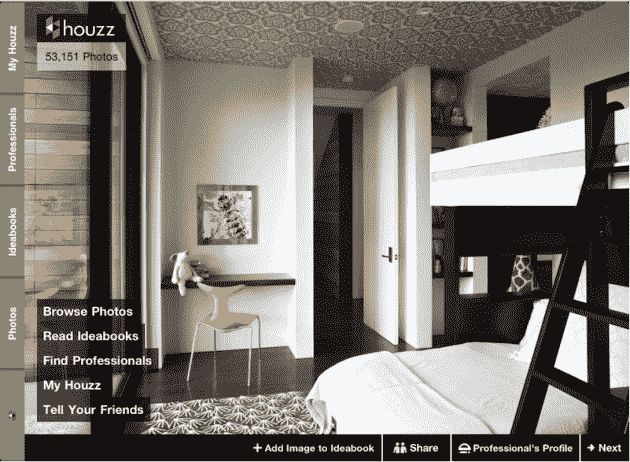

# 注意了，家居设计爱好者们:Houzz 发布了新的 iPad 应用程序，募集了 100 万美元 2M 

> 原文：<https://web.archive.org/web/https://techcrunch.com/2010/11/11/houzz-funding-ipad-app/>

# 注意了，家居设计狂们:Houzz 推出新的 iPad 应用程序，2M 募集资金

**独家**–[Houzz](https://web.archive.org/web/20230328153211/http://www.houzz.com/)，这个为家居设计爱好者设计的名不副实的在线家居(因为他们也需要在网上拥有自己的特殊位置)，已经从一些知名投资者那里获得了 200 万美元的首轮融资。在宣布融资的同时，该公司刚刚在虚拟应用商店的货架上推出了全新版本的 iPad 应用程序(你可以在这里免费获得)。

玩笑归玩笑，Houzz 似乎是一个执行得很好的好主意。

本质上，Houzz 是一个专门针对家居设计狂热者的照片数据库和社区网站，无论他们是从专业角度还是个人角度对它充满热情。

Houzz 已经声称提供了目前网络上最大的室内和室外设计照片集合，超过 10，000 名设计专业人员提供了超过 60，000 张高质量的照片。

如果你愿意的话，这是专为家居设计爱好者定制的 Flickr。

用户可以收集他们最喜欢的照片，按照地点、房间类型和风格进行分类，还可以上传自己家和花园的照片。此外，注册用户可以使用 Houzz 找到他们所在地区的设计专业人员，并与其他成员交流家居设计的信息和技巧。

该网站的吸引力很大一部分——当然，如果你属于该公司的目标受众——是 [ideabooks](https://web.archive.org/web/20230328153211/http://www.houzz.com/ideabooks) ，Houzz(相当准确地)将其描述为从设计杂志中剪下页面并将其塞进文件夹的在线版本，只是更容易搜索、保存和共享。这家初创公司表示，迄今为止，用户已经创建了超过 13 万本 idea book，并且每分钟都有新的 idea book 加入。

Houzz 由一对创业夫妻团队(Alon Cohen 和 Adi Tatarko)创建，刚刚从一系列知名投资者那里获得了 200 万美元的早期融资。

天使投资者名单包括像柳文欢·泽夫这样的人，他投资了 Audible 和 Chegg 这样的公司；Audible.com 创始人&首席执行官[唐纳德·卡茨](https://web.archive.org/web/20230328153211/http://en.wikipedia.org/wiki/Don_Katz)；[加里·金斯堡](https://web.archive.org/web/20230328153211/http://en.wikipedia.org/wiki/Gary_Ginsberg)，时代华纳公司执行副总裁；[杰夫·弗鲁尔](https://web.archive.org/web/20230328153211/http://www.crunchbase.com/person/jeff-fluhr)，StubHub.com 的联合创始人(在出售给易贝之前一直担任首席执行官)和[阿莫斯·威尔奈](https://web.archive.org/web/20230328153211/http://www.linkedin.com/pub/amos-wilnai/14/128/804)，MMC 网络的创始人。

【YouTube = http://www . YouTube . com/watch？v=cGtQu91b50g&fs=1&hl=en_US]

