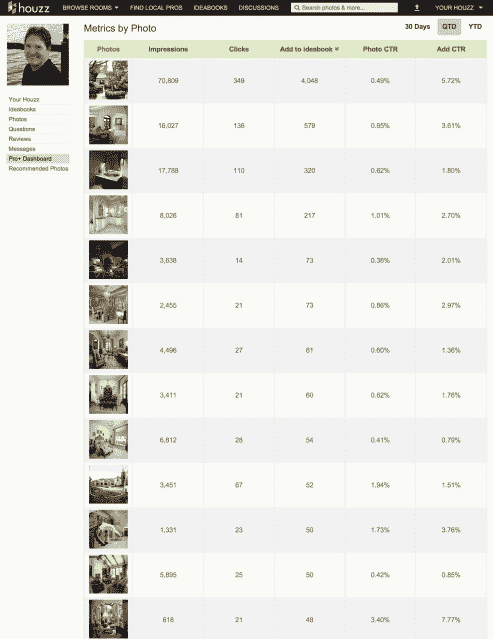
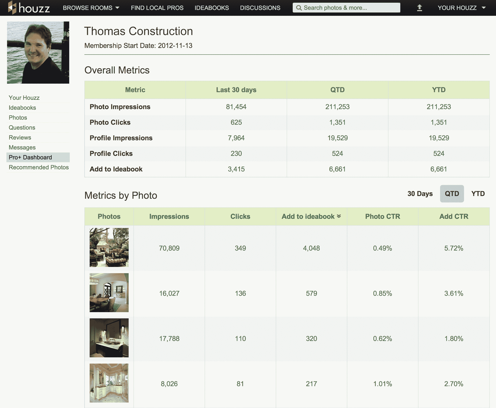

# Houzz 将其面向重塑和设计专业人士的 Pro+服务扩展到 425 个市场，推出新的分析工具

> 原文：<https://web.archive.org/web/https://techcrunch.com/2013/03/12/houzz-launches-new-analytics-tool/>

# Houzz 将其面向重塑和设计专业人士的 Pro+服务扩展到 425 个市场，推出新的分析工具

Houzz 最出名的是其网站和手机应用程序上漂亮的房屋照片，这些照片会激起即使是最幸福的房主对房子的嫉妒，但该服务也提供广泛的工具，旨在帮助设计和改造专业人士找到新客户。去年年底，Houzz [在筹集了 3500 万美元的 C 轮融资后，推出了 Pro+平台](https://web.archive.org/web/20230403113248/https://techcrunch.com/2013/01/29/home-remodeling-platform-houzz-raises-35m-series-c-round-led-by-nwa-and-ggv-capital-launches-paid-pro-accounts/)，允许专业人士在 12 个市场的网站上销售他们的服务[。如今，它正在通过其新的 Pro+ Dashboard 分析工具为专业人士扩展这一平台，并向美国和加拿大 425 个新市场的承包商、建筑师、设计师、园艺师和其他专业人士开放。](https://web.archive.org/web/20230403113248/http://www.houzz.com/professionals)

Houzz 在家居装修市场的重要性持续增加。去年年底，该公司报告称，约有 168，000 名家庭专业人士正在积极使用这项服务，如今，Houzz 表示，这一数字现已增加到 190，000 人。总的来说，这项服务目前每月有超过 1400 万的独立访客。

Houzz 在最初推出 Pro+计划时很快售罄。对于年度订阅，Pro+计划为专业人员提供了在当地的额外可见性，并允许他们突出自己的工作以吸引新客户。新的度量仪表板让专业人士能够进一步了解他们的照片在网站上的表现，并包括照片展示总数、点击次数、点击率和添加率(有多少人将照片保存到他们的 Houzz“idea books”)的实时数据。Houzz 说，这些数据将帮助专业人士“优化他们的营销和品牌建设工作。”

Houzz 首席执行官 Adi Tatarko 在今天的一份声明中表示:“借助这一强大的新分析工具，重塑专业人士将能够实时了解他们的个人资料和产品组合如何与房主社区产生共鸣，使他们能够做出调整，打造最有效的品牌形象，以吸引合适的客户。”。“我们与 Pro+的目标是提供一种服务，帮助专业人士建立自己的品牌，并以他们想要的方式增加他们在当地房主中的曝光率。”

