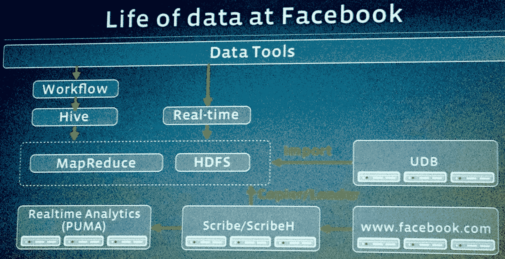
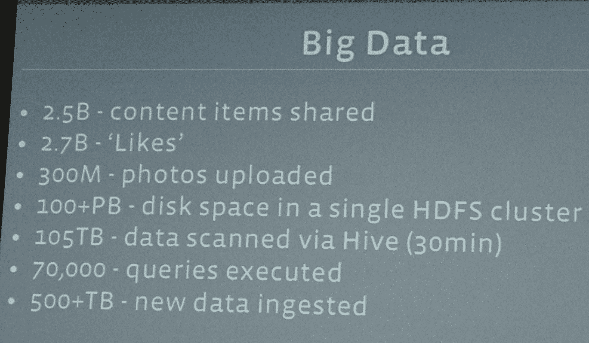

# 脸书的数据有多大？每天接收 25 亿条内容和 500 多 TB 数据 

> 原文：<https://web.archive.org/web/https://techcrunch.com/2012/08/22/how-big-is-facebooks-data-2-5-billion-pieces-of-content-and-500-terabytes-ingested-every-day/>

今天，脸书在其总部向一些记者透露了一些关于大数据的大数据，包括其系统每天处理 25 亿条内容和 500 多 TB 的数据。它每天吸引 27 亿个赞和 3 亿张照片，每半小时扫描大约 105 兆字节的数据。此外，它给出了新的“棱镜计划”的第一个细节。

工程副总裁 Jay Parikh 解释了这一点对脸书如此重要的原因:“大数据实际上是关于洞察和影响您的业务。如果你没有利用你正在收集的数据，那么你只有一堆数据，你没有大数据。”通过在几分钟内处理数据，脸书可以推出新产品，了解用户反应，并近乎实时地修改设计。

脸书透露的另一个统计数据是，超过 100 Pete 字节的数据存储在单个 Hadoop 磁盘集群中，Parikh 指出，“我们认为我们运营着世界上最大的单个 Hadoop 系统。”在一个令人捧腹的时刻，当被问到“你的 Hadoop 集群比雅虎的大吗？”，帕里克得意地眨眨眼说“是”。

虽然这对小企业来说听起来很多，但他指出，几个月后，“没人会在意你的仓库里有 100 的数据”。摄取的速度持续增加，“这个世界对数据越来越饥渴。”

这些数据不仅对脸书有帮助。它把利益传递给它的广告商。Parikh 解释说，“我们正在跟踪广告在我们网站上不同维度的用户中的表现，基于性别、年龄、兴趣[所以我们可以说]‘实际上这个广告在加州表现得更好，所以我们应该在加州展示更多这样的广告，让它更成功。’"

脸书现在甚至不需要推动变革就能看到它们的影响。“通过查看历史数据，我们可以在将模型投入生产之前对其进行验证。我们将数据放入模拟中，可以看到“这会将 CTR 提高 X 倍吗？”“它还有一个名为 [Gatekeeper 的系统，可以让它同时测试用户群中微小百分比的](https://web.archive.org/web/20221208082446/http://www.facebook.com/notes/facebook-engineering/building-and-testing-at-facebook/10151004157328920)不同变化。

然后是“棱镜计划”。目前，脸书实际上将其整个实时、不断发展的用户数据库存储在一个数据中心，其他数据中心用于冗余和其他数据。当主块对于一个数据中心来说变得太大时，它必须将整个东西移动到另一个已经扩展以适应它的数据中心。这种来回穿梭是对资源的浪费。

Parikh 说,“棱镜项目让我们获得了这个整体仓库……并在物理上分离[它],但保持了数据的一个视图。”这意味着实时数据集可以拆分并托管在脸书位于加利福尼亚州、弗吉尼亚州、俄勒冈州、北卡罗来纳州和瑞典的数据中心。

在内部，脸书选择不分割数据，也不在广告和客户支持等不同业务部门之间设置障碍。产品开发人员可以查看各部门的数据，以评估他们最近的小调整是否增加了现场时间，引发了投诉，或产生了广告点击。

用户可能会对脸书的员工可以如此深入地调查他们的活动感到有点不安，但脸书向我保证，有许多防止滥用的保护措施。所有的数据访问都被记录下来，这样脸书就可以跟踪哪些员工在看什么。只有那些致力于构建需要数据访问的产品的人才能得到它，并且有一个围绕可接受的使用的强化培训过程。如果员工在不该窥探的地方窥探，他们就会被解雇。帕里克强烈声明“我们有一个零容忍政策。”