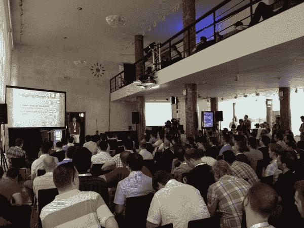

# Dropbox 是如何扩展到 1.75 亿用户的？一位前工程师详述了早期

> 原文：<https://web.archive.org/web/https://techcrunch.com/2013/07/11/how-did-dropbox-scale-to-175m-users-a-former-engineer-details-the-early-days/>

女士们先生们，我们中断了关于疯狂的企业家和更疯狂的风投的正常节目，为你们带来一点工程界的知识。记得吗？最近，Dropbox 出现在新闻中，因为它透露他们已经达到了 1.75 亿用户，并大胆地说他们的 T2 可以取代硬盘 T3。大词。但是他们如何到达那里的工程背景是什么呢？用技术术语来说，成功的创业公司如何扩展到数亿用户？它成功的方法之一是在早期创建一个非常简单灵活的平台。

今天在布达佩斯，前 Dropbox 服务器工程主管 Rajiv Eranki 在 [RAMP 会议](https://web.archive.org/web/20230307151956/http://rampconf.com/)上向一屋子的工程师简要介绍了他们是如何做到的。他在 2008 年加入 Dropbox，在 2011 年离开，因为他想应对“新的、不同的挑战”——其中之一可能是在纽约开一家鸡尾酒吧。(RAMP 由一些从匈牙利崛起的大公司运营: [Prezi](https://web.archive.org/web/20230307151956/http://prezi.com/) 、 [Ustream](https://web.archive.org/web/20230307151956/http://ustream.com/) 和 [LogMeIn](https://web.archive.org/web/20230307151956/http://logmein.com/) )。

在被学术界的潜在职业诱惑后，Eranki 在 Dropbox 只有 2000 名用户时加入了该公司。他与另外一个全职负责后端工作的人一起工作来扩展平台。当时，Dropbox 只有一台数据库机和一台前端服务器。

Eranki 告诉观众，早期的团队是如何“做了许多效率不高的事情，但实际上却为数千用户进行了扩展。”

例如，Dropbox 上的第一次分片就有很多问题。跨数据库的“连接”必须分开，并且有很多“反规范化”。

也就是说，他们“不会改变任何事情”，Dropbox 这种有点杂乱无章的启动方式实际上在工程方面创造了一些好处。

他们可以非常容易地对用户行为进行查询，而不必编写任何特殊的代码。他们可以根据需要跨数据库进行连接。这种结构允许修复很多错误，因为他们可以很容易地在 MySQL 中进行查询。拥有大量共享文件夹的用户只需对数据库进行一次查询。另一个好处是只有一个前端意味着团队只需要查看一个日志。

Eranki 说，所有这些意味着他们“获得了巨大的灵活性和可伸缩性”。

对于初学者来说，不从一开始就将数据库分离出来意味着他们可以做一些通常需要大量工作的事情。早期的另一个重大发现是:他们使用 Python 做任何事情。而且成功了。

这意味着在一百万用户之后，整个平台仍然只运行在数百行代码上，而不是数千行。通过全部使用 Python,“我们可以拥有 4000 万用户，而无需编写数千行 C 代码。”甚至客户端应用程序也是用 Python 编写的。

由此获得了一些知识，例如，在应用程序特定指标方面，如易用性和‘fooproofiness’。此外，还出现了“大多数图表是无用的”。相反，他们建立仪表板来分析性能；他们总是在值上加左(比如失败的登录等)；并且他们保持了一些松弛，例如:额外的查询被 memcached，并且延迟了 SQL 查询的优化。

最终，事实证明，最常使用 Dropbox 的“用户”要么是在非法使用它(比如试图将其用作 CDN 等)，要么就是它只是一个 bug。正是 Dropbox 的第二大用户——核心合法用户——以及他们表现出的行为类别，最终暗示了 Dropbox 如何发展成为一家真正的企业。就像这样的时刻，一个单纯的产品可以变成一个拥有数百万用户的企业。

Eranki 也提出了一些很棒的创业经验。

他说，每次他们试图预测事情或“提前变聪明”时，他们都失败了。事实上，随着架构的发展，保持在架构的顶部并对其进行监控要容易得多。

为了避免出错的“墨菲定律”,他们会做一些事情，比如让 web 服务器硬重启，看看它们是否会自己重启。

该团队还发现，保留日志数据比删除旧代码更容易——通常不管出于什么原因，以后都会需要它。“除非必要，不要删除任何东西，”Eranki 说。早期的一个主要结论是:对采用新技术持怀疑态度。

 
Eranki 分享了一些他们也做错的事情。

他们没有很好地跟踪停机时间或性能下降。在招聘方面，他们发现，如果被聘用的人与公司有某种联系或了解公司，他们应该更早开始工作，而且工作效果最好。由此，他们学会了雇佣更多的人，而这些人又有能力吸引更多的潜在雇员。

最后，Eranki 说，他的早期 Dropbox 团队发现“提前了解架构很难”，“对我们来说，扩展更多的是区分项目的优先级…和构建过程。”

当被问及 Dropbox 能否从目前的 1.75 亿用户扩大到 10 亿用户时，他说可以。毕竟，它只比现在大五倍。