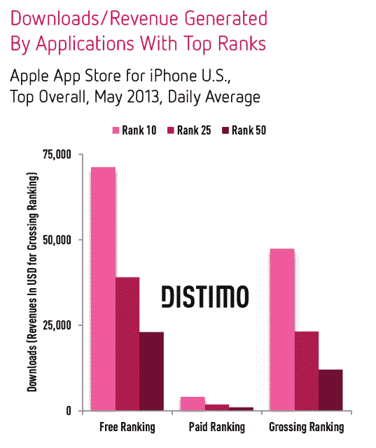
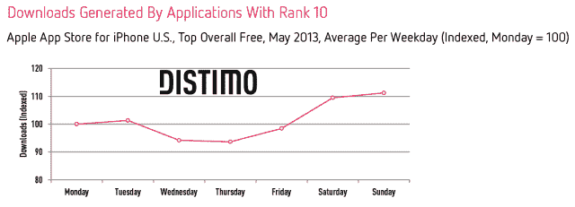
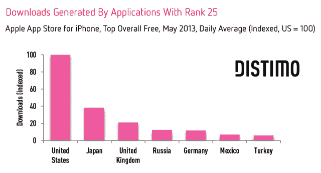
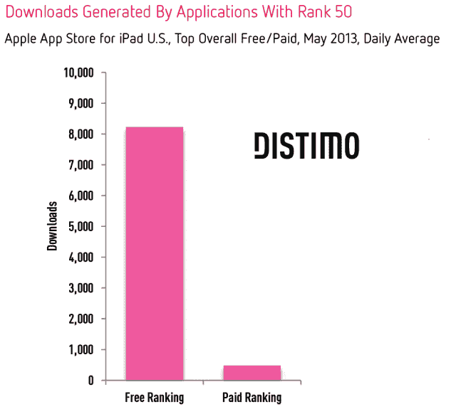
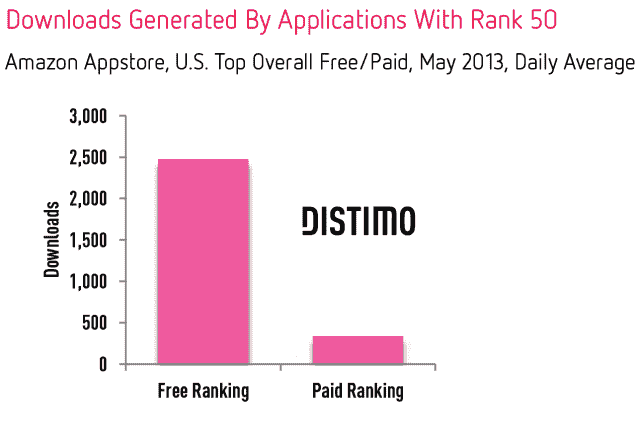
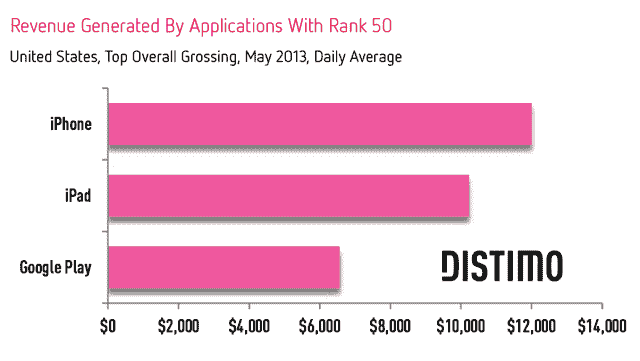
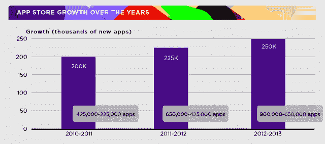

# 如何闯入 iPhone App Store Top 50？尝试 23K 免费每日下载，950 付费，或 12K 美元每日收入 

> 原文：<https://web.archive.org/web/https://techcrunch.com/2013/06/27/how-do-you-break-into-iphone-app-store-top-50-try-23k-free-daily-downloads-950-paid-or-12k-in-daily-revenue/>

移动应用分析公司 Distimo 表示，一款 iPhone 应用每天需要 23，000 次免费下载，才能在苹果应用商店的免费排行榜上名列第 50 位，该公司在 2013 年 5 月进行了一项研究，旨在发现如何进入应用商店的免费、付费和票房排行榜。对于付费应用，这个数字低了 25 倍，只有 950 次下载。与此同时，要想登上票房排行榜的第 50 名，一款应用需要日收入 12，000 美元。

在这项分析中，该公司只研究了 iPhone 的下载量和收入，而没有研究 iPads 上通用应用的下载量。

虽然进入前 50 名会让一个应用程序的知名度更高，但进入前 10 名更理想，但也更困难。根据 Distimo 的数据，一个免费的 iPhone 应用程序在 5 月份需要每天超过 70，000 次下载才能进入前十名，而一个付费应用程序平均需要超过 4，000 次下载才能做到这一点。要想进入票房排行榜前十名，一个应用程序需要 47，000 美元的日收入。

【T2

虽然这些是通过回顾一个月来的 App Store 趋势得出的高水平数字，但 Distimo 还发现，在日常生活中，进入排行榜所需的数字各不相同。例如，在工作日(周一至周五)，免费 iPhone 应用程序需要的下载量要少得多，而在周日，这个数字要高 11%。周四应用程序需要的下载量最少。

付费和票房排行榜的趋势相似:应用程序需要更多的下载量(或美元)才能在周末进入排行榜。(难怪 app 发布公告总是发生在工作日！)

然而，上述所有趋势仅适用于美国，因为达到最高职位所需的人数会因国家而异。Distimo 查看了其他应用商店市场的样本，以了解美国数据的对比情况，并发现美国仍然是最难进入的市场。

例如，在日本，一个应用程序需要的下载量不到美国的 40%，就能进入前 25 名。在英国，这个数字只有 21%。

**iPad 应用商店**

尽管 Distimo 的大部分研究特别考察了 iPhone 应用程序面临的挑战，但该公司确实提供了其他应用程序商店的简要比较，包括美国 iPad 应用程序商店。在这里，更容易进入前 50 名，免费的 iPad 应用平均每天只需要 8200 次下载，付费的 iPad 应用更少，只需要 480 次。

**亚马逊应用商店**

在美国的亚马逊应用商店，免费应用平均每天需要 2，500 次下载才能进入前 50 名，这比 iPhone 应用商店的需求少了大约 9 倍。所需付费应用的数量比 iPhone 应用商店低 2.8 倍，只有 340 个。

**iPhone vs . iPad vs . Google Play**

不幸的是，这份报告在很大程度上忽略了 Google Play，后者为目前全球市场份额最大的移动操作系统 Android 提供应用。该报告只提供了对票房排行榜的观察，但没有详细说明达到谷歌免费和付费排行榜榜首所需的应用数量。

毫不奇怪，Google Play 应用程序不需要产生那么多的每日收入来达到前 50 名的总收入位置，但他们需要在 Google Play 中产生更长时间的每日收入来获得他们的位置。这说明了苹果和谷歌应用商店的不同性质，即前者更不稳定，因为应用数量不断增加，[最近披露的数量为 90 万。](https://web.archive.org/web/20221231113708/https://techcrunch.com/2013/06/10/the-app-store-gold-rush-has-only-just-begun/)这一趋势也没有放缓的迹象，这意味着随着时间的推移，打入排行榜前列将变得更加困难。

在今年早些时候的一份报告中，Distimo 发现，在 iPhone 应用商店的前 250 名发行商中，只有 2%是“新来者”，而在 Google Play 上，这一数字仅略好(3%)。与此同时，前 250 个应用程序的总收入中只有 0.25%流向了新的 iPhone 应用程序发行商，而 1.2%流向了 Google Play 上的新 Android 应用程序发行商。

尽管[app store 淘金热尚未平息](https://web.archive.org/web/20221231113708/https://techcrunch.com/2013/06/10/the-app-store-gold-rush-has-only-just-begun/)，苹果最终将不得不通过提供更好的应用发现工具来解决其第三方开发者未来面临的一些挑战，或者冒着让他们将注意力转向可见性和可发现性更好的其他平台的风险。在某种程度上，这就是苹果收购 Chomp 的目的，但迄今为止，来自这家应用发现初创公司的所有知识和技术都没有进入苹果商店。此外，在今年的 WWDC 上，应用商店搜索和发现的唯一显著改进是儿童应用的新类别，[和启动 Genius 的“Ne 附近的应用”部分，而不是](https://web.archive.org/web/20221231113708/https://techcrunch.com/2013/06/11/why-apple-gave-up-on-genius-for-apps-and-whats-next-for-the-app-stores-long-tail/)，这两个都不是重大变化。

Distimo 的完整报告可从[这里](https://web.archive.org/web/20221231113708/http://www.distimo.com/report/download-latest)获得。