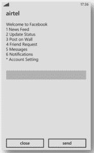
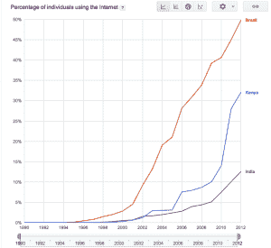

# 你如何将 1000 万 Dumbphone 用户连接到脸书？TechCrunch

> 原文：<https://web.archive.org/web/http://techcrunch.com/2013/08/19/how-do-you-connect-10-million-dumbphone-users-to-facebook/>

2011 年，由于互联网普及率低抑制了脸书在新兴市场的早期增长，印度初创公司 [U2opia](https://web.archive.org/web/20230128101020/http://www.u2opiamobile.com/) 开发了一种类似短信的系统，用户可以通过键盘浏览各种菜单来发布消息和阅读通知。现在，新兴市场中有 1000 万移动用户正在使用这种模拟技术，并以每月新增 100 万用户为荣。然而，如果不能随着日益增长的数字用户群而增长，这家初创公司就有可能变得多余。

 印度初创公司 U2opia 与脸书密切合作，开发了一款基于第一代技术 USSD(非结构化补充服务数据)的 app。它利用运营商的 GSM 系统来创建连接脸书系统和电话用户的数据会话。订户拨打*325#访问带编号的菜单，这些菜单允许他们实时阅读他们的新闻源、更新他们的状态或在他们的墙上发帖，以及批准好友请求。

据联合创始人苏梅什·梅农(Sumesh Menon)称，这家羽翼未丰的初创公司于 2011 年 5 月 17 日启动，要达到百万用户的里程碑还需要再等 10 个月，但在接下来的 13 个月里，它又增加了 900 万用户，现在每个月又签下 100 万用户。用户每月支付大约 1 美元无限制地使用这项服务，但是电信公司承担了绝大部分费用(在印度，电信公司通常承担这类交易 70%的费用。)U2opia 的客户分布在 25 个国家，通过 40 家运营商获得服务。在非洲，USSD 的脸书是 80%的用户访问社交网络的方式。

梅农说:“我们所做的是找到一种简单、廉价、与手机无关的移动解决方案。”。“我们着眼于最低的共同点，意识到在基础设施薄弱的情况下，有一个巨大的未开发的潜在基础。我们试图解决这些具体的市场问题。”

 根据国际电信联盟[的数据，2010 年至 2012 年间，印度互联网普及率翻了一番，达到 12%左右；在肯尼亚增长了一倍多，达到 32%；在巴西增长了 10%，跨越了一半的人口。](https://web.archive.org/web/20230128101020/http://www.google.com/publicdata/explore?ds=emi9ik86jcuic_&ctype=l&strail=false&bcs=d&nselm=h&met_y=i99H&scale_y=lin&ind_y=false&rdim=country&idim=country:IN:KE:BR&ifdim=country&hl=en_US&dl=en&ind=false&icfg)

这些市场显然有增长空间，Menon 也有在东欧扩张的计划，但承认这项服务并不适用互联网丰富的发达国家，如美国和英国。

他明白开发一种新的商业模式以跟上他渴望的用户群的重要性，这些用户一旦找到第一份工作并购买了第一部智能手机，就会放弃 U2opia 的服务，直接升级到脸书的应用。在这些发展中经济体，这只是时间问题。他的投资者 Matrix Partners 将密切关注此事，该公司在 2011 年 9 月投入了一笔未披露的资金。

梅农正在用工程师充实他的 100 多名员工，以推出专注于结识新朋友的新应用。

梅农说:“在这些国家中的一些国家，我们增加的用户比我们最初推出时更多，但是，我们确实想解决毕业用户的问题。”。“我们正在尝试一系列完全不同的产品。目前正在开发的东西是关于结识新朋友，根据人们的兴趣和对话与他们联系，而不是明确的约会应用程序。”这是我们正在评估的事情，因为随着这些用户成熟并进入认真的关系模式，它开始变得与具有不同观点的人联系起来。"