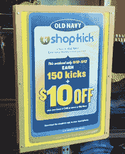
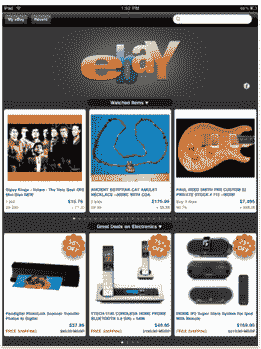

# 谷歌、易贝和贝宝如何为移动假日购物季做准备 

> 原文：<https://web.archive.org/web/http://techcrunch.com/2011/11/13/how-google-ebay-and-paypal-are-gearing-up-for-a-very-mobile-holiday-shopping-season/>

在线假日购物在 2010 年达到了创纪录的水平。今年电子商务[支出](https://web.archive.org/web/20230203095317/https://techcrunch.com/2011/08/08/comscore-u-s-retail-e-commerce-spending-up-14-percent-thanks-to-an-increase-in-buyers/)上升。所有迹象都表明，消费者在这个假期会花更多的钱在网上。我与谷歌、易贝、PayPal 和 ShopKick 的高管坐下来，讨论了未来几个月电子商务领域可能出现的趋势。它们围绕着手机、平板电脑和交易。

自 2010 年假日购物季以来，PayPal 的移动支付量已经翻了一倍多，我们甚至还没有遇到今年的高峰。易贝预计 2010 年移动支付量将达到 50 亿美元，这一数字在接下来的几个月里还会增加。谷歌预计，黑色星期五(感恩节后一天，一年中最大的购物日之一)总搜索量的 15%将来自移动设备。平板设备现在是网上购物体验的一部分，零售商也注意到了这一点。显然，所有迹象都表明，今年可能是手机购物的突破之年。

**移动，移动，移动**

我采访过的所有公司都一致认为，今年将是假日购物季的移动之年。易贝移动业务运营和发展主管 Steve Yankovich 表示，他预计今年将是易贝移动销售最大的一年。易贝表示，该公司预计 2011 年商品总销售额将达到 50 亿美元，这将在一定程度上得益于 11 月和 12 月强劲的移动业务。

PayPal 的移动业务高级总监劳拉·钱伯斯(Laura Chambers)对扬科维奇的预测表示赞同，并表示商家甚至已经为他们的移动网站的流量冲击做好了准备。一些大型零售商，如 Armani Exchange、Guess 和 The Limited，最近将 PayPal 的移动快速结账作为其移动网站上的支付选项，以帮助转换过程。“我们看到今年在线零售商对移动购物的大力投资，”她说。

钱伯斯说，去年，贝宝移动支付的高峰日是 12 月 12 日，移动支付量为 470 万美元。现在 PayPal 每天有 1000 万美元的移动支付，我们甚至还没有正式进入假日购物期。显然，从去年到今年，移动支付的数量甚至可能增加两倍。

虽然许多消费者可能会在移动设备上购买节日用品，但产品搜索、条形码扫描和其他信息应用的使用也将在今年的移动购物中发挥重要作用。易贝的 RedLaser 条形码扫描应用程序的扫描量在过去一年中增加了 50%。如果你不熟悉它的工作原理，RedLaser 将扫描实物产品的条形码，并告诉你在易贝的物业上哪里可以买到它，以及在你周围的当地商店哪里可以买到它(通过 Milo)以及多少钱。该应用程序已经更新了 PayPal 功能，因此用户可以直接从应用程序中购买产品。

另一个对移动设备寄予厚望的购物应用开发商是 ShopKick。联合创始人西里亚克·罗丁说，今年将是实体购物的移动之年。作为背景，当手机上有免费 Android 或 iPhone 应用程序的人走进商店时，Shopkick 会自动识别。一旦检测到 Shopkick 信号，该应用程序会向用户发送名为“kickbucks”的奖励积分，以奖励用户走进零售店、试穿衣服、扫描条形码和其他行为。Kickbucks 随后可以在所有合作伙伴商店兑换礼品卡奖励或脸书积分。用户还可以在梅西百货、百思买或塔吉特百货等合作商店获得特定产品的特别折扣。

罗丁解释说，手机是你在实体店随身携带的唯一互动平台，零售商希望利用这个平台来帮助推动交易。显然，提供店内折扣的移动奖励应用程序可以帮助做到这一点。“在过去的 15 年里，互联网给实体零售商带来的麻烦多于好处。现在，零售商开始意识到互联网可以如何帮助零售商——这就是移动技术的用武之地。”

谷歌商务产品管理副总裁 Sameer Samat 告诉我，这家搜索巨头发现越来越多的用户使用手机做出购买决定。“随着时间的推移，我们肯定会看到移动商务的转化在增长，而且规模越来越大，”他说。"但用户也在用他们的手机搜索产品和当地的供货情况."

Samat 表示，在过去的一年中，谷歌的移动产品搜索使用率和谷歌购物应用下载量增长了 200%。Shopper 可用于 iOS 和 Android，允许您查找产品价格、评论、规格、附近商店的本地产品库存等。

正如我们上面提到的，谷歌预测黑色星期五总搜索量的 15%。将来自移动。“毫无疑问，用户现在正在用手机做购买决定，”Samat 说。“随着时间的推移，我们看到移动商务的转化越来越大。”

**平板电脑**

随着平板电脑逐渐成为人们的首选浏览设备，iPad 和其他设备也正在成为一种购物方式。零售商也抓住了这一趋势。根据[全国零售联盟](https://web.archive.org/web/20230203095317/http://www.nrf.com/modules.php?name=News&op=viewlive&sp_id=1227)的一项研究，20%的零售商在这个假期投资了平板设备应用。

考虑到这一点，谷歌[在 8 月份推出了目录](https://web.archive.org/web/20230203095317/http://googlemobile.blogspot.com/2011/08/shop-your-favorite-catalogs-with-google.html)，这是一款针对平板设备的应用程序，包括 200 个主要品牌的目录，包括 Anthropologie、Bare Escentuals、Bergdorf Goodman、Crate and Barrel、L.L. Bean、Lands' End、Macy's、Neiman Marcus、Nordstrom、Pottery Barn、Saks Fifth Avenue、Sephora、Sundance、Tea Collection、Urban Outfitters 和 Williams-Sonoma。

这款应用不仅仅是一种浏览体验。当消费者找到他们想要购买的商品时，他们可以点击在附近的商店中找到它，或者点击“在网站上购买”来在线访问商家。

谷歌的 Samat 说，“平板电脑是终极的后仰体验，我们看到它在假日购物中发挥着重要作用，取代了你过去浏览的邮购目录。”

PayPal 称之为“沙发商务”,并认为平板电脑商务今年将创下纪录。PayPal [最近报告](https://web.archive.org/web/20230203095317/https://www.thepaypalblog.com/2011/10/research-how-do-tablets-impact-mobile-shopping/)称，同时拥有平板电脑和智能手机的消费者更有可能(63%)表示在移动购买上的总体支出有所增加，而只有智能手机的消费者只有 29%。同时拥有平板电脑和智能手机的人的购物频率是只有智能手机的人的近两倍，超过 40%的双重用户在过去一年中购买了 20 次以上的手机，而只有 12%的智能手机用户购买了手机。

Forrester 刚刚发布了一份报告，预测今年在线购物销售额将增长 15 %,达到近 600 亿美元，部分原因是消费者使用平板电脑购物的增加。

**超越黑色星期五和网络星期一**

黑色星期五和网络星期一历来是假日期间网上购物收入最高的日子。但高管们预计，由于移动购物和交易的增加，其他日子的网上购物量将会很高。

Yankovitch 告诉我，易贝预计收入数字将远远超过易贝去年黑色星期五和网络星期一的数字，但预计在人们传统上不购物的时候会有更多的活动。

钱伯斯说，[感恩节](https://web.archive.org/web/20230203095317/https://www.thepaypalblog.com/2011/09/paypal-predicts-major-spike-in-mobile-shopping-on-thanksgiving-day-3/)就是其中之一。因为人们将在任何地方(包括在餐桌上)都有他们的手机，消费者预计会在飞行中购物，尤其是在感恩节晚上。事实上，PayPal 预测感恩节晚餐后将是这个假期的第一个移动购物高峰。

另一个受欢迎的日子是 12 月的第二个星期天，这是人们有信心商品会及时运到的最后几天之一。钱伯斯说，总的来说，周日是手机购物最重要的一天。

**交易**

毫无疑问，交易、优惠券和折扣将是在线假日购物体验的一大部分，尤其是在当前的经济状况下。根据最近的 Forrester 报告，58%的美国人表示他们比一年前更加注重价格，近一半的人认为他们在网上找到了更好的价值。

钱伯斯解释说:“我真的希望消费者在这个季节能买到便宜货。”。她说，PayPal 历来为假日购物季提供特别优惠，今年假日购物季将会增加更多的消费优惠。

Samat 说，谷歌在假日期间总是看到交易、优惠券和销售等查询的激增，并完全预计今年会有所增加。“消费者对更好交易的渴望将有助于给某些产品决策工具带来巨大的冲击，”他解释道。“今年人们可能会花更多时间来找到尽可能好的价格。”

交易还可能包括利润丰厚的假日运输优惠。2010 年，排名前 50 的在线零售商中有 45 家在感恩节和网络星期一之间提供了某种促销活动，其中大部分是一种运输促销。2011 年，Shop.org 预计将有创纪录的 92.5%的在线零售商提供免费送货服务，而不仅仅是作为网络星期一的促销活动。

显然，零售商和科技公司对这个假期的在线消费和购物非常乐观。考虑到零售商在新技术上的巨大赌注，如移动、地理定位、平板电脑、本地产品搜索等，这个假期有点独特。一个大问题是，在接下来的几周内，消费者将如何对这些技术做出反应并参与其中。这可能是一个流动性很大的圣诞节。