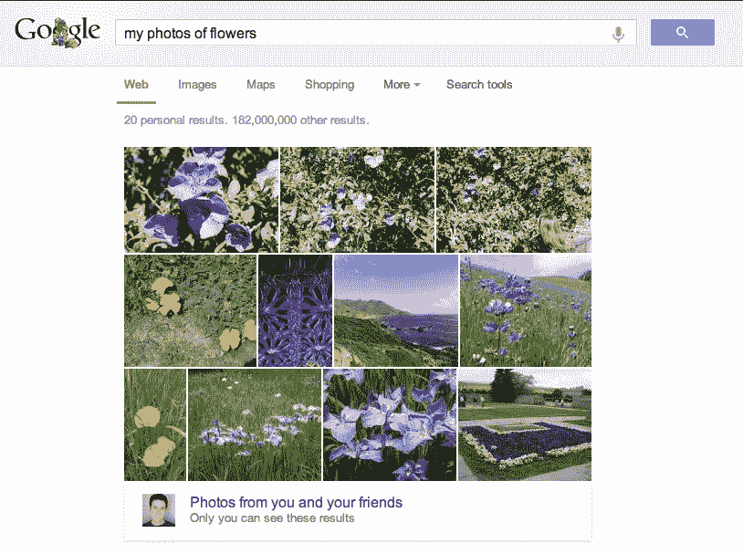

# 谷歌对 DNNresearch 的收购使其迅速建立了令人印象深刻的 G+照片搜索

> 原文：<https://web.archive.org/web/https://techcrunch.com/2013/06/12/how-googles-acquisition-of-dnnresearch-allowed-it-to-build-its-impressive-google-photo-search-in-6-months/>

# 谷歌对 DNNresearch 的收购如何让它在 6 个月内建立了令人印象深刻的 Google+照片搜索

在 I/O 开发者大会期间，谷歌悄悄地推出了 Google+ 中的[照片搜索功能的大规模改进版本，现在它使用先进的计算机视觉让你搜索你的个人照片。该公司并没有把这个工具当成](https://web.archive.org/web/20230324203325/https://techcrunch.com/2013/05/23/google-starts-using-computer-vision-to-let-you-search-your-google-photos/)[的大事](https://web.archive.org/web/20230324203325/http://insidesearch.blogspot.com/2013/05/finding-your-photos-more-easily-with.html)，但是它工作得非常好。今天，谷歌[更加公开了它是如何在大约六个月的时间里开发出这种新的照片搜索体验的。](https://web.archive.org/web/20230324203325/http://googleresearch.blogspot.com/2013/06/improving-photo-search-step-across.html)

谷歌的 Chuck Rosenberg 写道，这个系统本质上是谷歌已经提供了大约 12 年的网页图片搜索的下一个版本。然而，该工具主要依赖于图像文件名和来自网络的文本来对这些图像进行分类。对于个人照片来说，这是不可能的，因为除了一些基本的 EXIF 元数据之外，个人照片通常没有上下文。“一般的学步儿童比运行最先进算法的世界上最强大的计算机更能理解照片中的内容，”罗森伯格写道。

然而，去年 10 月，多伦多大学的杰弗里·辛顿教授的团队开发了一个基于深度学习和卷积神经网络的系统，轻松赢得了 ImageNet 计算机视觉竞赛。这改变了事情，谷歌的一个小组建立并训练了一个使用类似方法的系统，开始解决这个问题，并认识到这将有助于使照片搜索更加精确和简单。

为了让这成为可能，谷歌[在三月份收购了](https://web.archive.org/web/20230324203325/https://techcrunch.com/2013/03/12/google-scoops-up-neural-networks-startup-dnnresearch-to-boost-its-voice-and-image-search-tech/) [DNNresearch](https://web.archive.org/web/20230324203325/http://www.dnnresearch.com/) ，这是一家从辛顿团队的原始研究中分离出来的初创公司。直到现在，还不清楚这个团队在谷歌做什么，但现在我们知道了答案。当谷歌收购这家由辛顿和他的两名研究生 Alex Krizhevsky 和 Ilya Sutskever 创建的公司时，我们不确定[谷歌这样做是否是为了辛顿在语音识别、语言处理或图像识别方面的工作。](https://web.archive.org/web/20230324203325/https://techcrunch.com/2013/03/12/google-scoops-up-neural-networks-startup-dnnresearch-to-boost-its-voice-and-image-search-tech/)

正如 Rosenberg 所指出的，公司工具 this“在短短六个月多一点的时间里，将尖端研究直接从学术研究实验室中取出并启动。”

今天的照片搜索使用了大约 1100 个类别，基于构成知识图基础的免费实体。今天的帖子对[系统如何工作和处理不同种类的图像进行了更深入的探究。值得注意的是，谷歌表示，该系统的效果比预期的要好，特别是对于“芙蓉”或“大丽花”这样的特定子类(我不知道这两者之间的区别……)。](https://web.archive.org/web/20230324203325/http://googleresearch.blogspot.com/2013/06/improving-photo-search-step-across.html)

罗森博格指出，计算机视觉并没有“一蹴而就”，但我们正在接近让计算机“像人一样看世界”