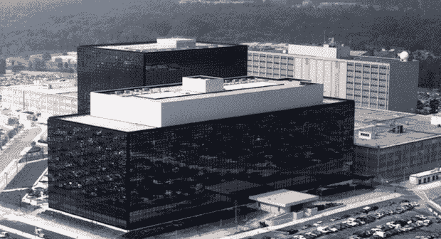
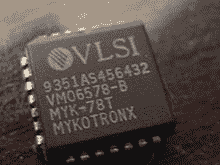

# 黑客如何在 90 年代击败美国国家安全局，以及他们如何再次做到这一点

> 原文：<https://web.archive.org/web/https://techcrunch.com/2013/06/28/how-hackers-beat-the-nsa-in-the-90s-and-how-they-can-do-it-again/>

CrunchGov Essential 是一份关于科技对当今重大问题的影响力的扫描综述。在一篇专题文章下面，我们呈现了通过网络最佳内容讲述的最有思想、最令人愤慨、最鼓舞人心的故事。在这里注册早间新闻[。](https://web.archive.org/web/20230330231354/http://link.beta.techcrunch.com/join/134/crunchgov-signup)

当世界解析国家安全局(National Security Agency)大规模窥探行动的后果时，重要的是要记住政府早些时候在数据收集方面的尝试，更重要的是，一群黑客和活动人士如何联合起来阻止它。

在 20 世纪 90 年代初，军方害怕加密技术会让他们对移动和数字通信的日益增长的使用视而不见，所以他们策划了一项计划，禁止放置一个给 NSA 后门窃听访问的硬件补丁，即所谓的“ [Clipper 芯片](https://web.archive.org/web/20230330231354/http://en.wikipedia.org/wiki/Clipper_chip)”。

在听说该计划后，黑客、工程师和学者组成的草根小集团爆发了抗议，引发了一场全国性的运动，质疑 Clipper 芯片的安全和商业影响，[最终使 NSA 的计划嘎然而止](https://web.archive.org/web/20230330231354/http://www.nytimes.com/1994/06/12/magazine/battle-of-the-clipper-chip.html?pagewanted=all&src=pm)。

现在，由程序员和技术高管组成的反权威团体正在准备与美国国家安全局的绝密互联网窥探设备棱镜(PRISM)进行另一场斗争，他们可以从获胜的前任那里学到一些重要的经验。

科技与文化的冲突

MYK-78，又名“飞剪芯片”

情报机构在爆满的日子里就像今天一样渴望监控恐怖分子的数字计划。由于担心美国杰出的学术头脑会无意中用尖端加密技术武装敌人，美国禁止出口任何可能隐藏通信的技术。

美国国家安全局前司法部长斯图尔特·贝克(Stewart Baker)回忆道:“如果你只是简单地利用这项技术，并将其广泛发布，你也有可能为非常小的恐怖组织、犯罪分子等创造机会，利用这项技术获得一种完美的信息安全。”。

因此，早期互联网浏览器上的加密程序被官方视为弹药，就像导弹火箭或狙击瞄准镜一样。这就是为什么你经常看到在为使用加密技术的程序服务时提到核武器。

这项禁令是不可持续的，因为迅速增长的购物狂群体希望能够通过万维网安全地购买“星球队长”t 恤，所以 NSA 知道它不能出于国家安全目的阻止整个安全电子商务。作为允许技术出口的第一步，克林顿白宫游说了一个铅笔橡皮擦大小的硬件补丁，至少允许情报机构将其珍视的窃听做法扩展到扎克·莫里斯式的移动电话。

最终，该计划被反对 NSA 棱镜计划的同一批技术专家和企业击败。“每种技术都有其文化中占主导地位的意识形态部分，”贝克说。“有一种从教授到学生流传下来的主导意识形态，你知道，‘我们必须反对滥用这种技术，以使国家更加强大’……人们将编写最大化个人自主权和减少政府权力的代码。”

贝克回忆起意识形态的协同努力，替代加密软件，对 Clipper 漏洞的学术攻击，以及大企业的游说是如何让 NSAs 计划付诸实施的。

**金钱万能**

“一场亚文化冲突变成了权力巅峰时期的微软和国家安全机构之间的战斗，”贝克回忆道，他认为出口产品的需要，尤其是对电子商务的需要，迫使商界赢得了国会议员的支持。

微软前首席软件架构师雷·奥茨在国会作证，并让易受攻击的成员知道加密法规可能会使他们每年损失 60 亿至 90 亿美元的收入。成功了。

职业参议员帕特里克·莱希(仍在任)说:“政府不应该强制推行特定的技术。”。

“他们去白宫，去国会，他们解释这将如何损害他们的业务，”史蒂芬·利维补充道，他写了一本关于快船芯片战争的书， *Crypto* 。

与上世纪 90 年代相比，科技行业在政府中拥有更多的密友。湾区为奥巴马筹集的资金比好莱坞(洛杉矶)或华尔街(纽约)都多。硅谷在 DC 的大规模存在得到了回报:谷歌对美国联邦贸易委员会垄断指控的密集游说使其潜在的数百万美元罚款[减少为严厉警告](https://web.archive.org/web/20230330231354/http://www.politico.com/story/2013/01/how-google-beat-the-feds-85743.html)。

我们已经看到[谷歌要求披露更多关于美国国家安全局间谍行为的数据](https://web.archive.org/web/20230330231354/https://techcrunch.com/2013/06/18/google-fights-spying-gag-order-but-key-details-would-lack-even-if-successful/)得到了回报:奥巴马政府已经表示，可能会放松关于可以公布哪些细节的禁令。该行业刚刚开始战斗，但硅谷在竞选期间支付了大笔费用，他们有恩惠等待召唤。

**第一修正案是你的朋友**

游说本身并没有推翻快船芯片和出口管制。在白宫屈服于科技行业的三个月前，第九巡回上诉法院以第一修正案为由推翻了出口管制。

“因此，政府控制加密的努力很可能不仅涉及打算拓展其科学边界的密码学家的第一修正案权利，还涉及我们每个人作为加密奖金潜在接受者的宪法权利，”[解释说](https://web.archive.org/web/20230330231354/https://www.eff.org/press/archives/2008/04/21-29)具有里程碑意义的*伯恩斯坦诉美国司法部*裁决。

尽管政府正式对这一裁决提出上诉，但它知道自己的地位被削弱了。“然后政府找到我们，说‘我们想了结此案’。电子前沿基金会的创始人约翰·吉尔摩说。

今天，政府电话和互联网监听的问题很大程度上是第一修正案的问题。国家安全局堵住了参议员和科技公司谈论该项目的嘴。

对于电子邮件间谍活动是否产生了效果，存在激烈的分歧。虽然美国国家安全局声称它帮助阻止了 2009 年纽约地铁爆炸阴谋，但公开文件表明，执法部门从警方在正常调查过程中恢复的硬盘文件中获得了最佳线索。

谷歌已经向司法部长提交了第一修正案投诉，参议员莱希[已经提议](https://web.archive.org/web/20230330231354/http://www.huffingtonpost.com/2013/06/24/patrick-leahy-nsa_n_3492512.html)立法向国会议员披露更多信息(是的，情报信息甚至向国会隐瞒)。

所以，当科技公司和公民自由团体起诉政府时，要知道他们有赢的历史。

**像狄更斯一样打造工具**

对 Clipper 来说，致命的一击是发现了它不可避免的弱点。著名黑客、贝尔实验室工程师马特·布雷泽(Matt Blaze)早在 1994 年就写道，“发现了 Clipper 中的一个缺陷，这个缺陷会让用户绕过芯片的安全功能”。Clipper 不仅仅是政府的后门，而是任何接管其薄弱安全墙的黑客。

在进攻方面，超级程序员正在构建免费的开源加密工具，如菲利普·齐默曼(Philip Zimmerman)的“相当好的隐私”，这使得公众可以更好地监督他们的漏洞，并且不受出口法规的限制。换句话说，政府无法阻止草根黑客群体传播它想要阻止的技术。

今天，颠覆国家安全局的工具已经没有多少吸引力了。有用于安全互联网浏览的 TOR，也有用于安全通话的 Redphone，但它们要么要求每个人都使用相同的软件，要么实现复杂。

“密码学并不简单，其背后的概念也不容易理解。TOR 项目的 Andrew Lewman 说:“一般来说，隐藏问题的复杂性只会让用户面临更大的风险。

因此，虽然公民有科技公司和民权组织站在他们一边，但第四修正案需要一个好的用户界面设计师。

一场可赢的战斗

如果历史告诉我们什么，反对国家安全局的秘密是一场胜利。情报领导人由民选官员统治，军事实践仍然容易受到法院的影响，黑客可以创造工具来掩盖用户免受广泛的互联网窥探。每个公民，无论他们投票，支持公民自由组织，建立加密工具，都有一个角色要扮演。

正如约翰·吉尔摩提醒我的那样，“我们相对于国家安全局的一个优势是，我们的人比他们的人多得多。”

*要了解更多故事，请在这里注册 CrunchGov 电子邮件简讯[，并在](https://web.archive.org/web/20230330231354/http://link.beta.techcrunch.com/join/134/crunchgov-signup)[Twitter](https://web.archive.org/web/20230330231354/http://www.twitter.com/ferenstein)T5 上关注 Gregory Ferenstein*

### 这本书:4 个条目——谷歌起诉国税局，军方阻止《卫报》,移民改革在参议院通过，德克萨斯电脑欺诈每日秀

谷歌起诉国税局索赔 830 亿美元[CNET](https://web.archive.org/web/20230330231354/http://news.cnet.com/8301-1023_3-57591491-93/google-to-irs-hand-over-our-%2483.5-million-tax-refund/)

*   谷歌声称美国国税局在 2004 年拒绝了一项税收减免，这项税收减免现在价值高达 835 亿美元。
*   “谷歌辩称，美国国税局错误地拒绝了该公司扣除的 2.386 亿美元，这笔扣除涉及美国在线为行使谷歌股票权证而支付的费用与该公司股票实际价值之间的差额。”
*   根据诉讼，美国在线在谷歌为其首次公开募股定价并上市前三个月获得了价值 2.386 亿美元的股票。这实际上让谷歌在首次公开募股中没有股票出售，而且由于认股权证被用作美国在线当时向谷歌提供服务的报酬，该公司希望支出全部股票支出。
*   谷歌是一个臭名昭著的避税天堂骗子，每年通过离岸账户骗取数十亿美元。所以，不用说，这套西装很有胆量。

**军事封锁《卫报》** [ [蒙特雷先驱报](https://web.archive.org/web/20230330231354/http://www.montereyherald.com/news/ci_23554739/restricted-web-access-guardian-is-army-wide-officials) ]

*   军方封锁了《卫报》的访问权限，以保护士兵不阅读泄露的关于国家安全局的机密文件。
*   陆军 Spox:“我们尽一切努力平衡保护信息访问和操作安全的需要……然而，在保护和处理机密信息方面有严格的政策和指令。”
*   还好没有其他人写过《卫报》的发现，所以军方的计划是无懈可击的。提醒一下，这些人掌管核武器。

移民改革在众议院有一场硬仗

*   参议院昨天以 68 票对 32 票通过了一项全面的移民法案。
*   但是，共和党人称该法案为“白日梦”，并计划通过他们自己的版本，目前由许多不同的法案组成，包括一项针对高技能移民的单独法案。

**德州共和党电脑欺诈每日秀**

在温迪·戴维斯对得克萨斯州限制堕胎权利的提案进行马拉松式的深夜阻挠后，共和党人试图改变他们投票的电子时间戳以支持该法案。戴维斯的阻挠议事有效地阻止了该法案，所以共和党希望它可以通过改变计算机记录追溯到前一天给自己更多的选票。*每日秀*认为这很棒:

[Hulu id = 7v 7 hkz 8 u 894 hwa 2 wfk 824g width = 480]