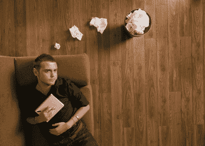

# 我如何利用可视化来推动创造力 TechCrunch

> 原文：<https://web.archive.org/web/https://techcrunch.com/2011/01/17/how-i-use-visualization-to-drive-creativity/>

*这是由[马克·苏斯特](https://web.archive.org/web/20230202233946/http://www.crunchbase.com/person/mark-suster)发布的客座博文，他是一名 2x 创业者，后来成为风投。他把自己的第二家公司卖给了 Salesforce.com，成为产品管理副总裁。他于 2007 年加入 GRP Partners，成为专注于早期技术公司的普通合伙人。在他的博客**和 Twitter[**@ m Suster 上阅读更多关于 Suster 的信息。**](https://web.archive.org/web/20230202233946/http://twitter.com/msuster)***

 **创造力。我一直认为这是商业成功的最重要的属性之一，但很少有商业领袖谈论这一点。所以我想写一篇关于我如何激发个人创造力的文章。

作为一名创造力的实践者，而不是一名创造力的指导者，我确信有很多方法可以让创造力流动起来，以及如何释放更多的创造力。对我来说最有效的方法是想象和自我对话。

视觉化对于帮助自己和他人概念化想法是非常重要的。这就是为什么我总是努力为我的博客帖子寻找图片&这就是为什么我所有的主题演讲都是视觉化的，而不是文字的要点。

**执行摘要:**这是一篇很长的帖子，所以如果你想在不阅读所有细节的情况下获得要点，我在这里放一个执行摘要。如果你打算阅读这篇文章，你可以跳过摘要。

*   几乎所有的商业成功都依赖于创造力。这同样适用于风投、初创公司和大公司高管
*   尽管创造力很重要，但似乎几乎没有关注教授它、鼓励它、训练它&把它融入我们的日常生活。对创造力的需求远远超出了产品设计。
*   许多人是视觉思考者。因此，为了激发创造力，人们需要进行视觉头脑风暴
*   你需要找到适合你的方法，把自己放在那个环境中，学会如何“自我对话”，学会如何创建可视图表，学会如何测试和重复想法，学会如何有效地交流结果。
*   对我来说，我只能靠自己。我认为团队会议更适合测试想法，而不是原创想法，但这就是我。孤独和创造力是携手并进的。
*   我用工具来唤起我的创造自我。一个例子是驾驶，这有一个实际的生理原因，它使你有创造力。关键是将你开车时学到的东西用纸记录下来，这样你就可以很快写下来
*   第一次让我意识到“创造性大脑”的一本书是贝蒂·爱德华兹的《[画在大脑的右边](https://web.archive.org/web/20230202233946/http://www.drawright.com/)》。这是一本关于创造艺术的书，但它展示了艺术家的思维如何“进入状态”，创造力如何被激发，以及为什么以不同于理性思维的方式看待你所创造的东西是创造力的重要组成部分。她真的鼓励你把东西倒过来画。
*   我驱动创造力的其他方式是时间压力、淋浴&偶尔喝点酒。所有这些都是众所周知的创造力驱动因素，在上面提到的书中都有涉及。对于其他人，他们相信音乐。我个人认为音乐与其说是有益的，不如说是令人分心的。
*   给创造力添加结构并不矛盾。这是你如何整理你的想法
*   像任何事情一样，创造力需要练习。没有所谓的“不是一个有创造力的人”有些人比其他人更有创造力，但这是我们每个人的天性。你只需要全身心地投入到挖掘你的创造力中去。
*   我几乎把视觉思维应用到我做的每一件事上:准备重要的电话(我想象我的开场白，我想象回应)，写主题演讲，决定是否投资一家公司，准备董事会议——你能想到的。这些都是创造性的过程。
*   在职业体育运动中，想象是一种众所周知的技术，输赢的区别往往是心理上的，而不是身体上的。如果对他们有用，对你也有用。

**细节**

**到底什么是可视化？**–听起来确实如此。视觉化的过程实际上是在你的头脑中想象或看到事物。当我需要做一个演讲的时候，我正在为我的甲板写一张幻灯片，我在我的脑海里想出我要为这张幻灯片讲的故事。我想象自己在舞台上说这些话。我考虑观众可能会有什么反应，如果我在观众中，我是否会被激起兴趣。

这就是为什么每次演讲前，我都会给组织者打电话，反复询问谁会是观众。我想知道有多少人，他们的技术水平，他们的年龄和他们的兴趣。我仔细地看着在我之前发言的人。为了想象观众会如何接受我的演讲，我必须能够想象整个情况。

当我写博客的时候，我经常在动笔之前看到文字。如果我知道我有一个我感兴趣写很多次的话题，我会在坐在电脑前打字之前，在脑海中逐字逐句地思考整个句子，作为一种尝试。

很奇怪，我知道。但是对许多人来说，创新最重要的驱动力是这种可视化&自我对话。然而，这听起来太过奇怪或神秘，因此我很少听到领导人谈论它。所以我想我会的。

**我们商业生活中的创造力**——如今，一般的科技创业公司都会花时间与同事和投资者谈论各种各样的事情:客户获取、病毒式采用、融资、雇佣/解雇员工、产品特性、技术趋势、营销/品牌等等。我很少听到关于如何变得更有创造力的讨论。

这很讽刺，因为我认为创造力是创业公司最重要的成功标准。如果我们善于反思，这也是投资者、高管、科技作家以及几乎所有参与商业领导的人最重要的成功标准之一。然而，大多数初创公司似乎将创造力局限于产品设计。真遗憾。

创造力是帮助我们首先想到我们的想法的东西。这有助于我们想象什么样的功能集最有吸引力。这是我们包装公司故事和推动媒体报道的方式。作为一名风险投资人，这是我如何思考未来哪些市场会有吸引力，我现在想进入哪些市场，以及技术和商业世界可能会如何演变。如果没有创造力，我会简单地投资于我在 TechCrunch 上看到的趋势，我天生认为这意味着我会投资于已经发生的事情，而不是想象可能发生的事情。

当我打重要电话时，在我拿起电话之前，我会在脑海中播放电话的开头。我想象自己说出我的开场白，并设身处地地为对方着想，想想他们会有什么反应。

我所做的任何一项重要的商业职能都离不开创造力。无论是准备参加董事会会议，还是计划与高管团队进行战略讨论，或者是准备接受电视采访，我都使用相同的流程。

[T3](https://web.archive.org/web/20230202233946/https://techcrunch.com/wp-content/uploads/2011/01/shapes-and-lines.jpg)

**创意过程**——每当我需要做任何需要洞察力的任务时，我必须能够想象——真正看到决策框架。许多人是视觉思考者。我经常从一张白纸和一支笔开始涂鸦。我试着用盒子、箭头、圆圈&和其他形状在视觉上解构这个问题。我补充一句话&想法。我试图弄清楚各组成部分的结构。我开始用隐喻来表达我的想法。我将隐喻融入到一个有连贯性的叙述或主题中。

我知道这听起来很抽象，所以让我给你举一个这周的例子。

我最近投资了一家媒体和娱乐行业的公司(这将在几个月后宣布)，所以我一直在思考这个行业是如何运作的，为什么这个结构会以这种方式发展，为什么我投资的公司会取得如此大的成功，以及这一切对未来意味着什么。我不得不做所有这些，以便对公司拥有可扩展和可持续的优势感到放心，并考虑我认为他们会遇到的威胁。

我开始将它构建成一个媒体和娱乐价值链，将这个行业的组成部分分解成独立的部分。我把我的定义放在上面，因为我不想让我的思维被行业定义的界限或定义所束缚。从左到右，我在方框中写道:人才发现、内容开发、制作、后期制作、发行和营销。支撑我所写的一切:销售、资产管理、分析和人才管理。

我用这些盒子来想象现有的电影、电视、广播和印刷媒体公司在这些领域做了什么。他们是纵向整合的吗？如果有，为什么？他们主宰了一个还是两个领域？他们是如何做到这一点的？为什么有线电视&卫星公司强迫我们接受比我们想要的价格更高的内容“捆绑包”和我们不看的内容。为什么？还有谁是同谋，同样受到[创新者的困境](https://web.archive.org/web/20230202233946/http://www.bothsidesofthetable.com/2010/11/04/understanding-how-the-innovators-dilemma-affects-you/)的约束？以后还会这样吗？

YouTube、Pandora、iTunes、Huffington Post、Boxee、网飞、Demand Media 和其他颠覆性产品等新进入者在这个等式中处于什么位置，它将如何变化？谷歌因搜索而拥有的权力有多大？脸书和推特上的社交媒体如何改变事情？

如果过去要求我们观看线性的、基于时间的电视节目，而这种电视节目更喜欢网格状的电视指南或电子节目指南( [EPG](https://web.archive.org/web/20230202233946/http://en.wikipedia.org/wiki/Electronic_program_guide) s)，我们将如何在这个过度丰富的世界中发现&发现内容？市场能否支持 Clicker 这样的新进入者，还是会偏向 Rovi 这样的守旧派？如果这个预约电视有一个 22 分钟的结构，是否有理由期待未来的时间分配？为什么？

我在一篇关于[电视的未来&数字客厅](https://web.archive.org/web/20230202233946/http://www.bothsidesofthetable.com/2010/10/19/the-future-of-television-the-digital-living-room/)的文章中写下了我的初步结论。如果你读了这篇文章，你会真正看到这个话题的剖析，就像我在脑子里看到的那样。

但是当我思考未来世界的时候，我问了自己一系列新的问题，我在脑子里认真思考了每一个话题，并在纸上草草记下了笔记。我移动了盒子，改变了箭头的方向，在每个盒子下面画了圆点。我重写了 7-10 遍。写作和重写都不是问题——这是我创作过程的一部分。

通过对这些问题的思考，我现在可以开始与业内人士讨论这个话题，以及它的工作原理和工作方式。我可以有针对性地征求反馈，而不是含糊其辞。“在哪些情况下，你会从人才入手，构建与他们的人才相匹配的内容？在哪些情况下，你会先写故事情节？”我的框架让我对这个行业有了更深入的了解。

**创造力&结构并不相互排斥**——我们将创造力与右脑联系在一起，而将逻辑或结构与左脑联系在一起。因此，有创造力的结构听起来像一个矛盾。它不是。在我(和我自己)的每一次头脑风暴会议中，我首先以快速、自由的方式记下想法，然后寻找结构。正如我已经说过的，当我用纸做的时候，我经常画出形状、单词、线条&要点，然后在我的脑海中大声自言自语，思考它们是如何联系在一起的。

我也有一套写博客的流程。这些想法本身几乎总是来自我在日常工作生活中与他人讨论时产生的想法。然后，当我慢跑、开车或躺在床上时，我会在脑子里反复思考。我将博客标题形象化，并思考它是否会有冲击力。我经常开始思考句子，并在脑海中构建它们。我思考重点是什么。

从那里我将标题添加到 WordPress。我可能有大约 30 个博客标题，我坐下来的任何一天都可以写。我从来没有真正来到 WordPress 并思考“我今天应该写些什么？”要么是我曾经有过的想法，不得不从我的脑海中消失，要么是因为我读了一篇我想回应的帖子而做出的反应，或者是——通常情况下——我浏览我的标题并思考，“今天我对哪一个充满热情？”

这就是正式结构出现的地方。我几乎总是在写作前把文章分成几个部分。就像在这篇文章中一样，在让文字从我的脑海中流出并出现在屏幕上之前，我思考了一下结构。我组织主题的组成部分，我写章节标题，我把它们作为单独的标题来考虑，我考虑顺序是否连贯，整体叙述是否成立。

在某种程度上，在我脑海中出现一个详细的单词之前，我已经写完了整件事。然后，它只是一个功能，编写每个部分，重读以测试流量，试图编辑一点，然后点击发布。

然后，我会对帖子进行视觉思考。我想人们会读它。我想知道它是否会产生影响。如果我认为我错过了标记，我要么推迟出版，要么重写章节。或者——就像今天——我觉得它对大多数读者来说太长了，但我仍然想把我所有的想法都表达出来，所以我决定为那些没有时间或兴趣的人添加一个执行摘要。

但要明确的是，是结构支撑了我的创作过程。一直都是。自由形式，然后聚合，然后组织，然后结构，然后单词，然后隐喻，然后叙事，然后出版。我变得可预测和可重复。

孤独的重要性——我不相信团队创造力。我知道有些人会。他们在辅导员的带领下工作得很好，他们从听取他人的想法中学习。不是我。我真的需要一个安静的空间，一张空白的画布，一支笔或键盘，一个目标，以及足够的时间让思想流动。在一个小组中，如果我有一个创造性的火花，我没有时间让它在其他人开始发言时酝酿。

要明确的是，我的 V1 想法从来都不是我能做到的最好的。一旦我有了自己的想法，我就会把它们带到公共场合进行试驾。辩论是创新中最重要的成分之一。但是我喜欢在辩论中展示我的“稻草人”思想，而不是第一次思考一个话题。一切都从我自己开始。

**时间压力&创意**——我以前写过“[尿急成瘾](https://web.archive.org/web/20230202233946/http://www.bothsidesofthetable.com/2010/08/18/do-you-suffer-from-the-urgency-addiction-its-more-common-than-you-think/)”。前提是，许多人把注意力放在紧急的重要事情上，而我们应该真正关注不紧急的重要事情。但是像我这样的人在紧迫感中茁壮成长。不管出于什么原因，它让我的创造力源源不断。我认为没有截止日期，我的思想会在其他任务上走得太远。知道我早上要在 200 人面前做演讲，如果我还没有完成我的套牌，前一天晚上我会有一种有趣的方式来集中我的注意力。我非常害怕失败，这是我的安全网。

在《紧急状态》一文中，我谈到了人为设定最后期限，让你挖掘出同样的创造性紧急状态，同时给自己一个缓冲空间来完善你的想法。上周，我在下一代会议上向众多观众发表了演讲。那是一个星期三，我正在去那里的路上。我知道前一天我有 7 个其他的会议，所以我告诉自己，我必须在周日晚上完成甲板，以避免周二开夜车，让自己生病。这就成功了。

我决定了题目——“我在第一家公司经历的所有事情。”这是一个主要面向大学本科生或应届毕业生的会议。第一次想要。所以我觉得这是个好话题。然后我拿了 20 张空白的幻灯片。我对我搞砸的事情进行了头脑风暴，并为每一件事写了一个标题:筹集了太多的资金，对行业没有热情，雇佣了太多的资深人士，制造了太多的产品&过度规范，过早国际化，等等。

接下来，我为每个主题想象一个故事，以及代表这个故事的图像。我花了时间在 istockphoto 和 Google Images 上获得了恰到好处的图像。两个小时后我就完成了。演讲那天我醒得很早，我在脑海中练习这些故事。我确实自言自语了。我设想这个故事是否会受到欢迎。我调整了几个标题，换了两张不适合我的图片。然后就搞定了。如果你感兴趣，这副牌就在这里。

[我在第一家公司搞砸的事情](https://web.archive.org/web/20230202233946/http://www.docstoc.com/docs/69286554/Things-I-Effed-Up-at-my-First-Company)

**激活创造性大脑**——你有没有注意到当你在长途驾驶时，你有更多创造性的想法？多年来，我一直有这种感觉，但一直不明白为什么，直到我读了贝蒂·爱德华兹(Betty Edwards)的书《在大脑的右侧画画》(Drawing on the Right Side of the Brain),这本书讲述了艺术中的创作过程。你的大脑必须处理这些信息，处理所有这些视觉刺激的过程迫使你进入“右脑思维”，当你在那个区域时，你就在挖掘你的创造潜力。

显然，当艺术家们坐在他们的画布上或者当他们录制歌曲时，他们所做的就是进入这个右脑创作区。艺术家通常有更多的右脑思考技巧，所以它来得更自然。对于我们这些左脑思考者来说，我们需要找到进入这个区域的方法。当我在一个创意区时，我真的感觉自己像一个工作中的艺术家。

当我开始在纸上涂鸦，并能够“看到”问题的解决方案或勾勒出行业结构时，我会感到“进入了状态”，多年来我学到的是，我需要正确的环境和刺激。这就是为什么我会说独处的重要性，我对安静的需求，有白纸可以疯狂地乱写笔记，施加时间压力，强迫自己天马行空地写作，这些都可以在以后有机会阅读的时候整理成模式。

除了开车，爱德华兹女士还谈到了另一项激发创造力的自然活动——洗澡。我相信你已经注意到你以前洗澡时有过创造性的想法。敞开心扉。当我跑步时，偶尔喝一杯酒后，我也会进入状态。

我最近注意到的最有趣的事情之一是，《吉他英雄》对我的影响和开车一样。我被迫看着电视上的颜色快速下降，我不得不快速敲击塑料吉他的按键。没有办法从逻辑上处理下落的颜色，所以你真的开始“感觉”到音符在下落，你的手指开始对你的视觉刺激做出反应，而没有理性的思考。这是我能向那些不经常体验它的人描述“这个区域”的最好方式。

**将人际互动重新整合到你的创意设计中**–我已经谈了很多关于我需要独立创新的问题，但是众所周知，人际互动的力量能够改善我们的思维。对我来说，这只是一个我什么时候让别人加入我的过程的问题。我最初的想法从未在与他人的接触中幸存。我会带着我的模型在几个聪明的&见多识广的人之间走动，谈论任何话题。我会练习我的论点，听听他们如何回应。

有时是通过向我的同事展示和辩论。有时是通过在会议上发言，就像喜剧演员在巡回演出前在小场地试演他们的作品一样。他们利用观众的反应来改进他们的技艺。我也以他人的能量为食。当你和客户一起测试你的产品并观察他们如何使用时，我的想法会改变你的产品。

**在添加的世界中保持创造力**——坐在电脑前经常会降低创造力，这就是为什么我经常在没有电脑的房间里用纸笔做这件事。我在电脑上遇到的问题是，总有一些干扰让我无法集中精力进行头脑风暴。我抬头看了看 Chrome 的标签，发现 Twitter 上有两条新的@消息。有人在 Gmail 中向我发送即时消息。我想看纽约时报的头条新闻。我听到 Outlook 的铃声告诉我，“你有邮件！”

我用三种方式处理这件事。我用纸和笔进行的非常重要的创新思维。如果我需要在我的电脑上创新，我会试着关掉所有的外部刺激(例如关闭电子邮件)，这样我就可以集中注意力。或者，如果我在努力进入状态，我会在电子邮件或 Twitter 上休息一下，分散注意力，20 分钟后再回来参加我的头脑风暴会议。

**总结/付诸行动:**

*   在你的周计划中分配足够的时间来“发挥创造力”
*   想办法激发你的创造力(开车、淋浴、葡萄酒、音乐)，了解你的最佳环境是什么(安静还是音乐、独自还是集体)
*   开发和完善流程。它可能和我的相似:写作、组织、塑造、移动物体、添加要点、发展故事等等。或者您的流程可能会有所不同。但是你需要一个创新的过程。它不会就这样发生。
*   与他人一起测试你的想法，寻求反馈，完善。
*   玩得开心。这就是创作的过程。**