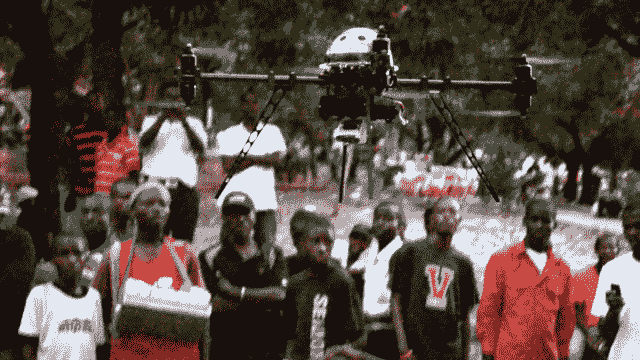

# Matternet 如何将无人机送货服务带给最需要的人| TechCrunch

> 原文：<https://web.archive.org/web/https://techcrunch.com/2013/12/10/how-matternet-wants-to-bring-drone-delivery-to-the-people-who-need-it-most/>

# Matternet 如何将无人机送货服务带给最需要的人

上周，媒体世界

[was abuzz with the news](https://web.archive.org/web/20230308161801/http://www.techmeme.com/131201/p14#a131201p14)

电子商务巨头亚马逊正在试验一个名为“

[Amazon Prime Air](https://web.archive.org/web/20230308161801/http://www.amazon.com/b?node=8037720011)

该公司将使用小型自动化“无人机”飞机为客户送货。但是当杰夫·贝索斯

[primetime television announcement](https://web.archive.org/web/20230308161801/https://techcrunch.com/2013/12/01/amazon-is-experimenting-with-autonomous-flying-delivery-drones/)

亚马逊的无人机雄心当然吸引了很多关注，值得注意的是，他不是第一个对无人机送货领域表示兴趣的人。

一家名为 [Matternet](https://web.archive.org/web/20230308161801/http://www.matternet.us/) 的硅谷初创公司已经开发无人机送货技术好几年了。该公司的联合创始人兼首席执行官 Andreas Raptopoulos’[今年夏天的 ted 演讲](https://web.archive.org/web/20230308161801/http://www.ted.com/talks/andreas_raptopoulos_no_roads_there_s_a_drone_for_that.html)讲述了使用小型无人机送货的潜力，自上个月发布到网上以来，已经获得了超过 20 万次的点击量——也许有助于激励贝佐斯本人，因为贝佐斯在 *60 分钟*上推出亚马逊 Prime Air 概念时，使用了 Raptopoulos 的 TED 演讲中使用的一些相同语言。

Matternet 在海地的无人机送货飞行员的图像

Matternet 非常有趣的一点是，该公司认为无人机送货技术应该首先在发展中国家使用，将食品、药品和其他必需品送到汽车或卡车难以到达的地区。通常，消费类技术从服务于高端市场开始，然后向下渗透到广泛的应用领域，比如电脑、手机、汽车等等。Matternet 表示，其方法是将无人机送货技术介绍给“最需要它的人”，并从那里建立网络。

很高兴 Raptopoulos 和他的 Matternet 联合创始人 Paola Santana 上周来到 TechCrunch 的旧金山总部，更多地谈论他们的技术进展，无人机面临的独特技术和监管挑战，以及他们对亚马逊也在该领域工作的反应。观看上面嵌入的视频。

在下面嵌入的视频中，你可以看到 Matternet 在海地的无人机送货试点项目的镜头。

[海地 matter net](https://web.archive.org/web/20230308161801/http://vimeo.com/51498640)发自 [Vimeo](https://web.archive.org/web/20230308161801/https://vimeo.com/) 上的 [Matternet](https://web.archive.org/web/20230308161801/http://vimeo.com/matternet) 。