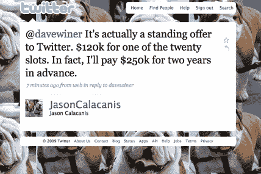

# Twitter 上的一个推荐位置值多少钱？杰森·卡拉卡尼斯出价 25 万美元。

> 原文：<https://web.archive.org/web/https://techcrunch.com/2009/03/12/how-much-is-a-suggested-slot-on-twitter-worth-jason-calacanis-offers-250000/>

# Twitter 上的一个推荐位置值多少钱？杰森·卡拉卡尼斯出价 25 万美元。

现在，当新手注册 Twitter 时，他们会收到一份 100 名推荐用户(T2)的名单，可以开始关注他们。仅仅是在那个名单上就能让你的追随者超过 10 万。名单上的一些人和组织(如阿尔·戈尔、兰斯·阿姆斯壮、凯文·罗斯、《纽约时报》和 CNN)现在都有超过 25 万名粉丝。许多最受欢迎的 Twitter 用户都在名单上，包括 TechCrunch(我们有 214，465 名粉丝)。这太疯狂了。

Mahalo 首席执行官杰森·卡拉卡尼斯(Jason Calacanis)也不像 Twitter 那样懒散，他拥有 61266 名辛苦赚来的粉丝，他认为成为推荐名单上的前 20 名之一将在五年内相当于一个超级碗广告。他向 Twitter 提供 25 万美元(T6)来锁定推荐名单上的一个位置，为期两年，或 12 万美元一年。我给 Calacanis 发了邮件(他是我们举办 TechCrunch 50 会议的合作伙伴)，他确认了这个提议是非常认真的。事实上，他上周就此事联系了 Twitter 的联合创始人杰克·多西和伊万·威廉姆斯，并正在游说投资者弗雷德·威尔森。卡拉卡尼斯写道:

> 我相信，5 年后，前 20 个推荐位置的年收入将达到 100 万美元——实际上是超级碗的商业水平。
> 
> 。。。这绝对是认真的。不管怎样，我想今天就把支票寄出去。如果它放在他们的桌子上，他们可能会兑现它。

他想现在锁定价格，因为他认为这是一个很好的营销机会。对于推荐名单上的人来说，每天获得 10，000 名新粉丝并不罕见。这相当于一年 360 万，即使有一半的人退订，这仍然是一个超过 100 万潜在客户的直接渠道。这些客户因为 Twitter 消息的个人性质而感觉与你有联系。

如果其他公司也有同样的想法，出售这些广告位对 Twitter 来说可能是一项有利可图的副业。以每次 12 万美元计算，20 个老虎机第一年将产生 240 万美元的收入。推荐名单上已经有一些品牌，比如 JetBlue、Zappos、Whole Foods 和 Dell Outlet。为什么不让他们付出代价？为了避免垃圾邮件，卡拉卡尼斯提出了一个简单的规则:

> 买槽的人滥用了就丢了。他们每天被限制在 10 条推特上，他们不能发送垃圾邮件。如果我吸人退订。如果我发垃圾邮件(即每天发 10 条以上)，他们会把我、捷蓝航空或捷步达康挤出前 20 名。

我认为卡拉卡尼斯只是无法忍受他不再是 Twitter 顶级用户之一的事实，并希望通过购买重回顶级。戴夫·维纳认为，建议的清单总体来说是个坏主意。但也许卡拉卡尼斯发现了什么。你认为一个排名前 20 的 Twitter 一年能卖多少钱？