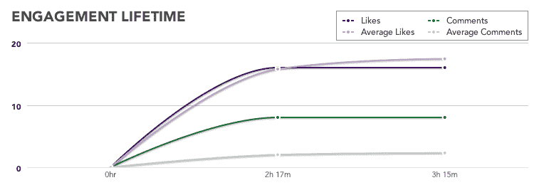

# 研究:脸书页面每 3 小时不应发布超过 1 条

> 原文：<https://web.archive.org/web/https://techcrunch.com/2012/01/17/how-often-should-facebook-pages-post/>

# 研究:脸书页面每 3 小时不应发布超过 1 条

脸书页面发布的新闻平均在发布后 3 小时内获得赞和评论。为了最大限度地提高参与度、浏览量和新闻流量，脸书页面所有者应该在两次发布之间至少等待 3 个小时。

脸书页面分析公司 EdgeRank Checker 的一项研究中的这一新发现可以帮助页面所有者避免缩短帖子的生命周期，避免新内容掩盖帖子。每个页面都是不同的，需要根据其内容和受众找到自己的最佳发布频率，但不超过 3 小时是一个很好的通用指南。

上个月，脸书在 9 月份改变了新闻提要，EdgeRank Checker 分析了超过 500 页的 3 万篇帖子，平均粉丝数为 14 万。该公司将一个帖子的生命周期定义为当它每小时获得 10%的参与度时，就像它最受欢迎的一个小时一样。最大化参与度很重要，因为这会影响一篇帖子和页面未来帖子的 EdgeRank 或 news feed 可见性。参与度也是一个强有力的指标，表明一个帖子正在被看到，并获得页面的点击量，以提高知名度或流量。

该研究发现，平均后寿命为 3 小时 7 分钟，而中值后寿命为 2 小时 56 分钟。一个帖子死后，它只会收到少量的参与，再次发帖也不会有什么损失。

【T2

任何特定页面的后期平均寿命都有差异。像 EdgeRank Checker 这样的服务可以帮助页面找到它们的平均值。或者，页面可以通过手动记录他们的帖子每小时收到的总赞数和评论数来绘制自己的生命周期，然后观察它们何时停止累积。

需要明确的是，3 小时的平均发布时间并不意味着页面所有者应该每 3 小时发布一次。一天 8 个帖子可能会迫使他们生产低质量的内容，惹恼他们的粉丝。最佳发布频率是一个独立的问题，取决于页面的受众、内容制作技能、发布时间以及其他因素。

大多数页面所有者每天坚持大约 2 到 3 篇文章。更新:新闻媒体和那些像 TechCrunch 这样生产紧急内容的媒体应该更频繁地发布帖子，但他们最终会从过去的帖子中蚕食一些参与度。

当页面拥有者拥有大量优秀内容并渴望分享时，他们应该记住这项研究。深吸一口气，看看你上一篇帖子的赞数和评论数在上升。总会有例外和页面需要更频繁地发布，但那些不确定的人应该平均等待 3 个小时才能再次发布。