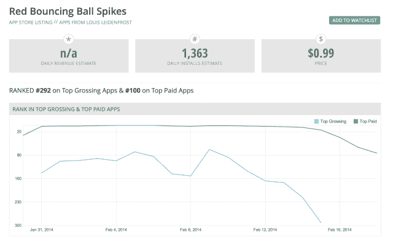

# 一个骗子如何利用一个 10 美元的 GameSalad 模板操纵苹果的排行榜，每天赚取数万美元 TechCrunch

> 原文：<https://web.archive.org/web/https://techcrunch.com/2014/02/19/how-one-scammer-manipulated-apples-top-charts-to-earn-tens-of-thousands-daily-using-a-10-gamesalad-template/>

苹果应用商店排行榜一直有猫腻。不，我说的不是“Flappy Bird”(嗯，也许也是“T1”)，而是两个不同的开发者如何使用一个 10 美元的 GameSalad [模板](https://web.archive.org/web/20221209105535/http://gshelper.com/shop/core-controls/red-ball-template/)将他们各自的应用程序——一个[免费](https://web.archive.org/web/20221209105535/https://itunes.apple.com/us/app/red-bouncing-ball-spikes!/id814004548?mt=8)，一个[付费](https://web.archive.org/web/20221209105535/https://itunes.apple.com/us/app/red-bouncing-ball-spikes/id587353203?mt=8)——送上 App Store 的排行榜。更重要的是，这个付费应用程序是如何不断攀升的，为一个显然是众所周知的骗子的开发者赚了很多钱？

业内人士在本月早些时候注意到这种情况正在发生，尽管随着应用程序在排行榜上越来越高，这个词已经传播得越来越广。

问题中的 GameSalad [模板](https://web.archive.org/web/20221209105535/http://gshelper.com/shop/core-controls/red-ball-template/)叫做“红色弹跳球钉”这是一个简单的游戏，对那些希望通过探索其他不需要太多认知负荷的 iOS 游戏来驾驭“Flappy Bird”浪潮的人来说很有吸引力，但这些游戏旨在让你开始玩。

而且，这是一个很糟糕的游戏。

截至 2 月 14 日，由“ [Talo Games](https://web.archive.org/web/20221209105535/https://www.facebook.com/TaloGames) 开发的这款游戏的免费版本已经在 App Store 的免费排行榜上排名第 73 位。这是许多游戏背后的同一个开发者，包括最近的[滑稽的“Flappy Bird”](https://web.archive.org/web/20221209105535/http://www.theguardian.com/technology/2014/feb/19/flappy-bird-flying-cyrus-app)，“飞行赛勒斯”，涉及麦莉·赛勒斯的头和几个破坏球。Talo Games 的开发者最近接受了以色列博客 [Geektime](https://web.archive.org/web/20221209105535/http://www.geektime.co.il/flying-cyrus-top-app/) 的采访，他在 2014 年 2 月 10 日发布了红球游戏的免费版本，远远晚于 2012 年 12 月推出的付费版本。很明显，他只是利用应用商店的人气来找乐子，而不是诈骗。

与此同时，这款游戏的付费版本来自一个更具争议的开发者，他被称为 Mateen Pekan(这可能不是他的真名)。截至上周，他的应用在 App Store 付费排行榜上排名第八。

基于模板的标题一度成为苹果应用商店中排名第二的付费 iPhone 应用。

现在事情变得奇怪了。好了，*陌生人*。

如上所述，这款付费应用于 2012 年 12 月发布，在 2014 年 1 月 30 日发布“更新”后，才蹿升至 App Store 的顶部。

如果这让你想起另一个最近在应用商店流行的轨迹(又名“Flappy Bird ”,开发者[在几乎没有解释的情况下取消了](https://web.archive.org/web/20221209105535/https://beta.techcrunch.com/2014/02/09/flappy-bird-remove-from-app-store/)),你并不孤单。《Flappy Bird》其实是 2013 年 5 月上映的，今年 1 月才炸的。*(值得一提的是，GameSalad 论坛成员[推测](https://web.archive.org/web/20221209105535/http://forums.gamesalad.com/discussion/comment/447799/#Comment_447799)它的病毒效应得到了流行的 YouTube[PewDiePie](https://web.archive.org/web/20221209105535/http://www.youtube.com/watch?feature=player_embedded&v=lQz6xhlOt18)发布的视频的帮助，这是一个似乎合理的解释，尽管其他[比比皆是](https://web.archive.org/web/20221209105535/http://www.bluecloudsolutions.com/blog/flappy-birds-smoke-mirrors-scamming-app-store/)。)*

## “红色弹跳球钉”:一个知名骗子的 99 美分的应用程序

至于“红色弹跳球钉”游戏的付费版本，GameSalad 论坛成员回忆说，有问题的开发者“Mateen Pekan”在过去被称为骗子。他[多次剽窃开发者](https://web.archive.org/web/20221209105535/http://iphonedevsdk.com/forum/shameless-advertising/99740-warning-mateen-apps-reza-pekan.html)，窃取游戏和源代码，并被禁止进入 GameSalad 等论坛。据报道，他来自加拿大，年轻，有好几个名字，包括"[菲鲁泽·莫拉迪](https://web.archive.org/web/20221209105535/http://iphonedevsdk.com/forum/shameless-advertising/99740-warning-mateen-apps-reza-pekan-p2.html)、" "[路易·莱登弗罗斯特](https://web.archive.org/web/20221209105535/http://forums.gamesalad.com/discussion/comment/447835/#Comment_447835)、[也许更多](https://web.archive.org/web/20221209105535/http://forums.gamesalad.com/discussion/comment/448795/#Comment_448795)。

一些基本的互联网研究也追踪到 Mateen 的 Google Play 列表 T1，这是 Mooney's Bay Computer 在加拿大的一家电脑商店。有人猜测这是马丁工作的地方，但更有可能的是他只是为他们做了一点自由职业。他还将他的红球游戏推向了 Google Play，在 Google Play 中,[仍然是其他游戏中的](https://web.archive.org/web/20221209105535/https://play.google.com/store/apps/developer?id=Mateen%20Pekan&hl=en)。

其他游戏开发者论坛，包括 [TouchArcade](https://web.archive.org/web/20221209105535/http://forums.toucharcade.com/showthread.php?t=218389) ，也发现《红球》是马丁的作品，并一直称该游戏在 App Store 的提升是一个骗局。

目前的理论是，马丁(或者不管他的真名是什么)利用了一个[特殊的应用程序商店骗局](https://web.archive.org/web/20221209105535/http://www.tuaw.com/2014/01/10/the-strange-shady-world-of-1-000-ios-apps/)，要求你通过，比如说，用你自己的钱来操纵总销售额。正如 GameSalad 论坛的一名成员[指出的那样，](https://web.archive.org/web/20221209105535/http://forums.gamesalad.com/discussion/comment/447792/#Comment_447792)App Annie 上的排名历史表明，当你将红球付费应用与前 10 名中的其他应用进行比较时，它的总销售额较高，但下载量较低。一般来说，前 10 名的应用程序都有*高总销售额*和*高下载量。*

为了实施这一骗局，开发者必须使用 iTunes 账户网络来下载足够多的游戏副本，以将游戏的总销售额推高至 2 万美元。发薪日到来时，该应用程序连续多日位于应用商店的顶部，赚回这些钱，然后更多。

或许比骗子已经知道如何操纵 App Store 算法以获取不义之财(这是必然会发生的)这一事实更令人担忧的是苹果公司的延迟回应。这本书整个月都在排行榜上攀升，但直到最近才被挤出前 100 名。又是怎么做到的？通过苹果的直接干预？刚才苹果的算法抓到这个了吗？我们可能永远不会知道。

**更新**:或者也许我们会！我们现在听说，苹果没有采取任何行动直接将该应用程序从排行榜上移除，而是该应用程序自己掉出了排行榜——也许是因为人们知道了谁是幕后黑手？

## 开发者试图以 25 万美元的价格出售登上排行榜榜首的应用

同样有趣的是，马丁显然试图通过在应用程序和模板市场 [Apptopia](https://web.archive.org/web/20221209105535/https://www.apptopia.com/) 上出售应用程序来增加他从骗局中获得的收益。根据清单，游戏是这样描述的:

> 这款应用在 app store 上的总付费应用中排名前五，每天赚 10，000 美元！2 月*【原文如此】*5 日和 6 日，它是付费应用中排名第二的应用，几乎没有什么促销活动。不到一周就下载了 5 万次。
> 
> 我们愿意谈判。

也许马丁列出这个应用程序是因为他需要在被彻底揭穿是个骗子之前迅速收回投资？本月早些时候，他将价格降至 25 万美元，并试图销售安卓版本。

Apptopia 创始人乔纳森·凯告诉我们，他们把他列为“马丁·佩坎”和“菲鲁兹·莫拉迪”他的公司决定从他们的网站上删除他的应用程序，因为关于他的历史的负面报道和讨论，以及他们在 Twitter 上收到的反馈。凯补充说，在 Apptopia 的 2.5 年里，他们只撤下了两三次清单，这表明他们对这个问题有多重视。(不幸的是，他们无法确认最初的上市价格，但在撤下时，它是 25 万美元)。

但是，尽管游戏开发者社区和其他第三方似乎很清楚马丁的一般手法，而且有很多资料提到他是一个众所周知的骗子，但迄今为止，[苹果](https://web.archive.org/web/20221209105535/https://itunes.apple.com/us/app/red-bouncing-ball-spikes/id587353203?mt=8)和[谷歌](https://web.archive.org/web/20221209105535/https://play.google.com/store/apps/developer?id=Mateen%20Pekan&hl=en)都允许他在各自的应用商店中保留列表。这可能是因为该应用程序没有发出任何通常会将应用程序视为骗局的信号，和/或因为没有其他开发者使用官方[渠道](https://web.archive.org/web/20221209105535/https://developer.apple.com/contact/)进行投诉。

今天，Mateen 的应用程序不再是 iTunes 上的热门应用程序，但 Appsfire 首席执行官 Ouriel Ohayon 是第一个发现模板游戏崛起的人之一，他提醒我们，美国市场上的顶级付费应用程序每天可以让你获得“数万”的付费下载。

它花了很多天来这样做:

如果你被骗真的买了这个东西，从苹果公司拿回你的钱。[下面介绍一下](https://web.archive.org/web/20221209105535/http://www.imore.com/how-request-refund-itunes-or-app-store-purchase)。