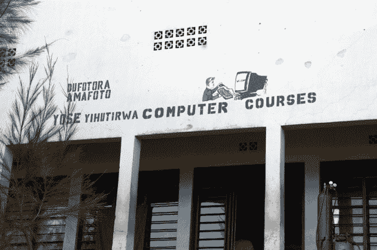

# 如何跨越数字鸿沟，卢旺达式的技术危机

> 原文：<https://web.archive.org/web/https://techcrunch.com/2009/06/24/how-to-cross-the-digital-divide-rwanda-style/>

每当我告诉某人我要为我的新书去哪个国家，他们会开始点头，然后点头的速度会减慢，然后他们就会感到困惑。"中国、印度、巴西、以色列和……卢旺达."还有一个不可避免的问题:“卢旺达？卢旺达有什么技术吗？”有时我甚至被问及去那里的时候是否要住在帐篷里。

第二个问题的答案是否定的。有很多酒店，除非有插座和 wifi，否则我不会搭帐篷。

技术问题的答案有两个。首先:尽管过去十年我只报道了科技，但实际上我更像是一名报道企业家的记者。碰巧的是，这通常与技术相关，尤其是在美国。但越来越多的是，即便是在印度和中国等市场，建立下一家价值 10 亿美元的大公司的最佳机会更多的是基于技术的服务和产品业务，而不是传统的高科技游戏。说真的，现在的网络业务已经不再仅仅是纯粹的技术了吗？

第二:是的，卢旺达有技术。未来几年还会有更多。卢旺达正在成为一个有趣的测试案例，证明数字鸿沟是如何以一种有条不紊、深思熟虑、循序渐进的方式被真正弥合的。

第一步是通过手机基本连接彼此和网络。在卢旺达，几乎每个人都有手机——即使是该国一些最贫穷、最偏远地区的人。我的卢旺达 SIM 卡和足够维持一个月的分钟花费了我相当于 12 美元。在一个必须进口大部分消费品的内陆国家，这是唯一便宜的东西之一。手机连接在任何地方都可以使用，即使是在没有电的蜿蜒的土路上。我们可以在某个偏僻的地方进行狩猎旅行，但在旧金山市中心的客厅里，我们似乎无法建立良好的联系。现在谁是发展中国家，美国？

确切地说，第二步正在展开。在卢旺达，无论你走到哪里，都有巨大的光缆卷轴。两年后，美国的每个地区都将相互连接，并与互联网相连——这是美国不敢自夸的。它由一家私营公司运营，但卢旺达政府拥有光纤基础设施，并欢迎竞争对手，以确保没有一家公司对该国的网络接入拥有太大的权力，据卢旺达发展委员会负责 It 的副首席执行官 Nkubito Manzi Bakuramutsa 说。

政府也在协调下一步行动:卢旺达一次向印度理工学院输送 300 名学生，培养他们可以带回国的硬件、软件和电信技能。当一个孩子毕业了，另一个就可以走了。为什么是 IIT？巴库拉姆特萨说，它比西方学校便宜，同样擅长培训工程师，而且对新兴市场的挑战和需求有更好的理解。此外，卢旺达希望他们的孩子能继承一些印度人的创业精神。(美国，请注意:我们不再是新兴世界的首选教育目的地。)

当然，你需要电脑来使用所有的光纤，享受这些孩子们正在开发的新的网络应用程序。现在，全国 30 个地区都有互联网中心，里面有 50 台电脑，以每小时 50 美分的低价上网，还有几台电脑用于学习计算机基础知识，比如微软 Word。全国各地也有私人经营的网吧。

一个孩子一台笔记本电脑[刚刚在卢旺达首都开设了一个计算机学习中心](https://web.archive.org/web/20221007032525/http://blog.laptop.org/2009/06/11/one-laptop-per-child-creates-a-global-center-for-excellence-in-laptops-and-learning/)——事实上，在我开展更多外联活动的同时，OLPC 的人们也在卢旺达。但是卢旺达政府不会把它留给其他人。该国将在明年购买 10 万台低价笔记本电脑，分发给该国的教师和学生。“我是这里的负责人，我很少缺钱，”巴库拉姆特萨笑着说。去年政府在这上面花费了 4300 万美元；他说今年这一数字将增加到 1 亿美元。

那么，在一个所谓的贫穷的非洲国家，所有这些钱到底从哪里来呢？很多都可以追溯到援助和外国投资。卢旺达的国家预算 60%来自国家本身的税收和收入，40%来自“合作伙伴”——其中许多合作伙伴是在 1994 年残酷的种族灭绝期间让卢旺达失望的国家和组织，它们正在加快步伐帮助该国重建。T2 总统保罗·卡加梅早就说过，比起外国援助，他更希望卢旺达有外国投资。但是，很明显，他会把这个国家变成一个不需要援助的地方。如果你愿意，可以称之为“罪恶感钱”,但至少这个国家很好地利用了这笔钱。

负责这一切的人 Bakuramutsa 是卢旺达人，但在 2007 年之前从未在该国居住过。就在搬回来之前，他在加州为惠普工作了几年，所以他懂技术。他梦想着一个完全自动化的卢旺达社会——一个连挤牛奶都自动化的社会。这与今天的卢旺达相比是一个相当大的飞跃——在那里，市议会每天付给人们美元，让他们用砍刀和镰刀手动修剪高速公路边的草坪。第一步将包括所有的政府表格和医疗记录都转移到网上。

所有这些自动化正是那 300 名 IIT 大学毕业生的用武之地。卢旺达要真正弥合数字鸿沟，需要当地开发的网站和软件，还有很多工作要做。我不认为任何人会很快将维基百科或脸书翻译成基尼亚卢旺达语，当地的网站和卢旺达企业、酒店和景点的信息页面很少甚至不存在。要预约参观著名的银背大猩猩，你必须亲自去基加利的一个办公室，并支付 500 美元现金。事实上，卢旺达几乎每个地方都只接受现金。如果你用美元支付，账单上的日期最好晚于 2000 年。这对电子商务不太友好。

当巴库拉姆特萨说他想在卢旺达建立一个迷你硅谷时，他指的不是一个将诞生下一个惠普或谷歌的地区，而是一个可以首先为卢旺达，然后为肯尼亚、坦桑尼亚、乌干达等周边国家生产 IT 服务的地方。它不仅是教育、连通性和生产力的核心，也是卢旺达未来经济发展的核心。

这个小国有幸拥有一些非洲最肥沃的土壤，但几乎没有丰富的矿藏，也没有什么制造业和工业。90%的人是自给自足的农民，随着人口的激增，没有足够的土地来发展这种经济。该国许多人怀疑，在制造业方面，他们无法与肯尼亚和乌干达等更成熟的工业经济体竞争，更不用说中国制造产品的低廉价格了。

但是 IT 服务呢？在非洲很少有地方能称之为特产。这就是为什么巴库拉姆特萨从来不缺钱投资:卢旺达不仅仅试图弥合数字鸿沟，而且是经济鸿沟。