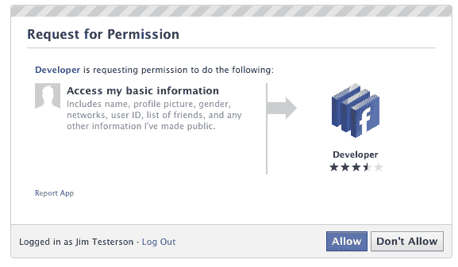

# 如何立即启用脸书时间轴 

> 原文：<https://web.archive.org/web/http://techcrunch.com/2011/09/22/how-to-enable-facebook-timeline/>

[**2011 年 12 月 15 日**更新:脸书时间表现已对所有脸书用户开放。了解更多关于网络的[全球时间表，以及 iPhone](https://web.archive.org/web/20230205022542/https://techcrunch.com/2011/12/15/its-here-facebook-timeline-now-available-to-users-worldwide/) 、[移动网络和 Android](https://web.archive.org/web/20230205022542/https://techcrunch.com/2011/12/15/facebook-mobile-timeline/) 的[时间表。要为您的个人资料启用时间轴，请访问](https://web.archive.org/web/20230205022542/https://techcrunch.com/2011/12/18/facebook-iphone-timeline/)[http://www.facebook.com/about/timeline](https://web.archive.org/web/20230205022542/http://www.facebook.com/about/timeline)

今天早上[脸书宣布了时间线](https://web.archive.org/web/20230205022542/https://techcrunch.com/2011/09/22/facebook-timeline/)，这是一部疯狂(有点令人毛骨悚然)的综合性影片，讲述了在你的脸书生涯中*曾经*发生的一切。这就像一本关于你生活的故事书——或者至少是网上记录的部分。

脸书说，时间表将在未来几周的某个时候为每个人制定……这对每个人来说都很好。你是那种阅读 TechCrunch 的人，因此也可能是那种现在就喜欢他们崭新闪亮的东西的人。

没关系。我们可以让它发生。

幸运的是，稍微早一点启用时间线并不太难——但也不是一帆风顺的。

你看，脸书为开放图形开发者提前启用了时间轴。你也可以成为一名开放图形开发者——即使你只是想涉猎一下。

**需要注意的几件事:**
——除非你真的是开发人员，否则你可能不想这么做。期待 bug。
–最初只有你会看到你的时间线(除非你另有决定)，但几天后它会自动公开。我的时间表被自动设定为 9 月 29 日公开。似乎如果你在另一台机器上登录脸书，时间轴会在你所有的机器上自动关闭。也就是说，你似乎可以通过导航到 http://www.facebook.com/YOURUSERNAMEHERE?sk=timeline
回到你的时间表(但只有在遵循以下步骤之后)——你需要有一个“已验证”的帐户，这意味着你需要一个信用卡或电话号码与帐户关联。

## 以下是如何做到这一点:

**1。**登录脸书

**2。如果您还没有启用开发者模式，请启用它。要做到这一点，在脸书搜索框中输入“开发者”，点击第一个结果(它应该是一个由脸书制作的拥有几十万用户的应用程序)，然后添加该应用程序。**

**3。**跳转到[开发者 app](https://web.archive.org/web/20230205022542/https://developers.facebook.com/apps) (如果脸书没有自动把你放在那里，应该在你左手边的工具栏里)

**4。**创建一个新的应用程序(不要担心，你实际上不会将它提交给其他人查看/使用)。给你闪亮的新应用任何你认为合适的显示名称和命名空间。通读并同意平台隐私协议。这是您需要验证的步骤。

**5。**确保你进入了新应用的主设置屏幕。您应该会在页面顶部附近看到您的应用程序名称

**6。**找到“打开图形”标题，点击“开始使用打开图形”链接。

为你的应用程序创建一个测试动作，比如“阅读”一本书，或者“吃”一个三明治

**7。**这将使您进入操作类型配置页面。更改一些默认设置(我将“read”的过去式更改为“REDD”——同样，只有您可以看到这一点，除非您尝试将您的应用程序提交到公共目录)，并单击所有三个页面的设置

**8。**等待 2-3 分钟

**9。**回到你的脸书主屏幕。邀请试用时间表应该在页面顶部等待

你完了！我们已经看过这个工作很多次了，所以它应该对任何人都没有问题。