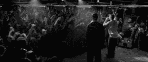

# 如何获得阿姆的 MBA 学位

> 原文：<https://web.archive.org/web/https://techcrunch.com/2014/01/18/how-to-get-an-mba-from-eminem/>

詹姆斯·阿尔图彻撰稿人

More posts by this contributor

**编者按:** *[James Altucher](https://web.archive.org/web/20230326051057/http://jamesaltucher.com/) 是一位投资人、程序员、作者，也是数次[创业者](https://web.archive.org/web/20230326051057/http://www.jamesaltucher.com/2011/01/how-i-screwed-yasser-arafat-out-of-2mm-and-lost-100mm-in-the-process/)。他最近的一本书**是[《选择你自己！](https://web.archive.org/web/20230326051057/http://www.amazon.com/Choose-Yourself-ebook/dp/B00CO8D3G4/ref=cm_cr_pr_product_top)*** *(推特 CEO 迪克·科斯特罗作序)。在 Twitter 上关注詹姆斯 [@jaltucher](https://web.archive.org/web/20230326051057/http://twitter.com/jaltucher) 。*

2002 年，我开车去一位对冲基金经理家，希望能从他那里筹到钱。我迟到了两个小时。这是前全球定位系统，我没有手机。我完全迷失了。

我一遍又一遍地放着阿姆的《迷失自我》。

我害怕这是我唯一的机会，而我却搞砸了。我甚至在车里哭了。我快破产了，我觉得这是我唯一的机会。真是个失败者。

最后我到了那里。对冲基金经理穿着一身粉色。他的房子很大。大概两万平方英尺。他的厨师为我们提供了一顿丰盛的饭菜。我让他等了两个小时才吃饭。当时他得了癌症。我感觉很糟糕。

然后我们下棋，很有趣，他带我参观了房子。一个房间是专门放 1848 年制造的玩具的。他在房子里有一个壁球场。

另一个房间里有奇怪的手工艺品，比如列侬和麦卡特尼第一次写下“嘿，裘德”歌词时的手写笔记

另一份是特德·肯尼迪在警察局签署的官方声明，此前他报告了查帕奎迪克事故，这可能最终导致他决定不竞选总统。

最终我从这位经理那里筹到了钱，这让我开始了新的生活。

但这根本不是我提起阿姆的原因。

《迷失自我》这首歌来自电影《8 英里》。虽然我推荐它，但你不必看到它就能理解我将要写的东西。我会给你你需要知道的一切。

阿姆是销售和竞争方面的天才，他在电影《T21》的一个场景中展示了这一点。

我将为你一行一行地讲述这个场景，这样你就能了解关于销售、认知偏差和击败竞争对手的一切。

首先，这是你需要知道的关于这部电影的所有信息。

阿姆扮演一个贫穷、无领、自称“白色垃圾”的家伙，住在拖车场。他挨打，做蹩脚的工作，被背叛，等等。但他活着就是为了说唱和爆发。

在第一个场景中，他正在与另一个说唱歌手“战斗”,他哽咽了。他一句话也没说就放弃了。在整部电影中，他被认为是一个在压力下窒息的人，他似乎注定要失败。

直到他选择了自己。

我给你看然后分解的场景就是电影里的决战。他是唯一的白人，而所有观众都是黑人。他面对的是观众喜爱的卫冕冠军。

他赢得了战斗，我会告诉你怎么做。有了他的技术，你可以对抗任何竞争。

首先，看我解释前后的场景(有歌词)。

场景是这样的:[http://www.youtube.com/watch?v=gatNLacOjC8](https://web.archive.org/web/20230326051057/http://www.facebook.com/l.php?u=http%3A%2F%2Fwww.youtube.com%2Fwatch%3Fv%3DgatNLacOjC8&h=AAQFvQcKtAQHyvwYeMfhEX8JuqGELp4g81413uBVSlVJnhg&s=1)

【T2

现在就看。

好，我们来分解一下。阿姆怎么这么容易就赢了？

暂且把他的天赋放在一边(假设双方都有同样的天赋)，阿姆使用了一系列认知偏见来赢得这场战斗。

人脑是在过去 40 万年中发展起来的。事实上，可以说，当大脑更多地用于游牧环境中的生存时，人类的智商比今天更高。

但是非常重要的一点是，大脑发展了许多偏见作为生存的捷径。

例如，一个非常普遍的现象是，我们倾向于注意负面消息而不是正面消息。

原因很简单:如果你在丛林中，你看到一只狮子在你的右边，一棵苹果树在你的左边，你最好忽略苹果树，尽可能快地逃离狮子。

这被称为“消极偏见”,这也是报纸通过非常明确地利用人类的这种偏见而生存下来的全部原因。

我们不再那么需要这些捷径。街上没有那么多狮子。但是大脑花了 400，000 年才进化出来，也许只是在过去的 50 年里，我们才相对安全地避免了威胁早期人类的大部分危险。

我们的技术和想法已经进化，但我们的大脑却无法快速进化以跟上它们。因此，这些偏见被用在几乎每一个销售活动、商业、营销活动、电影、新闻、关系、一切事物中。

几乎你所有的互动都受偏见支配，当你对自己的想法或他人的行为进行指责时，理解偏见是有帮助的。

你必须学会如何越过来自大脑的信号，发展直觉并掌握这些偏见。

**1)组内偏差**

注意阿姆的第一句话:“现在，来自 313 的所有人，举起你们该死的手，跟我来”。

313 是底特律的区号。不仅仅是底特律。这是为了底特律的蓝领阶层，所有的观众，还有阿姆，都来自那里。

因此，他消除了可能与他的种族有关的群体外偏见，并将话题改为“谁在 313，谁不在 313”。

**2)羊群行为**

他说，“举起手来，跟我来。”所有人都开始不假思索地举起手。所以他们的大脑告诉他们，他们这样做是出于理性的原因。

例如，他们现在正在追随阿姆。

**3)可用性级联**

大脑倾向于相信重复的事情，不管它们是不是真的。这被称为可用性级联。

注意阿姆重复了他的第一句台词。在这之后，他不再需要说“跟我来”他说，“看，看。”

他正在建立下一个认知偏差。

**4)区分偏差或外组偏差**

如果两个事物同时被评估，大脑倾向于认为它们非常不同，而不是分开评估。

阿姆希望他的对手“爸爸医生”马上被评价为一个与众不同的人，即使事实是他们都在同一群有相似兴趣的朋友中，等等。

阿姆说:“现在，虽然他站得很强硬，但请注意，这个人没有举起手来。”

换句话说，即使 Papa Doc 是黑人，他也和观众中的每一个人一样，不再是阿姆所定义和指挥的“群体”中的一员:313 群体。

他完全改变了话题，从种族变成了区号。

**5)歧义偏差**

他没有提到爸爸医生的名字。他说“这个人”换句话说，有一个“313 团体”，我们都是观众中的一员，现在有一个暧昧的男人试图侵犯我们。

观看总统竞选辩论。一个候选人很少会提到另一个候选人的名字。相反，他可能会说，“我所有的对手可能会认为 X，但我们这里知道 Y 更好”。

当大脑开始用模糊的眼光看待一个人时，它会变得困惑，无法做出包含这种模糊的选择。所以没有歧义的人赢了。

**6)学历偏见**

因为大脑想走捷径，它会更多地从有证书或血统的人那里寻找信息，而不是从不知从哪里冒出来的人那里。

例如，如果一个来自哈佛的人告诉你今天会下雨，而另一个随机的人告诉你今天会是晴天，你可能更倾向于相信这个来自哈佛的人。

阿姆在两行之后巧妙地做到了这一点。他说，“一，二，三，数到四。”

这是史努比狗狗狗狗和德瑞医生合作的第一首歌中的一句台词，“除了 G 之外什么都不是。”这是这首歌的第一句台词，也可能是有史以来最著名的说唱台词之一。

当阿姆使用这句话时，他直接将自己与著名的成功说唱歌手德瑞医生和史努比联系在一起。

然后他再次使用可用性级联，说:“一个 Pac，两个 Pac，三个 Pac，四个。”首先，他再次使用了 1、2、3 和 4，但这次是用 Pac，指的是说唱歌手 Tupac。所以现在他在底特律的这场小战斗中与三位最伟大的说唱歌手站在了一起。

**7)内组/外组**

阿姆指着观众中随机出现的人说“你是 Pac，他是 Pac”，将他们与自己联系在一起，将他们的血统与这些伟大的说唱歌手联系在一起。

但接着他指着他的对手，多克爸爸，做了一个好像他的头被切掉的手势，说，“你输定了，一个也没有”。意味着爸爸医生没有血统，没有信誉，不像阿姆和观众。

**8)基本直销:预先列出异议**

任何直销商或销售人员都知道阿姆使用的下一个技巧。

当你在销售一种产品，或者你自己，或者甚至进行一场辩论，或者说服你的孩子打扫他们的房间，你的销售对象或团体很容易遭到反对。

他们知道这些异议，你也知道这些异议。如果你不提出来，他们也不提出来，他们就不会买你的产品。

如果他们在你之前提出来，那么看起来你在隐瞒什么，你强迫他们提出来只是浪费了他们一点时间。因此，一个很好的销售技巧就是提前解决所有的异议。

阿姆的下一组台词出色地做到了这一点。

他说，“我知道他要对我说什么。”

然后他把它们一个一个地列出来:

“我是白人”
“我是个该死的流浪汉”
“我确实和我妈妈住在拖车里”
“我的儿子，未来，是个汤姆叔叔”
“我确实有个叫切达·鲍勃的傻朋友，他用自己的枪自杀了”。
“我确实被你们六个笨蛋吓了一跳”

诸如此类。他还列举了几个例子。

但是在列表的最后，你对他没有更多的批评。他解决了所有的问题，并驳回了它们。在一场说唱之战(或推销)中，如果你把对手能说的话都说了，他就没什么可说的了。

当他无话可说的时候，观众，或者销售前景，你的约会对象，你的孩子，不管是谁，都会从你这里买东西或者听你说什么。

看看你在电子邮件中收到的直销信函。他们都花了一页又一页来解决你的问题。这是直销中最重要的技巧之一。

**9)幽默偏见**

阿姆把他最好的留到了最后。“但是我知道一些关于你的事”他盯着多克爸爸说。

他戏谑地唱着这首歌，让这首歌显得与众不同，近乎幽默。有一种东西叫幽默偏见。比起严肃的事情，人们更容易记住幽默的事情。

**10)极限外组**

“你去了克兰布克。”然后阿姆转向他的“313 小组”强调他解释什么是克兰博。“那是私立学校。”

嘭！

现在观众不可能站在爸爸医生一边，但是阿姆让这个群体变得更大了。“他的真名叫克拉伦斯。和他的父母有一个真正的好婚姻。”

嘭嘭！还有两件事让多克爸爸与众不同。他是个书呆子，上的是有钱的学校，父母在一起。

不像观众中的每个人，包括阿姆。难怪多克爸爸不住在 313，这原本是有点幽默的说法，但现在毫无疑问地被证明了。

**11)凭据偏差(再次)**

Eminmen 说，“没有这样的东西”…观众和他一起唱，因为他们确切地知道他引用的是“半路骗子！”Mobb Deep(我在 1998 年建了他们的网站)的一首歌中的一句话，Mobb Deep 是另一个巨大的东海岸说唱团体。所以现在阿姆已经在他自己和西海岸和东海岸之间建立了血统。

通过让观众说“中途骗子”,我们又回到了同一组，而“克拉伦斯”在节目结束后回到了他父母的家。

**12)稀缺**

音乐停止，这意味着阿姆必须停下来，让爸爸医生轮到他。但他没有。他基本上是说“去他妈的所有人”，“如果你们怀疑我，就去你们的。”“我不想赢。我出局了。”

他让自己消失了。在与观众建立了完全的信任之后，他基本上说他不想要他们必须提供的东西。

他通过说他已经离开那里来减少自己的供给。也许他永远不会回来了。在需求上升的同时减少自己的供给，会发生什么？基础经济学。价值上升。

他如此彻底地控制了这场战斗，以至于现在，与电影的开头相反，多克爸爸哽咽了。不过，他没有完全窒息。没什么好说的了。阿姆已经替他说了一切。

爸爸医生不可能提出任何“异议”，因为阿姆已经解决了所有的问题。他所能做的就是为自己辩护，这会让他显得软弱。他完全不在“313 小组”里，所以没有办法再回到那里。

没什么好说的了。所以阿姆赢了这场战斗。

阿姆用他的胜利做了什么？他无所不能。

但是他远离了整个亚文化。在电影的结尾，他离开了，与他为之奋斗的目标毫无关系。

他将选择自己成功，而不是依靠底特律战场上的小打小闹。

他在全球卖出了 2.2 亿张唱片。他发现并生产了 50 美分，并卖出了数亿美元(罗伯特·格林在他的书《第 50 定律》中非常恰当地描述了“选择你自己”的另一个例子)。

分析一首说唱歌曲来寻找如何更好地进行销售和沟通的想法是不是很傻？我不知道。你告诉我。我在博客里暴露了太多。事实上，我不会点击“发布”按钮，除非我害怕人们会有什么反应。

当你暴露自己的时候，人们会有很多很多方法来攻击你。人们会刺伤你，伤害你。但是你不能创造艺术，除非你展示出你是多么独特，同时又能包容与你有同样问题的人。

当我点击发布时，我仍然很害怕。但我喜欢那种冒险和恐惧的最终感觉。匆忙。马车返回。点击。