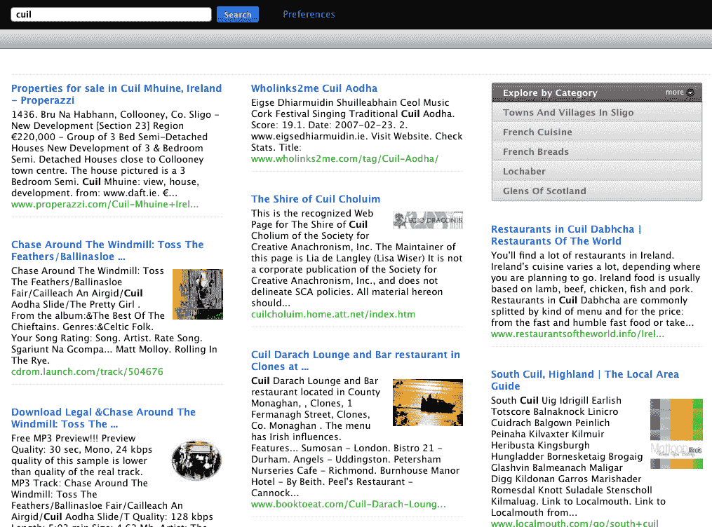

# 如何在发布后 20 秒内丢失 Cuil TechCrunch

> 原文：<https://web.archive.org/web/https://techcrunch.com/2008/07/29/how-to-lose-your-cuil-20-seconds-after-launch/>

# 如何在发射后 20 秒失去你的 Cuil

 炒作周期现在持续不到一天。就拿昨天被过度宣传的隐形搜索初创公司 [Cuil](https://web.archive.org/web/20230219140040/http://www.cuil.com/) 的[发布会](https://web.archive.org/web/20230219140040/http://www.techmeme.com/080728/p94#a080728p94)来说吧，当所有人都意识到它在卖一张商品清单时，它很快就遭到了强烈反对。这完全是公司自己的错。它预先向地球上的每个博客和科技记者做了简报，但不允许任何人在发布前实际测试搜索引擎。

该公司的创始人有着良好的背景，并且已经开发出一种廉价且大规模的网络索引的独特方法。但是创建一个大指数只是成功的一半。一个好的搜索引擎也必须从大海捞针中带回最好的结果。Cuil 在这一点上有所欠缺，正如我们在网站上线一小时后指出的那样，我们实际上可以检查它。

故事很快从谷歌杀手转向了谷歌午餐(让它成为一道开胃菜)。结果 Cuil 回报不是特别大，有时完全不着边际。例如，[搜索“Cuil”](https://web.archive.org/web/20230219140040/http://www.cuil.com/search?q=cuil%20&sl=long)甚至不会在结果的第一页显示链接。(参见本文末尾的屏幕截图)。

当 Cuil 试图将图像与搜索结果集配对时，它通常会选择看似随机的图像来伴随一组结果。例如，[“WordPress”](https://web.archive.org/web/20230219140040/http://www.cuil.com/search?q=wordpress&sl=long)与一个看起来像电视新闻节目的团队相关联，而[“TechCrunch”](https://web.archive.org/web/20230219140040/http://www.cuil.com/search?q=techcrunch&sl=long)与一个 Gmail 标志配对。我不知道在我们“关于”部分的结果旁边的那个人是谁。

这种反弹超出了博客圈。Friendfeed 创始人、前谷歌人保罗·布切特在 FriendFeed 上发起了[这一系列理所应当的严厉评论](https://web.archive.org/web/20230219140040/http://friendfeed.com/e/f468fed1-6ea4-49af-a79d-412b962db2aa/Maybe-Cuil-isn-t-supposed-to-be-good-They-must/):

> ***保罗·布赫海特**发布了一条消息
> “也许 Cuil 不应该是好的。他们肯定知道结果不好，但还是发射了。也许他们并没有试图建立一个完整的搜索引擎，而只是想展示他们的爬行+索引技术，期望有人会收购该公司并插入更好的排名。”
> 。。。
> —其中“某人”= MSFT，他们已经表明愿意为非功能性搜索引擎支付大量费用。–**保罗·布赫海特**
> ——我也是这么想的。–**罗伯特·斯考伯**
> ——如果你搜索“cuil launch”—**迈克尔·马克曼**
> ——当你看到结果有多糟糕时，这是唯一有意义的事情。你不会推出类似的东西，除非你只是炫耀界面。–**凯文·邦德利**
> ——这也可以解释品牌的疲软。谁在乎，如果它只是被插入其他东西？–**克里斯·巴斯金德**
> ——我认为目前结果不太好—**新知 via tw hirl**
> ——在一个对渐进式改进没有太多宽容/耐心的领域推出一些东西肯定很难。这个领域的门槛很高，消费者非常挑剔。看看雅虎。他们的搜索实际上相当不错。然而，他们的份额不断下降。–**Sacca**
> ——同意 Sacca 的观点——此外，我认为 Cuil 背后的人已经向谷歌出售了一些搜索技术，因此他们这次想自己尝试一下——因此，如果有什么不同的话，他们会比其他人更不想翻盘。–**亚当·卡兹韦尔**。。。
> —谷歌黑仔？我甚至不需要看就能知道答案—**迈克·雷诺
> 。。。**
> ——在我看来很尴尬。结果很单薄，图像完全错误。不好是一回事… Cuil 现在看起来比不好低一截。–**AJ Kohn**。。。在我看来，有更好的方式来展示你自己的爬行+索引技术，而不是向公众开放，并因为没有提供人们期望的服务而被痛打一顿。我很难相信 cuil/cuill 的人不知道他们在做什么…他们是被金融家逼着释放的吗？他们急需使用数据吗？–**穆斯塔法·k·伊西克***

如果你要满足炒作周期，你最好能够交付。因为如果你不这样做，它只会持续 20 秒左右。

(照片由[史蒂夫·杰维特森](https://web.archive.org/web/20230219140040/http://www.flickr.com/photos/jurvetson/2390973067/)拍摄)。

