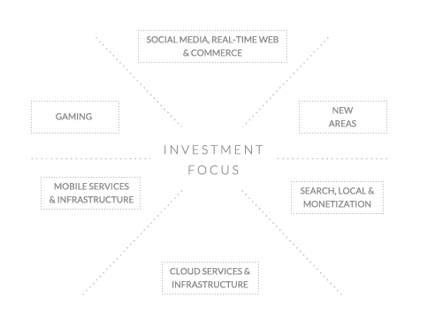

# 如何准备你的创业公司进行天使轮融资

> 原文：<https://web.archive.org/web/https://techcrunch.com/2012/07/15/how-to-prepare-your-startup-to-raise-an-angel-round/>

【YouTube = http://www . YouTube . com/watch？v = iS _ 0oc 67 oiq & feature = youtu . be]

**编者按:** [德里克·安德森](https://web.archive.org/web/20230131211835/http://twitter.com/derekjandersen) *是* [Startup Grind](https://web.archive.org/web/20230131211835/http://startupgrind.com/) *的创始人，这是一个在全球 12 个城市举办的系列活动**以帮助教育、激励和联系企业家。他也是前电子艺界人士，Commonred 和 Vaporware Labs 的创始人。*

一位完全陌生的企业家最近发来一封电子邮件，上面写道:“我们需要筹集资金。你能给我们介绍谁？”我很快鼓励他将自己的创业项目提交给 AngelList，但几天后他又回来了，“我给 AngelList 的创始人发了信息，他没有回复。能给我点提示吗？”这篇文章是给你的，伙计。

冷淡地接近一个著名的硅谷天使投资人，期望他们会资助你，就像走向一个美丽的陌生人，期望在谈话结束时你会计划一场婚礼。对于大众来说，如果你想要顶级资金，在大多数情况下都有一个流程或路线图可以遵循(忽略天才和例外)。试图绕过它表明缺乏考虑和基本的资金过程如何运作的情报。

**为什么会有协议？**

知名天使投资人和风险投资人收到了大量的会议和融资请求。[几个月前](https://web.archive.org/web/20230131211835/http://startupgrind.com/2012/07/jeff-clavier-softtech-vc-gives-an-insider-look-at-raising-top-angel-dollars/)我采访了硅谷顶级投资品牌之一 SoftTech VC 的杰夫·克拉维尔，他的一位企业家最近告诉我，他“简直是一个了不起的投资者”Jeff 解释说，SoftTech VC 每年都会收到 2，000 到 3，000 封要求开会的电子邮件。如果他们与每个团队进行 30 分钟的电话通话，他们将被价值 90，000 分钟的会议所困。假设他们一周工作 50 个小时，他们要花半年时间才能完成第一次会议。相信我，你不会想看到尽职调查所需的数学计算。

作为创始人，当一个风投甚至不回复我们冷冰冰的邮件时，我们应该感到被冒犯吗？当然不是。看了这些数字之后，你能责怪他们吗？在大多数情况下，他们实际上没有带宽。这并不意味着他们不会参加会议或不想投资，你只需要找到合适的渠道，通过他们的过滤器，以他们会回应的方式进行接触。

**如何安排会面**

[YouTube = http://YouTube . be/IlZXnrRzvMs]

我能够每周为我们的[创业研讨班](https://web.archive.org/web/20230131211835/http://startupgrind.com/)活动找到顶级演讲者，尽管我很少事先认识这些人。获得它们的协议几乎总是涉及转诊。这里有一个例子。我们开始举办活动，大约有 20 个人会定期来。我遇到了一位非常优秀但不太出名的风险投资家，并邀请他演讲。他有一次很好的经历，并鼓励史蒂夫·布兰克来演讲。史蒂夫有一个很好的经验，并鼓励安·米乌拉·柯(洪水之门)，她本周将在 T4 演讲。

召开投资者会议也是同样的过程。你需要一个坐在创始人和投资者之间的人来介绍你。投资组合中值得信任的企业家、投资伙伴或与投资者有关系并能为企业家担保的人。在 SoftTechVC 的案例中，Jeff 表示，他们使用这种社交证明来“穿越交易流和 200-300 个(每月)机会，以获得我们每月实际参加的前 20-30 个会议。”如果有人总是给投资者朋友发糟糕的介绍，那么这些邮件很快就会被置若罔闻。

不要做什么？杰夫说，“不要通过电话、传真、推特、在我们门前唱歌或联系我的孩子来联系我们，那真的很糟糕。”

**会议和跟进**

当投资团队最终与创始团队坐在一起时，Jeff 寻找“一个聪明的 a**团队，在一个大的 a**市场中开发一个 kick a**产品。”虽然你的产品不需要尽善尽美，但大多数有经验的投资者都希望看到一个先进的原型，以及至少一些客户开发。杰夫和他的团队寻找符合他们公司明确确定的投资重点的公司。虽然大多数公司可能不太清楚，但只要稍加努力，你就可以看到投资的公司，并对投资者感兴趣的市场类型或类别做出假设。

我认识的任何一个好的投资者都不会投资一个投资组合公司的竞争。如果有，开始向公司的竞争对手推销。也许他们错过了机会，或者在等待合适的团队。最近最好的例子是安德森·霍洛维茨，他在 PicPlz 上投入了大量资金，[在 Instagram 的](https://web.archive.org/web/20230131211835/http://www.forbes.com/sites/shelisrael/2012/04/25/why-andreesen-horowitz-backed-out-of-instagram/)上通过了后一轮，因为他们得出结论，“资助凯文与道尔顿竞争将违反最初对道尔顿做出的隐含承诺——不资助 PicPlz 的竞争对手。”

如果会议进展顺利，天使可能会参与尽职调查过程，他们会打电话给推荐人，亲自检查你和你的团队。他们将与市场专家交谈，审查产品和机会，他们将查看团队与公司的兼容性。在软科技风险投资中，所有合伙人必须就投资达成一致。如果有任何异议，他们将通过。

**要约、资助和超越**

从开会到收到工作邀请甚至是答复的时间可能会有很大的不同。一些 Y Combinator 的创始人当场或当天晚些时候通过电子邮件获得聘用。有些人和你见面，无论如何都不会给你一个明确的答复。在 SoftTech 的情况下，他们将在 10 天内从最初的聊天到做出决定。

如果你收到并接受了一个提议，根据你接受的融资类型，你可以期待几天到几周的电汇。大多数风险投资不会支付现金或无标记的美元。听听那些尝试过的人的看法。

一个投资者可能只拥有 5-7 个董事会席位，所以如果你想让他们进入董事会，那就做做功课，看看他们已经有多少个了。杰夫说，在资金到位后，最优秀的企业家会通过明确需求和提供帮助的方式，或者快速打电话讨论产品或战略问题，来影响他们的投资者。但他补充道，“一些早期创业者或第一次创业的人忘记了，仅仅因为你花时间和投资者在一起，并不意味着你花得很明智。”