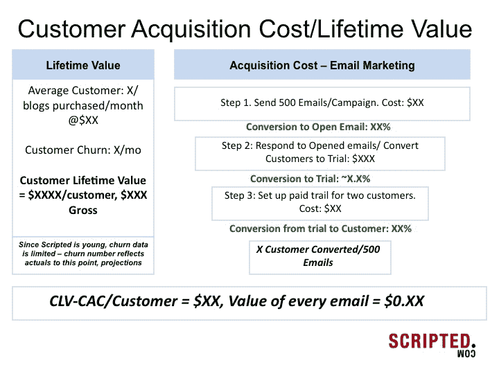

# 如何筹集 100 万美元的种子资金 

> 原文：<https://web.archive.org/web/https://techcrunch.com/2012/05/13/how-to-raise-1m-seed-round/>

**编者按:** *苏尼尔·拉贾拉曼是[Scripted.com](https://web.archive.org/web/20221207014254/http://www.scripted.com/)的联合创始人兼首席执行官，这是一个为企业招聘自由撰稿人的市场。在推特上关注他 [@subes01](https://web.archive.org/web/20221207014254/http://www.twitter.com/subes01) 。*

当我与目前不在初创公司或硅谷的朋友交谈时，他们的感觉是风投和个人投资者像喝醉的水手一样扔投资美元。局外人认为[存在泡沫](https://web.archive.org/web/20221207014254/http://www.forbes.com/sites/nicoleperlroth/2011/05/26/scenes-from-a-silicon-valley-bubble/)，任何有两个工程师和一个想法的公司都会得到资助(尽管在某些情况下这是有一定道理的)。

事实是，对于创业公司来说，竞争从未如此激烈，尤其是在种子阶段，要完成一轮融资。对于 Y Combinator 公司来说，钟摆[可能已经摆动](https://web.archive.org/web/20221207014254/http://42floors.com/blog/posts/did-everybody-see-what-just-happened-the-pendulum-has-swung)，但不是所有其他公司。

我是 Scripted.com 的非技术型联合创始人，这是一个为企业招聘自由撰稿人的市场。我们最近完成了由一家机构(Crosslink Capital)牵头的 100 万美元种子轮融资——我想强调一下我在这一过程中学到的一些经验，并为你们中可能处于相同情况的人提供一些花絮。

**准备打一场硬仗**

我和我的联合创始人都不是技术人员(更糟糕的是，我们是 MBA)。我们都来自高度量化的背景，我以前为一家初创公司工作过，但没什么值得注意的。如果你和我们在同一条船上，做好长期艰苦战斗的准备。在我们开始融资时，我们有一个工程副总裁，但当我们四处游说时，他并不是全职的。如果你还没有准备好 6 个月的加薪，你应该尽快找到 B 计划。

回头看看我的收件箱，看起来我们总共收到了大约 120 封介绍个人天使和机构的邮件——只有 10 多一点的人投资了我们的这一轮。记住，在资金方面，击球率并不重要，重要的是结果。

**失去你对估值的自豪感**

每个人都在谈论 YC 公司最近获得的疯狂估值、不封顶的票据以及其他我们前几年没有见过的各种东西。我有一个不幸的消息要告诉你，如果你不在 YC，或者另一个著名的孵化器——你不会得到这些术语，所以在门口检查一下你的自我。

**推荐有效，但前提是合适的人推荐你进入**

不言而喻，最好的风投不会接受你的会议，除非你从一个强有力的来源获得推荐。我们很早就了解到，成功创立或退出公司的企业家是进入公司的最佳途径。我们很幸运，在开始加薪之前，我们组建了一个非常强大的顾问委员会，这很有帮助。

在这个过程的早期，我们尝试了一种更加漫无目的的推荐方法，但没有成功。远离那些想要公平或报酬以换取介绍的人。我们有一个人厚颜无耻地向我们索要股权，以换取一个天使团体的接见。我录下了我和他的对话，有时会放出来供自己消遣。

**牵引力对你来说更重要**

如果你想完成种子培育，你需要有吸引力和付费客户。YC 企业家理所当然地以产品远见卓识而闻名。他们的种子基金与你的有很大不同——他们接受大量的种子基金来构建产品——你将需要大量的种子基金来发展业务。当我们完成融资时，我们已经做到了每月数万美元的收入，这仍然是一场艰苦的战斗。

**你需要一个可以用一句话来解释的商业模式**

对我们来说，卖点是:“我们以统一价格向企业出售内容，并从每笔交易中抽取一定比例。”无论对等物对你来说是什么，你都需要能够清楚简明地解释它。

**你的市场规模数据会被撕成碎片**

无论你如何评估市场，都要做好被撕成碎片的准备。不言而喻，风险投资者希望看到一个数十亿美元的市场，但风险投资者对你的数字的反应可能取决于他们那天早上吃了什么早餐。我们开始推销市场的方式与我们解释收入模式的方式非常相似:“我们的市场是任何需要书面内容的业务”。我们发现，这比试图对写作市场中的每个细分市场进行自下而上的分析更有效。

**发挥你的长处，拥有一个伟大的故事**

我意识到我不是一个产品梦想家，也永远不会是。我擅长数字，我的联合创始人也是如此——我们也很努力，并成功地将公司从以前的产品中转型出来。我们的故事很吸引人，我们知道如何获得客户，对于决定投资我们的人来说，我们不会放弃。不管你的故事是什么，弄清楚它是什么，并用事实来支持它。我们的故事是关于执行的——我们当时有一个不错的(不是很好的)产品，但是我们赚了很多钱。现在我们有一个全职的工程团队，产品变得更好了，这使得销售周期更容易了。

此外，做一个产品幻想家对我来说并不那么有趣…我不想拍一堆迷人的照片，扮演一个痛苦的艺术家的角色。

**决定是否获得资助的幻灯片**

从上面的主题开始，我和我的联合创始人在推销过程中逐渐更好地专注于实际数字。就在我们制作下面这张幻灯片的时候，我们的推介开始有了转机:

如果你能向风投传达你有一个可重复的商业模式，并且了解你的企业的微观经济学，那么你就是黄金。

[ *图片 via[Flickr/epsos . de](https://web.archive.org/web/20221207014254/http://www.flickr.com/photos/epsos/5394616925/in/photostream/ "http://www.flickr.com/photos/epsos/5394616925/in/photostream/")*]