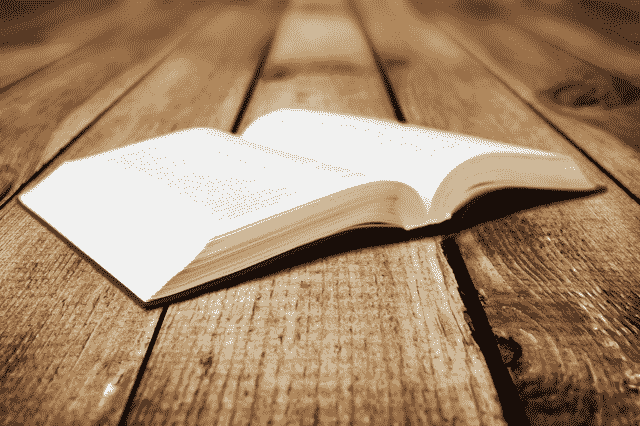
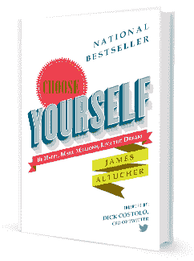
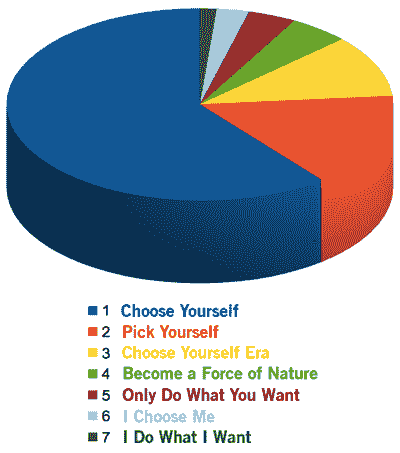
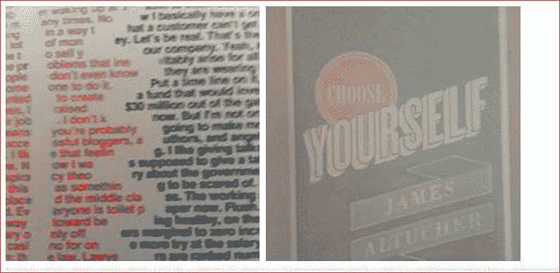

# 如何自助出版一本畅销书:出版 3.0 

> 原文：<https://web.archive.org/web/https://techcrunch.com/2013/07/20/how-to-self-publish-a-bestseller-publishing-3-0/>

****

**编者按:** *[James Altucher](https://web.archive.org/web/20230328185233/http://jamesaltucher.com/) 是一位投资人、程序员、作者，也是数次[创业者](https://web.archive.org/web/20230328185233/http://www.jamesaltucher.com/2011/01/how-i-screwed-yasser-arafat-out-of-2mm-and-lost-100mm-in-the-process/)。他的最新著作，[《选择你自己！](https://web.archive.org/web/20230328185233/http://www.amazon.com/Choose-Yourself-ebook/dp/B00CO8D3G4/ref=cm_cr_pr_product_top)* *(推特 CEO 迪克·科斯特罗作序)*6 月 3 日问世。在 Twitter 上关注他 *[@jaltucher](https://web.archive.org/web/20230328185233/http://twitter.com/jaltucher) 。*

我最近的一本书，[“选择你自己！《T1》在第一个月售出 44294 本[更新:截至 12 月 30 日，销量超过 10 万本]，登上《华尔街日报》畅销书排行榜，连续几天在亚马逊非小说类书籍中排名第一，目前仍在各种类别中排名第一。这篇文章是关于我做了什么不同的事情，为什么我做了不同的事情，以及我认为任何人都可以这样自助出版一本畅销书。我描述了所有的数字，我雇佣了谁，为什么，以及我是如何做出各种选择的。](https://web.archive.org/web/20230328185233/http://www.amazon.com/Choose-Yourself-James-Altucher/dp/1490313370/ref=tmm_pap_title_0)

每个企业家都应该自助出版一本书，[，因为自助出版是新的名片](https://web.archive.org/web/20230328185233/https://techcrunch.com/2012/01/28/why-every-entrepreneur-should-self-publish-a-book/)。如果你想在内容的世界中脱颖而出，你需要突出你的专业知识。出版一本书不仅仅是把你的想法放在博客上。这是一个事件。它展示了你最好的策划思想，也向顾客、客户、投资者、朋友和爱人展示了你现在脑子里最重要的事情是什么。

不幸的是，大多数人都不擅长。我在很大程度上被它搞砸了。我已经出版了 11 本书——5 本由传统出版商出版，6 本自行出版。

现在，区别不再是“传统出版”和“自助出版”现在的区别在于*专业*和*非专业*出版。我的前 10 本书做得很不专业。即使是那些大出版社。他们现在可能会恨我。我希望不会。我真的很喜欢和我一起在这些出版社工作的人。

希望大家自助出版。好处是巨大的:

**钱多**。除非你是约翰·格里森姆或 E L .詹姆斯，否则你会通过专业的自助出版赚更多的钱。不仅仅是销售上的钱，还有外国版权和特殊的包装，如果你控制了你作品的所有版权，你就可以提供这些东西。传统出版商几乎从不追求的包装。

**设计控制。传统出版商通常保持这种控制。**

**速度。如果你自己出版，你可能会将出版日期提前一年或更长时间。**

**含量控制。我敢打赌，阅读这篇文章的人几乎百分之百都有足以写成一本书的内容。但 22 岁的出版公司实习生不会认识到这些内容。即使是编辑、出版商、营销人员——他们中的大多数——也不会意识到你要提供的信息。这让我想到…**

避免生活中的坏事。我讨厌那种“我希望他或她选择我做 X”的感觉，这里的“X”可以是投资、收购、出版一本书、购买我的产品，等等。我尽可能地在生活中限制这种感觉。当你不得不和越来越多的不得不选择你的层的人打交道的时候，你没有得到选择自己的机会(！)，价值无限。

**进入出版 3.0:如何专业地自助出版你的下一本书**

以下是我在新书出版后的第一个月里按部就班所做的事情。

##### **1)构建您的平台**

除非你有自己的平台，传统出版商甚至不会看你一眼，这意味着有 Twitter 粉丝、脸书粉丝和/或重要的博客粉丝。但是如果你已经可以亲手交付客户，你还需要传统出版商做什么？

这不应该是出版商给你的吗？书店里没有吗？**答案是否定的**

书店很少接受出版商出版的书籍。每当你看到一本书面朝前，或者在前面的桌子上，或者“工作人员精选”，这意味着出版商通常会支付特殊的位置。大多数书不明白这一点。如果你没有做到这一点，你的书很可能卖不出去。

##### **2)你如何搭建自己的平台？**

有诚实的声音。不要害怕谈论你自己或者你所在的行业。提供独特的视角。如果它不流血，它不会导致。确保你做的每一个帖子或视频都发自内心，寓教于乐。按照这个顺序。

你怎么获得流量？在更大的网站上写博客，这些网站聚集了博客作者或播客等。这需要时间来积累。但真诚的声音总会升到最高。

##### **3)写**

这不是一个关于写作或如何写一本好书的帖子。假设你会写一本好书。但是，两个建议:每天写 500-2000 个单词，保持锻炼写作肌肉。每天阅读优秀的作家。然后你会写一本更好的书。

一本典型的书有 40，000 到 80，000 字。所以如果你平均每天 1000 字，一周七天，你一年可以写四到八本书。或者一个非常非常好的，编辑过的，修改过的，专业的。还是 10！请自便！

我还想为这本书写一篇高质量的前言。我真的很感激 Twitter 的首席执行官迪克·科斯特罗同意做我的工作。当我读到他写的东西时，我意识到为什么他曾经是一个即兴喜剧演员。

##### 4)知道自己想要什么

如果你是自助出版，那么你现在就可以出版你的书，不需要任何其他的努力。去 [CreateSpace](https://web.archive.org/web/20230328185233/http://createspace.com/) (亚马逊旗下)，勾选你既想做平装书又想做 Kindle(Kindle 上要多花 69 美元)，选个封面，上传你的手稿，几天后你就会在亚马逊上出版，人们就可以开始买你的书了。

如果你的目标是出版一本书，并用它来获得客户、咨询演出、演讲等。或者是你下一本书的第一批读者，那么无论如何都要以这种方式出版。这是最快的方法。我强烈推荐。

但是如果你的目标是推出最好的产品，最大化你赚的钱，并获得最多的读者，那么遵循下一步，我称之为“出版 3.0”

*   **1.0** 与传统出版商合作出版。
*   **2.0** 是自助出版的耻辱消失的时候，一个全新的艺术出口对数百万人开放(去年出版了 1500 万本书，而 10 年前只有 30 万本)。出版你的书既便宜、快捷又容易。
*   3.0 现在就开始了——在这里你可以更好地自助出版，更成功，更好地编辑，更好地设计，更好地营销，比走任何其他路线都更赚钱。之所以现在才成为可能，是因为第一次，最好的编辑、设计师、营销人员不再在大出版社工作。取而代之的是，他们自己动手，独立收取服务费用。需求是存在的。这条路线比“出版 2.0”更贵，但利润更高。

##### 5)编辑

以前我的编辑只是拼写检查。这比我的一些主流出版商做的还要多。我妻子问我是不是在开玩笑。但我告诉她去读我的第二本书，她不再质疑了。换句话说，太糟糕了。

我全力以赴写了我的新书。我雇了两个文字编辑来检查拼写和语法的基础知识。然后，我雇佣了尼尔斯·帕克(Nils Parker)经营的 Z 编辑公司(Command Z Editing)来帮助我进行结构性编辑，也就是说，做编辑过去常常做的工作(例如:20 世纪 30 年代的麦克斯威尔·珀金斯)，但过去 20 年传统出版商非常缺乏这种工作。尼尔斯之前编辑过塔克·马克斯、卡迈勒·拉维坎特、瑞安·霍利迪和十几个作家的畅销书，也写过剧本、书籍等。

#### 为了我的书，尼尔斯和我来来回回进行了超过 15 次不同的重写。原版和最终版的区别就像鸡屎和鸡肉沙拉的区别。

顺便说一下，我不是说“雇佣尼尔斯”。我只是说这是我用过的人(还付钱了)。确保你使用的人是世界上最好的，否则你没有利用出版 3.0 世界所提供的优势。为了我的书，尼尔斯和我来来回回进行了超过 15 次不同的重写。原版和最终版的区别就像鸡屎和鸡肉沙拉的区别。

是的，出版商有编辑。一些非常好的。但是我特别想选择我自己的编辑，并且使用一个编辑过已经卖出几百万册的书的编辑。“出版 3.0”的整个想法是，我不局限于谁是出版商的员工，但我可以挑选行业中绝对最好的人。市场上有数百万本书，竞争非常激烈。

雇佣最好的编辑、设计公司、营销公司和音频公司都是其中的一部分。不仅是周围最好的，而且是我觉得是世界上最好的。

##### 6)设计

我从来不喜欢我传统出版的书籍上的任何设计，但我无法控制它们。我不想让这听起来这么反出版商。但他们更忙于更大的作者，我不认为他们总是能够为我投入资源。

我确保我推出了一款让我引以为豪的产品。我用了[艾琳·泰勒设计](https://web.archive.org/web/20230328185233/http://erintylerdesign.com/)，她帮我找到了合适的[封面设计师](https://web.archive.org/web/20230328185233/http://herbthornby.com/)，她还负责室内设计过程，这比我想象的要复杂得多。

她设计了书脊，挑选了字体、内折、封底和所有奇怪的东西——表格、图片、旁白等等。——在书里面，然后当我上传到亚马逊上的 Kindle Direct 时，帮助格式化。

##### 7)有声读物

去年 10 月，我参加了亚马逊为自出版作家举办的一场晚宴。

一个靠自助出版科幻小说谋生的家伙告诉我，他总是制作有声读物。我认为这是一个可怕的想法，并告诉了他。

但是有声读物有两点:

1.  他说:“当人们看到你有一本有声读物时，他们会认为你的书更加可信。当你有一本电子书、一个印刷版本、*和*一本有声读物时，它就从一般的自出版书籍中脱颖而出了。此外，有声书更贵，所以尽管销量少，但这是一笔可观的收入。”顺便说一句，如果你自己出版，至少要做一本纸质书。即使你 99%的销售额是电子书。
2.  我问一家广告公司的负责人，他对我即将出版的书有什么营销建议。他说，第一件事，“做一本有声读物。对于你这种类型的书，人们会喜欢在开车上班的时候听。”

因此，我的妻子克劳迪娅一直支持这项工作的各个方面，她在我们家设立了她的办公室，作为一个迷你录音室。我写信给塔克·麦克斯说我要做一本有声读物。他回信说:

“詹姆斯，你在哪里做音频，谁在编辑它？请告诉我，你不是在用你的 Mac 和你在网上买的麦克风自己做这件事。”

我们看了看我们的 Mac 和一个我们刚刚在网上买的麦克风，决定去一个专业的工作室。塔克建议[约翰·马歇尔媒体](https://web.archive.org/web/20230328185233/http://johnmarshallmedia.com/)。他们做的有声读物从克林顿总统的自传到《哈利·波特》到《魔鬼经济学》。

这是一次非常讨厌的经历，但却是值得的。

光是坐在那里八个小时看我写的字，我就觉得不舒服。首先，它很痛。连续阅读八个小时让我喉咙痛得要命。

第二，我不想只是阅读我已经写好的故事。所以我完全不加删节地做了一些即兴创作，使它与书相比有些原创性。

但是做有声读物的最好原因是它迫使你真正地看着你的作品，听到什么有用，什么没用。在读了一些听起来不太清楚的东西后，我重写了这本书的大约 20%。

这意味着另一轮编辑(在 Nils 的帮助下)来改善这本书，如果我没有做音频版本，我永远不会经历这个过程。

##### 8)标题

这值得单独归类。我完全控制了这个头衔。我对这本书的第一选择是“选择你自己的时代”但是每当有人让我说这个标题的时候，我总是说不出来。“时代”听起来像“错误”一个人问我是不是要去一本关于考古学的书。所以不知何故它不起作用。

所以我选了 10 本我喜欢的书，把它们和封面结合起来，制作了脸书广告，发给我在美国的所有朋友和朋友的朋友。然后我坐下来，看着点击率。几天后，经过数千次点击，我有了自己的标题。

*“选择自己的时代”*排在第三位，遥遥领先。*“自己挑吧！”排在第二位。还有*“自己选吧！*“遥遥领先。*

然后，我采用了同样的脸书方法来挑选副标题和封面设计的最终版本。

脸书职称考试成绩:

##### 9)营销

我用的是瑞安·哈乐迪的公司[布拉斯切克](https://web.archive.org/web/20230328185233/http://brasscheck.net/)。瑞安是美国服装公司的营销主管，销售了许多畅销书，包括蒂姆·菲利斯(《四小时厨师》)、罗伯特·格林(《掌握》)、塔克·马克斯(《我希望他们在地狱里供应啤酒》)和其他人的书。

我以前从未使用过外部代理，总是相信我自己的基本平台或出版商。瑞安提供的东西令人难以置信。在他和我的通讯录之间，我们安排了大约 60 个播客、电台采访、演讲以及在热门博客和网站上的客座博文。

还有一些我无法协调的其他事情:[一个 Reddit AMA](https://web.archive.org/web/20230328185233/http://www.reddit.com/r/IAmA/comments/1fssv7/i_am_james_altucher_founder_of_20_companies_17_of/) 在过去的一个月里收到了超过 3000 条评论，可能接近一百万次浏览。他的公司创建了一个 [SlideShare 演示文稿](https://web.archive.org/web/20230328185233/http://www.slideshare.net/JamesAltucher/choose-yourself)，在发布的那一周，该演示文稿成为网站上点击率最高的幻灯片，点击率超过 30 万次。发布后一个月，我的计划是不停地营销。到月底时，我累坏了。

我也成为了比特币的粉丝。因此，在我发行这本书的前一个月，我建立了[bitcoin . choose yourself . us](https://web.archive.org/web/20230328185233/http://bitcoin.chooseyourself.us/)，成为第一本仅用比特币预发行的书。Ryan 然后找了几个主要的媒体来报道这件事。

### 如果人们能向我证明他们买过并读过这本书，我会向他们还钱。

我还想在书的开头推销一个提议。我的目标并不是一定要赚最多的钱，而是要确保尽可能多的人知道这个信息。所以在第一页，在编辑信息和奉献之前，有“要约”

如果人们能向我证明他们买过并读过这本书，我会向他们还钱。然后我会把这本书的钱全部还给他们(每笔交易都赔钱，因为亚马逊拿的提成加上运费)。我的想法是我很乐意免费赠送这本书，但是我知道人们不珍惜免费得到的东西。我也知道大多数人不读他们买的书。因此有了这个提议。

Ryan 成功地确保了各种媒体报道了这一提议。

布拉斯切克还为由 Simplifilm 制作并制作动画的视频预告片编写了脚本。我在下面描述营销的结果。

##### 10)外国权利

我发现，就我以前的书而言，传统出版商或多或少会等外国出版商打电话来，然后他们会出售版权，我的分成会很少。一般来说，分成是五五开，但我的 50%将来自我的代理人的分成。我和出版社里太多的其他作者竞争，以至于没有引起外国出版社的注意。

现在我拥有我的书的所有权利。大多数自行出版的人并没有考虑外国权利。你仍然需要有人在国外出版商面前为你辩护。所以我找了一家外国权利代理公司，[两海代理公司](https://web.archive.org/web/20230328185233/http://2seasagency.com/)，代理处理所有的外国权利。他们去世界各地参加图书发布会，在每个国家都有人脉。

6 月，也就是这本书出版的第一个月,《两海世界》的 Marleen Seegers 将版权卖给了:巴西(2500 美元)、中国(4300 美元)、韩国(5000 美元)。她目前正在与其他 10 个国家的出版商谈判。上面提到的三个地方是合同完成得非常快的地方。

##### 11)其他商品

因为我拥有权利，我可以做任何我想做的事。在下面的“数字”一节中，我描述了我将这本书的精装版与三本早期书籍以及一些由电子通讯公司发出的原创作品组合在一起的捆绑包，该公司完成了所有的履行工作，并与我分享了收益。

在社交网页和 T2 文字的帮助下，我还制作了一张海报，从远处看它就像书的封面，但当你靠近它时，你会清楚地看到这本书的 67000 个单词。我还把它做成一件衬衫。我要用它做什么？我不知道。但这很有趣，我想做。

在下面的照片中，当你站在离海报大约一英寸的地方，你可以看到远处的版本和文字。

##### 12)数字

首先，我之前的数字是多少？以下是我的第一本主流出版的书的预付款，五本书依次为:5000 美元、7500 美元、30000 美元、100000 美元和 30000 美元。预付款下降得很快！

我的第一本书赚回了我的预付款，加上大约 10%的版税，我可能又赚了几千美元。我的其他书都无法弥补它们的进步。

我没有我前五本自助出版的书的全部数字，但是我免费赠送了大量的书，以便建立我的读者群。几乎所有我出版的书都是免费的，但是我的收入很少，即使我有很多读者。

第一周“选择你自己！”我登上了《华尔街日报》畅销书排行榜，卖出了大约 1 万本。要登上《纽约时报》畅销书排行榜，我可以告诉你一个趣闻(这取决于每周)，你需要在第一周卖出 2500-3000 本。我上不了 NYT 畅销书排行榜，因为他们不看书店里没有的书。我现在不在任何书店，尽管我正在努力改变。我只想说，我会和《华尔街日报》一样登上这份榜单。

第一个月，我卖出了 44294 本平装本、有声本、电子书甚至精装本。

精装版是通过波特·斯坦斯伯里经营的电子邮件简讯出售的，其中捆绑了我过去书籍的三个免费版本以及我写的一份原始报告。精装成本收回后他和我五五分成收益。我第一个月通过这种方式卖了 2 万左右。主流出版商几乎从未尝试过电子邮件营销。

在剩下的 24000 个中，近 50%是 Kindle，45%是 CreateSpace，5%是 Audible。在亚马逊 Kindle 的所有销售中，版税是 4.99 美元成本的 70%。有声版本的版税大约为 52%，上下浮动几个百分点。在 CreateSpace 上，给定我的定价，版税大约是 26%。

上述所有项目的总成本为 31，000 美元(根据您的具体需求，可以大幅降低成本。例如，并不是每本书都需要音频版本和视频预告片)，这还不包括我为营销而做的旅行，以及建立我的平台所涉及的其他营销成本。

我很乐意在下面的评论中回答关于这个过程的问题。

*【上图:[快门](https://web.archive.org/web/20230328185233/http://www.shutterstock.com/cat.mhtml?lang=en&search_source=search_form&search_tracking_id=hekusXSqQfTqsFrN_L_fAw&version=llv1&anyorall=all&safesearch=1&searchterm=book&search_group=&orient=&search_cat=&searchtermx=&photographer_name=&people_gender=&people_age=&people_ethnicity=&people_number=&commercial_ok=&color=&show_color_wheel=1#id=108961397&src=hekusXSqQfTqsFrN_L_fAw-4-81)*