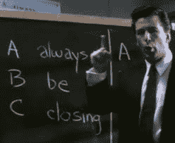

# 如何推销你的公司 TechCrunch

> 原文：<https://web.archive.org/web/http://techcrunch.com/2011/09/03/how-to-sell-your-company/>

***编者按** : [James Altucher](https://web.archive.org/web/20230205031540/http://en.wikipedia.org/wiki/James_Altucher) 是一名投资人、程序员、作家、企业家。他是 Formula Capital 的董事总经理，写了 6 本关于投资的书。他的新书[他免费赠送](https://web.archive.org/web/20230205031540/http://www.jamesaltucher.com/2011/05/why-and-how-i-self-published-a-book/)。他在 1998 年创建并出售了 Reset 公司，在 2007 年创建并出售了 Stockpickr.com 公司。可以关注他 [@jaltucher](https://web.archive.org/web/20230205031540/http://twitter.com/#!/jaltucher) 。*

我是一个相当好的推销员，但是我是最差的谈判者。如果我说，“花 10，000 美元买我的车”，有人说“8，000 美元”，我只会耸耸肩说“好的”。事实上，那确实发生了。

有些人可能两样都擅长。但是我觉得很难。根据定义。当你是一名推销员时，你希望对方说“是”作为谈判者，你必须愿意说“不”，不管对方说什么。

因此，尽管它们不是完全对立的，但目标是完全不同的。但是总体来说:

**谈判毫无价值。**销售就是**一切**。

为什么？因为当有人对你说“是”的时候，你就在门里了。最终，你会得到床上的女孩(或男孩，无论如何)。如果你就在门口谈判，那么你可能不得不走开，去下一家试试。这需要时间和精力，而且仍然可能行不通。

**我的一些糟糕的“谈判”的例子已经对我奏效了。**

我以比同时期其他互联网公司低得多的价格卖掉了我的第一家公司。但那是 1998 年，互联网即将破产，但首先所有的股票都上涨了。许多同类企业坚持不懈，最终破产。即使是那些卖得更多的人，当他们不卖股票时也会破产。

b)我把我的第二家公司 Stockpickr 的 50%无偿给了 thestreet.com。博客帖子写的是我的交易有多糟糕。但当有人拥有你 50%的股份时，他们会关心会发生什么。四个月后，他们不得不买下我的公司，而不是冒险让别人拥有 50%的股份。对于那些他们只持有 10%股份的公司，他们放弃了。我能够在市场见顶前四个月左右卖出。在那之后，就不会发生了。我的一名员工离开了我，因为他对我做的交易非常反感。【参见，[我是如何卖掉斯托克、奥萨马·本·拉登和谈判艺术的】](https://web.archive.org/web/20230205031540/http://www.jamesaltucher.com/2010/12/osama-bin-laden-stockpickr-and-everything-i-know-about-negotiation/)

c)我以低于我妻子克劳迪娅要价的 1000 美元卖掉了她的车。但是现在车不见了。我们不必为此担心。那对我来说值 1000 美元。

d)我让我以前的公司为新线电影公司做网站，一部电影 1000 美元。这是我们做《黑客帝国》所得到的 1/200，尽管有些网站是同样的大小。我为什么这么做？最好的设计师想被我们雇佣来制作这些电影。与此同时，他们周六晚上加班到很晚，为报酬更高的爱迪生公司工作。我根本没有谈判。
T3

E) [我免费赠送了我的上一本书](https://web.archive.org/web/20230205031540/http://www.jamesaltucher.com/2011/05/why-and-how-i-self-published-a-book/)，并在 Kindle 上以 0.99 美元的价格出售，而不是更高的价格。但是这让我的想法更加深入人心，已经有 20，000 多人下载了这本书。关于如何免费获得这本书，请参见上面的链接。

f)我每天都收到在我的博客上做广告的邀请。我对他们每个人都说“不”。不是我的大局。

关键是，只和你真正想卖给的人谈判。否则就归结为钱。最近有人写信给我，说他们想让我在哥本哈根演讲。我不想去。所以我说，“5 万美元。”我给它的定价远远超出了合理的范围，如果他们说“是的”，我会很乐意接受。我从未收到他们的回复。那对我来说很好。但是如果我真的想做，我会毫不犹豫地以更低的价格去做。有时，当你向你不爱的人推销商品，而你给自己定的价格超出了合理范围时，有时他们会答应。那也很好。这是我对谈判的唯一了解。

你不想犯傻。只把你爱的东西卖给你爱的人。总是想“这里的大局是什么？”在很多情况下，从大局来看，谈判没有“销售”重要。因此，出现了“免费增值”这样的模式。

**销售的十大关键:**

**1)询问客户的终身价值是什么？**当我免费赠送一本书时。它让我的名字在那里。这对我有终身价值，远远超过我可能收取的几美元。

**2)提问，拥有这位客户有什么附带好处？**当我们花 1000 美元在 Miramax.com 演出时，我们变成了在 MIRAMAX.COM 演出的人！所有这些都有助于获得价值更高的 20 个其他客户。我会付钱给他们做那个网站。

了解你客户的全部历史。你需要爱你的客户。喜欢他们所有的产品。让自己了解他们的产品。我想在 HBO 工作，因为我喜欢他们所有的节目，在我 90 年代申请工作之前，我研究了他们从 70 年代开始的历史。

**4)赋予额外的功能。**做第一个项目便宜。不管规范中有什么，至少添加两个新的很酷的特性。这个*吹走了*客户端。别忘了客户是人，不是公司。那个人类有个老板。他们想在老板面前表现得更好。如果你给他们一个升职的机会，那么他们会喜欢你，并且会继续聘用你。

赠送厨房洗涤槽。我的对冲基金中最大的投资者之一刚刚在庞氏骗局中被骗。他们几乎倒闭了。我把他们介绍给每家报纸的记者，帮助他们宣传庞氏骗局。他们非常感激，甚至在我的基金里投入了更多的钱。每当主角对发生的事情感到沮丧时，我会和他聊上一个小时，试图让他振作起来。对他来说，我不仅仅是一项投资，还是一名公关人员和治疗师。多走一步。

推荐你的比赛。请这样想:互联网上最受欢迎的两个网站是什么:雅虎和谷歌。他们是做什么的？他们只是链接到他们的竞争对手:其他网站。如果你成为一个可靠的来源，那么每个人都会回来找你，因为你的知识是有价值的，他们只有通过接触你才能得到。他们通过购买你的产品或服务来获取。[见，[关于谷歌我不知道的 10 件不寻常的事情，加上我有史以来最糟糕的风险投资经历](https://web.archive.org/web/20230205031540/http://www.jamesaltucher.com/2011/03/10-unusual-things-about-google/)

**7)意念机。**有句话叫“永远要结束”。如果你总是站在客户的角度，想办法帮助他们，那才是正确的。当我把 stockpickr.com 卖给 thestreet.com 时，表面原因是他们想要我的网站产生的流量、社区和广告。真正的原因是他们需要帮助来为他们的公司出主意。我总是产生新的想法，并与他们讨论。通常，有人向你购买的真正原因不是因为你的产品，而是因为你。

【T2

8)露面。当我想管理维克多·尼德霍夫的一些钱时，我会阅读他所有喜欢的书。我为他写文章。无论何时何地，只要他要求，我都会出现在晚餐上。如果他需要做一项研究，需要一些超出他或他的员工能力的编程，我会主动提出做，而且会做得很快。没有人付钱给我，但最终他把钱交给了我(费用低得离谱，但我没有讨价还价)，我可以利用这笔钱从其他人那里筹集资金。另外，我真的很喜欢他。我认为他是一个了不起的人。

**9)知识。当我建立交易业务的时候，我一定读过 200 多本关于交易的书，并且和另外 200 个交易者交谈过。没有交易风格是被禁止的。这不仅帮助我建立了交易业务，还帮助我建立了对冲基金的基金，并最终建立了 stockpickr.com。我觉得，我比世界上任何人都更了解交易和顶级投资者。创造价值几乎是事后的想法。当我在建网站的时候，我知道所有关于网络编程的事情。没有什么是我做不到的。竞争通常是由商人而不是程序员进行的，他们知道我的情况。并且知道我总是比他们便宜。**

喜欢它。只有做自己热爱的事情才能赚钱。[如果你做一份你讨厌的朝九晚五的工作，那么你就被束缚住了，你挣的钱只够糊口，你不会快乐。如果你喜欢某样东西，你会得到知识，你会得到联系，你会建立一个有别人没有的特色的网站，你会吓退竞争对手，你会赢得顾客。](https://web.archive.org/web/20230205031540/http://www.jamesaltucher.com/2011/05/10-more-reasons-you-need-to-quit-your-job-right-now/)

我不喜欢写金融文章。我会为一些随机的金融网站写一篇金融文章，然后在 jamesaltucher.com 上转贴。我没有交通堵塞。

然后我决定写我喜欢的文章。回到我热爱写作和阅读的真正根源。我也想真正探索我所有的失败，我的不幸，我的痛苦。在公共场合。我喜欢对人诚实和亲密。我喜欢建立社区。我喜欢给读者发电子邮件。那是大约 10 个月前，我决定做出改变，在 jamesaltucher.com 打开和服，说出我想说的一切，同时沉浸在我对写作、艺术、创造力和阅读的热爱中。250 万+“客户”后来，我比以往任何时候都更喜欢做自己喜欢的事情。