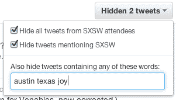

# 如何暂时让 SXSW TechCrunch 上那些烦人的推特用户安静下来

> 原文：<https://web.archive.org/web/https://techcrunch.com/2012/02/22/how-to-temporarily-silence-all-those-annoying-twitterers-at-sxsw/>

# 如何暂时让 SXSW 上那些烦人的推特用户安静下来

出于各种原因(呻吟)我今年不会去 SXSW，但其他数百万人也不会去。但这不会阻止 20，000 名与会者堵塞我们的 Twitter 订阅源，试图在最近的酒吧找到彼此，不停地在 Twitter 上谈论一些你没有参加的“棒极了”小组会议，或者通常谈论你没有在场见证的笑话。

这就是为什么你需要一种便捷的方式来暂时屏蔽那些推文或那些人——或者甚至两者都屏蔽。

去年有一个方便的浏览器扩展阻止了 SXSW 的推文。今年，它背后的人现在在一家前 YC 创业公司，Lanyrd，他们再次参与其中，这次是带着一个改进的产品。

该扩展屏蔽了标签为#SXSW 的推文，但这一次，因为 Lanyrd 也有一个参与者目录，该扩展将屏蔽那里的所有推文。解脱！

这就是了(不需要先签到):【notatsxsw.lanyrd.com

尽情享受吧，各位！

与此同时，对于那些要去的人，他们可以查看 Lanyrd [会议指南](https://web.archive.org/web/20230122032204/http://sxsw.lanyrd.com/)以了解他们的 Twitter 联系人正在发言或计划参加的会议。然后，他们可以建立自己的会议计划，并使用 Lanyrd iPhone 应用程序或 HTML5 移动 web 应用程序在手机上随身携带(离线保存)。在会议期间，他们每天还会通过电子邮件收到一份个人日程表。

很明显，Lanyrd 正在从 Plancast 未能提供的[中获益。](https://web.archive.org/web/20230122032204/https://techcrunch.com/2012/01/22/post-mortem-for-plancast/)

更多的好东西，有一个可搜索的目录，上面有 [SXSW 与会者](https://web.archive.org/web/20230122032204/http://sxsw.lanyrd.com/-/attendees)、[投资者](https://web.archive.org/web/20230122032204/http://sxsw.lanyrd.com/-/attendees?q=investor)、[创始人](https://web.archive.org/web/20230122032204/http://sxsw.lanyrd.com/-/attendees?q=founder)名单，应有尽有。

SXSW 演讲者还可以[从 SXSW 日程数据中自动生成 Moo 迷你卡](https://web.archive.org/web/20230122032204/http://lanyrd.com/blog/2012/minicards/)来帮助宣传他们的演讲。