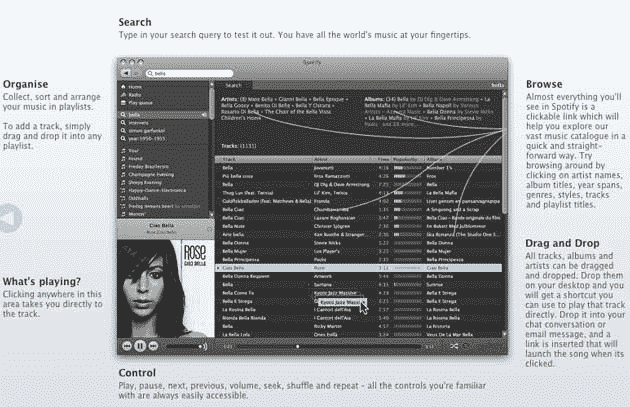

# 如何立即试用 Spotify，无论你住在哪里 

> 原文：<https://web.archive.org/web/http://techcrunch.com/2009/01/03/how-to-try-spotify-immediately-no-matter-where-you-live/>

# 如何立即试用 Spotify，无论你住在哪里

新的欧洲流媒体音乐服务 [Spotify](https://web.archive.org/web/20230203005308/http://www.spotify.com/) ，英国 TechCrunch[从 10 月份开始跟踪](https://web.archive.org/web/20230203005308/http://uk.beta.techcrunch.com/2008/10/07/spotify-launches-public-beta-of-lastfm-competitor/)，越来越受到好评。Spotify 是供 Windows 和 Mac 用户下载的客户端，可以让你搜索、浏览和播放大量音乐。遗憾的是，它只在英国、瑞典、芬兰、挪威、西班牙和法国可用，你需要邀请才能加入。

用户体验甚至超过了 LaLa、MySpace Music 和 Imeem 等最好的网络流媒体服务。它就像一个库存充足的 iTunes，所有东西都有超链接，可以很容易地找到相关的音乐。创建播放列表很容易。没有办法将音乐移出应用程序或移动到音乐设备上。但这是我见过的合法查找和免费播放音乐的最佳方式

我没有收到邀请，我住在美国，但我整个下午都在使用 Spotify。以前有过[帖子](https://web.archive.org/web/20230203005308/http://filesharefreak.com/2008/11/28/join-and-access-spotifycom-in-unavailable-locations/)说一旦你收到使用代理服务器的邀请，就可以从一个被禁止的地点进入服务。然而，今天在 Digg 上，一位评论者留下了关于如何在没有邀请的情况下使用 Spotify 的说明。我试过了，它有效(目前)。

> 从任何地方邀请您自己:
> 1)去 http://www.daveproxy.co.uk/
> 2)输入以下 URL:https://www.spotify.com/en/get-started/
> 3)创建您的帐户，用于英国邮政编码–检查 http://www.postcodesearch.org.uk/

很可能代理服务器很快就会被禁止，但是在未被禁止的国家还有无数的代理服务器。重要的是从代理服务器访问这个 URL。我建议你现在就做，在漏洞被堵住之前。