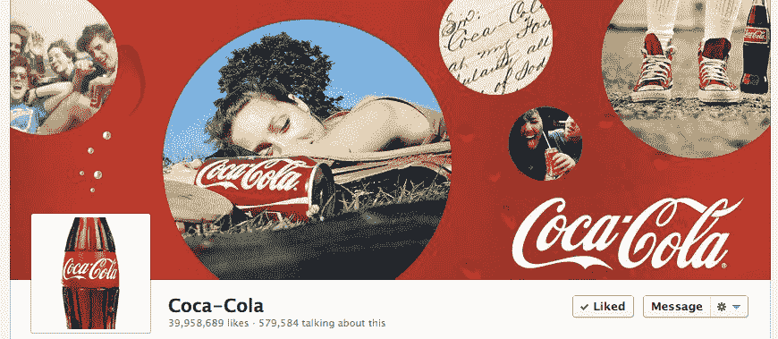
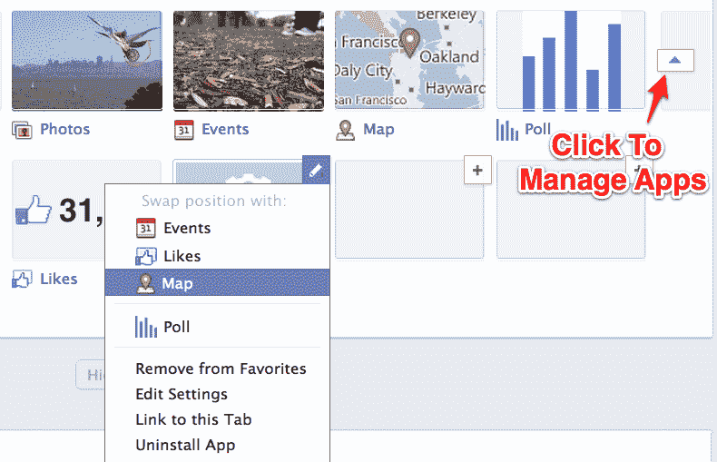
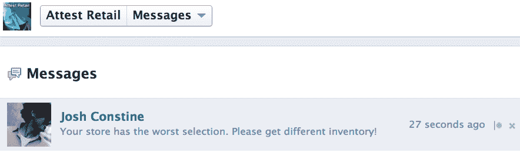
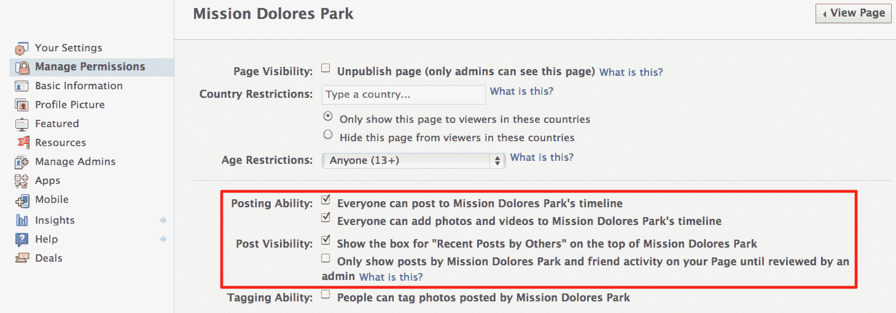
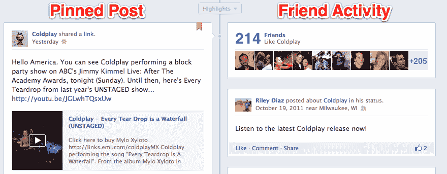
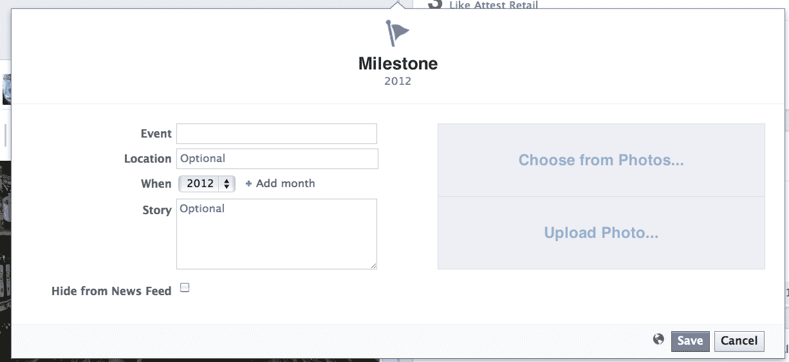
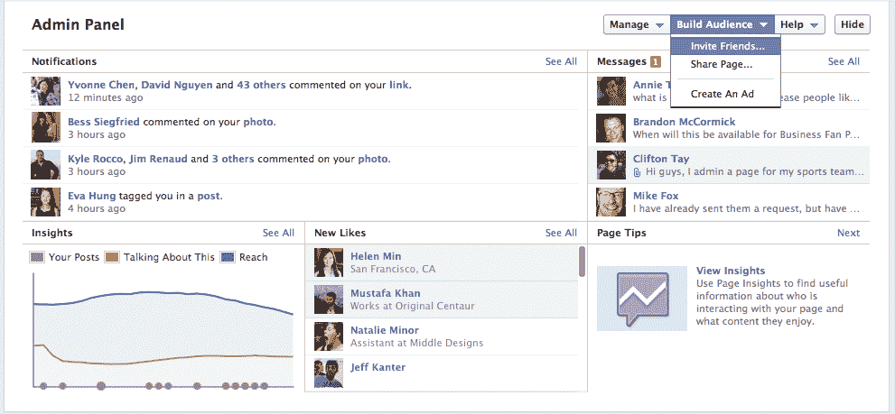
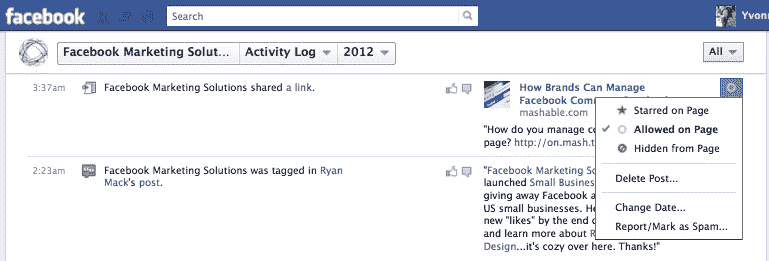

# 如何使用品牌页面的脸书时间线:新功能详情

> 原文：<https://web.archive.org/web/http://techcrunch.com/2012/02/29/how-to-use-timeline-for-pages/>

第页的[脸书时间表的推出对你的品牌意味着什么？前所未有的控制，提高参与度的机会，但也有大量的初始工作。今天早上，当](https://web.archive.org/web/20230404120607/http://www.facebook.com/about/pages/)[脸书给全球所有网页](https://web.archive.org/web/20230404120607/https://techcrunch.com/2012/02/29/facebook-timeline-for-pages/)升级到时间线重新设计的选项时，许多新功能变得可用。以下是它们的工作原理，以及如何利用它们来为您的企业带来好处。

#### 激活时间线

首先，访问页面预览管理器的[时间线](https://web.archive.org/web/20230404120607/http://www.facebook.com/pages/status/)，并选择将时间线添加到您的页面。然后你将进入一个监管期，只有你的页面管理员可以看到时间线，而其他人包括你的粉丝都可以看到旧的设计。浏览下面详细介绍的功能，准备好之后，点击页面顶部的“立即发布”按钮，开始向所有人展示时间轴。您可以在 2012 年 3 月 30 日之前随时升级，届时 Timeline 将自动对您的所有页面公开。

#### 涉及

时间轴封面在页面顶部显示一个 851 x 315 像素的巨型横幅。脸书广告公司的产品总监戈库尔·拉贾拉姆告诉我，它的“目标是象征一个组织的全部。对于一家餐馆来说，它可以是一个受欢迎的菜单项，一个乐队可以展示专辑封面，一家企业可以展示他们的客户使用他们产品的照片。”

封面不得显示行动号召或提及脸书特色，如“喜欢此页”，购买或定价信息，如“40%折扣”或“在我们的网站下载”，或联系信息，如网址。拉贾拉姆说,“品牌对(限制)非常积极，因为他们不想被视为过度宣传——这令人倒胃口。选择一个视觉上令人惊叹的高分辨率图像，让访问者高兴或感兴趣，并让他们想向下滚动到您的更新。

#### 关于部分

封面下方是你页面的标准个人资料图片、名字和两个统计数据:你的总点赞数和“谈论这件事的人”的数量。“关于”部分显示品牌描述或当地企业的地址和联系信息。用户可以通过点击“关于”链接来展开地图并查看其他基本信息。请务必填写一份简短有力的品牌标识描述。

#### 页面应用程序

重新设计页面应用程序的显示方式可能是 Timeline for Pages 的主要缺点。应用程序已从左侧导航侧边栏移到“关于”部分的右侧。虽然它们以缩略图而不是文本链接的形式出现，但它们被上面巨大的封面遮住了。折叠上方有四个应用程序磁贴，第一个永久被照片占据。其余的可以包括喜欢，视频，事件，地图和页面的自定义应用程序。

以前，Pages 可以设置一个默认的登录标签，所有非粉丝在访问页面时首先看到的是这个标签，而不是墙。这是不允许的。相反，用户总是看到主时间轴视图，必须主动点击定制应用程序。这意味着，你的竞赛、促销、游戏、媒体、优惠券和注册小工具的定制应用程序可能会从找到你页面的用户那里获得更少的参与。

Pages 还经常在默认的登录应用程序上使用“喜欢门”，要求用户喜欢某个页面以换取使用该应用程序的能力。虽然 Like-gates 仍然是允许的，但它们的功能远没有那么强大，因为它们不会是用户访问页面时看到的第一样东西。

要编辑您显示的应用程序，请单击磁贴右侧的下拉图标，单击“+”按钮导入您的自定义应用程序，然后将鼠标悬停在这些应用程序上并单击铅笔来交换它们。我建议把对你的业务最重要的本地或定制应用放在首位，比如电子商务品牌的优惠券、消费者包装商品公司的竞赛、促销员的活动等等。只有当你有很多喜欢的页面，并且想给新访客施加压力让他们喜欢你的页面时，才显示喜欢面板。

#### 信息

默认情况下，页面时间轴允许用户向您的页面发送直接的私人消息。这创造了一个新的客户服务渠道，在这里你可以解决用户关心的问题，而不必在你的页面上公开讨论问题。Pages 不能主动发送消息，您只能回复已经联系您的用户。

由于通过消息的异步客户服务比现场语音呼叫便宜得多，如果你说服用户用消息代替呼叫，寻呼消息可以创造额外的投资回报。如果你发现用户在你的墙上公开抱怨，请他们代之以给你发信息，说你会在那里解决他们的问题。不过，你需要始终如一地监控和回复信息，否则你可能会被视为忽视你的粉丝。

#### 亮点提要

当用户访问您的页面时，他们会看到由您的页面本身、他们的朋友发布的故事，以及来自其他用户的故事，这些故事已经获得了很多喜欢、评论和分享。这与 Timeline 之前的专用页面和其他用户专用提要有很大不同。不过，用户可以选择访问这些专用提要。左侧的时间线导航栏让用户可以跳转到品牌历史上的不同年份。

由于不一定是正面的随机用户帖子可能会出现在时间轴上，因此亮点提要存在品牌风险。幸运的是，您可以禁用随机用户直接向您的页面发帖的功能，并阻止他们的时间线显示您的页面。然而，访问者的朋友在你的页面上发帖或提及你的页面总是可见的。如果你看到负面的帖子，悬停在上面并选择隐藏它们，或者删除它们，如果它们特别具有煽动性或明显的恶意。

#### 用销钉固定的柱子

你可以选择将你最好的新的或旧的帖子钉在时间线提要的左上角，一次钉七天。Pinning 可用于将用户引导至一个重要的推广应用程序，展示一张特殊的照片，或显示及时的状态更新。该功能使您能够有效地控制访问者首先看到的内容。确保至少在任何时候都保持一个链接到你的网站，并与你的应用程序和任何你想增加流量或印象的链接一起旋转。

除了固定帖子，您还可以选择突出显示整个时间线中的重要帖子，使它们显示整个页面。理想情况下，在你发布时间表之前，或者至少在某个时候，你应该浏览你的整个时间表，并突出显示你所有最好的照片和仍然相关的链接，隐藏或删除那些事后看来愚蠢或尴尬的帖子，有断开的链接，或者发布时及时但不再有意义的帖子。你也应该突出那些特别积极的用户帖子，而隐藏那些消极的。

#### 朋友活动

在一个页面时间线的右上角，访问者可以看到喜欢你页面的朋友的数量和面孔，然后是一个朋友的更新，提到脸书的算法认为特别吸引人的页面。你对这部分没什么控制权。第一次发布时，通过隐藏或删除这些帖子来避免放大页面的负面提及。

#### 设计者

除了传统的状态、照片、视频和问题更新，您还可以选择发布特殊的里程碑事件，如您的成立日期，以及其他重大成就，如收购或赢得大量客户。这些更新很可能受到 EdgeRank 新闻订阅源可见性算法的青睐，并且可能在新闻订阅源中获得更多印象，在时间轴上比标准帖子更突出。里程碑全幅显示在页面上，顶部有一个特殊的旗帜图标。不要害怕在适当的时候使用它们。用户还可以看到 standard composer，sans Milestones，并可以使用它将反馈公开发布到您的页面上。

#### 管理面板

点击时，新的管理面板会下拉并覆盖在时间轴上，而不是将管理员发送到一个单独的界面。它显示最近活动的通知，如粉丝在您的时间线上的帖子、您最近的页面消息对话列表、新的赞，以及您的见解数据快照，包括您自己帖子的数量、总覆盖范围和“谈论此事的人”的数量。每个部分都可以深入查看，以获得更详细的信息。管理面板上的“管理”按钮显示“编辑页面”选项，在这里您可以配置您页面的所有设置，包括粉丝是否可以向您的时间线发帖以及谁可以看到这些帖子。

#### 活动日志

在这里，你可以看到你的页面曾经发表过的每一篇文章，以及用户提到的所有文章。你可以高亮显示文章，将它们扩展到页面的最大宽度，如果脸书认为它们相关，允许它们出现，或者隐藏它们。直接写在页面时间线上的帖子也可能被删除。活动日志让你更容易规划你的时间表，并确保你全力以赴。

总之，这里有一张清单，上面列出了你的时间表中最重要的事情

*   选择一个漂亮的封面
*   提供有力的描述
*   展示您最重要的应用
*   把你想吸引最多流量的帖子钉在上面
*   突出你和你的粉丝的伟大的历史帖子
*   隐藏或删除您和您的粉丝发布的令人尴尬、过时或负面的帖子

*如需了解更多信息，请观看脸书时间表的第页[介绍视频](https://web.archive.org/web/20230404120607/http://www.facebook.com/photo.php?v=3346293894451)，并阅读[产品指南](https://web.archive.org/web/20230404120607/http://www.scribd.com/doc/83187932/Facebook-Timeline-For-Pages-Product-Guide-from-TechCrunch)。*

*查看我们脸书营销会议报道的其余部分:*
[脸书向所有商业页面开放时间线，强制进行 30 天的监管](https://web.archive.org/web/20230404120607/https://techcrunch.com/2012/02/29/facebook-timeline-for-pages/)

[脸书网页时间表扼杀了至关重要的营销功能:默认登陆标签](https://web.archive.org/web/20230404120607/https://techcrunch.com/2012/02/29/death-of-the-facebook-default-landing-tab/)

[直播脸书与雪莉·桑德伯格的营销主题演讲](https://web.archive.org/web/20230404120607/https://techcrunch.com/2012/02/29/fmc-liveblog/)

[脸书披露移动新闻订阅广告和大量注销页面广告](https://web.archive.org/web/20230404120607/https://techcrunch.com/2012/02/29/facebook-reveals-reach-generator-to-turn-posts-into-mobile-news-feed-ads-and-logout-page-ads/)

[在 5-10 分钟内完成业务数据报告，而不是几天。脸书推出实时洞察](https://web.archive.org/web/20230404120607/https://techcrunch.com/2012/02/29/insights-in-minutes-not-days/)

[你的平均脸书帖子只有 16%的朋友看到](https://web.archive.org/web/20230404120607/https://techcrunch.com/2012/02/29/facebook-post-reach-16-friends/)